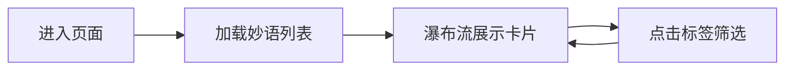
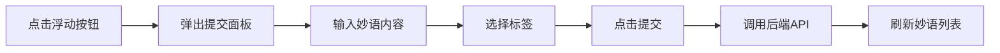
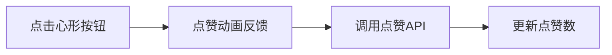

# 团队妙语墙 PRD

## 1. 产品概述

团队妙语墙是一个收集和展示团队成员在日常协作中产生的有趣梗、金句和暖心鼓励的轻量级应用。通过专门的展示空间来活跃团队氛围，让散落于聊天记录中的精彩瞬间得以留存和传播。

- **目标用户**：远程协作的团队成员
- **核心价值**：收集团队文化载体，增强团队凝聚力
- **产品定位**：轻量级团队文化展示墙

## 2. 核心功能

### 2.1 用户角色

| 角色 | 注册方式 | 核心权限 |
|------|----------|----------|
| 团队成员 | 无需注册，输入名称即可使用 | 浏览妙语墙、提交妙语、点赞妙语 |

### 2.2 功能模块

1. **妙语瀑布流展示**：瀑布流卡片布局展示所有妙语，支持标签筛选
2. **妙语提交**：右侧浮动按钮唤起提交面板，输入内容并选择标签
3. **点赞互动**：心形点赞按钮，带动画反馈
4. **侧边栏统计**：今日贡献榜，按点赞数排名前三
5. **响应式布局**：移动端侧边栏收起为汉堡菜单

### 2.3 页面详情

| 页面名称 | 模块名称 | 功能描述 |
|----------|----------|----------|
| 主页面 | 左侧边栏 | 应用标题 + 今日贡献榜（前三名头像+用户名，按点赞排序） |
| 主页面 | 主展示区 | 瀑布流卡片布局，每张卡片含标签、内容、点赞按钮和点赞数 |
| 主页面 | 浮动按钮 | 圆形渐变按钮，点击弹出提交面板 |
| 主页面 | 提交面板 | 输入妙语内容（100字限制）、选择标签、提交按钮 |

## 3. 核心流程

### 3.1 用户浏览妙语墙

### 3.2 用户提交妙语

### 3.3 用户点赞妙语

## 4. 用户界面设计

### 4.1 设计风格

- **主色调**：渐变紫色系（#6366F1 → #8B5CF6）
- **背景色**：浅灰渐变（#F8FAFC → #E2E8F0）
- **卡片背景**：白色 #FFFFFF，2px 浅灰边框 #E2E8F0
- **文字颜色**：深灰 #1E293B
- **点赞色**：红色 #EF4444
- **圆角**：16px（卡片），pill形（标签）
- **阴影**：悬浮时 0 6px 20px rgba(99,102,241,0.2)
- **字体**：现代无衬线字体

### 4.2 页面设计概览

| 页面名称 | 模块名称 | UI元素 |
|----------|----------|--------|
| 主页面 | 侧边栏 | 深灰背景 #1E293B，白色标题 24px 加粗，统计卡片 |
| 主页面 | 瀑布流卡片 | 白色圆角 16px，浅灰边框，彩色标签 pill，深灰内容 16px 加粗，心形点赞按钮 |
| 主页面 | 浮动按钮 | 圆形 50px，渐变背景 #6366F1→#8B5CF6，微光晕动画 |
| 主页面 | 提交面板 | 居中弹出，输入框 100 字限制，标签选择器，渐变提交按钮 |

### 4.3 交互细节

- **卡片悬浮**：上移 4px，阴影加深
- **点赞按钮**：灰色 #CBD5E1 → 红色 #EF4444，缩放 1.2 倍回弹
- **提交按钮**：背景从 #6366F1 平滑过渡到 #4F46E5，按下轻微下沉
- **浮动按钮**：微光晕呼吸动画

### 4.4 响应式

- 桌面端：侧边栏 260px 固定宽度
- 移动端（<768px）：侧边栏收起为顶部汉堡菜单
- 瀑布流列数随屏幕宽度自适应

### 4.5 性能要求

- 首屏渲染时间 ≤ 1.5 秒
- 点赞交互反馈延迟 < 100 毫秒
