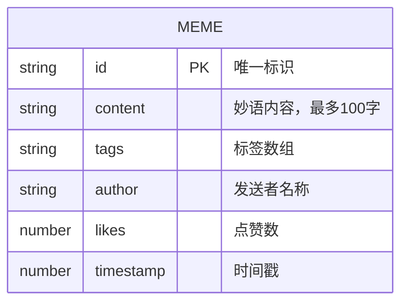

# 团队妙语墙 技术架构文档

## 1. 架构设计

```mermaid
flowchart TB
    subgraph "前端 (React + TypeScript + Vite)
        A["App.tsx\n(主组件 + Context)"]
        B["MemeWall.tsx\n(瀑布流展示)"]
        C["SubmitPanel.tsx\n(浮动按钮+提交面板)"]
        D["types.ts\n(类型定义)"]
    end
    
    subgraph "后端 (Express + TypeScript)
        E["server/index.ts\n(Express 服务)"]
    end
    
    subgraph "数据层"
        F["内存数组\n(Memes 数据)"]
    end
    
    A --> B
    A --> C
    A --> D
    B -.-> E
    C -.-> E
    E --> F
```

## 2. 技术栈说明

- **前端框架**：React 18 + TypeScript
- **构建工具**：Vite 5 + @vitejs/plugin-react
- **后端框架**：Express 4
- **HTTP 客户端**：Axios
- **跨域中间件**：Cors
- **唯一 ID 生成**：UUID
- **状态管理**：React Context
- **样式方案**：CSS Modules / 内联样式

## 3. 目录结构

```
.
├── package.json
├── vite.config.js
├── tsconfig.json
├── index.html
└── src/
    ├── App.tsx          # 主组件，Context 提供者
    ├── MemeWall.tsx     # 瀑布流展示组件
    ├── SubmitPanel.tsx  # 浮动按钮和提交面板
    ├── types.ts         # TypeScript 类型定义
    └── server/
        └── index.ts     # Express 后端服务
```

## 4. API 定义

### 4.1 获取妙语列表

- **GET** `/api/memes`
- **响应**：

```typescript
interface Meme {
  id: string;
  content: string;
  tags: string[];
  author: string;
  likes: number;
  timestamp: number;
}
```

响应为 Meme[]

### 4.2 提交新妙语

- **POST** `/api/memes`
- **请求体**：

```typescript
interface CreateMemeRequest {
  content: string;
  tags: string[];
  author: string;
}
```

- **响应**：创建的 Meme 对象

### 4.3 点赞妙语

- **POST** `/api/memes/:id/like`
- **响应**：

```typescript
{
  id: string;
  likes: number;
}
```

## 5. 数据模型

### 5.1 Meme 数据模型



### 5.2 内存存储

使用内存数组存储所有妙语数据，服务重启后数据清空。

## 6. 状态管理

使用 React Context 进行全局状态管理：

- `memes`：妙语列表
- `selectedTag`：当前选中的标签筛选
- `addMeme`：添加妙语方法
- `likeMeme`：点赞方法
- `fetchMemes`：刷新列表方法

## 7. 性能优化

- **首屏性能**：组件懒加载、CSS 动画优化、避免重排重绘
- **点赞性能**：本地状态立即更新（乐观更新），后台异步请求
- **瀑布流布局**：CSS columns 实现，避免 JS 计算开销
- **动画性能**：使用 transform 和 opacity 动画，触发 GPU 加速

## 8. 响应式方案

- 桌面端（≥768px）：侧边栏固定 260px，主区域自适应
- 移动端（<768px）：侧边栏收起为汉堡菜单，点击展开
- 瀑布流列数：桌面 桌面 3 列，平板 2 列，手机 1 列
