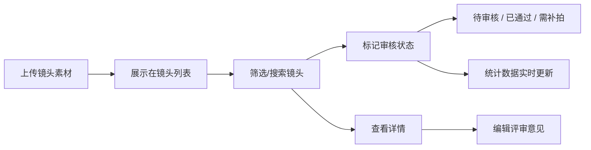

## 1. 产品概述

LensBoard 是一款面向影片制作团队的镜头素材管理与剪辑进度可视化看板应用，旨在解决非线性编辑流程中，导演、剪辑师和制片人通过多个沟通工具交换镜头反馈导致的信息错漏和进度模糊问题。

- 核心价值：提供统一的镜头素材审核管理后台，直观展示剪辑进度，减少沟通成本
- 目标用户：导演、剪辑师、制片人、后期制作团队

## 2. 核心功能

### 2.1 用户角色

| 角色 | 注册方式 | 核心权限 |
|------|----------|----------|
| 团队成员 | 默认使用 | 上传、查看、审核、删除镜头素材 |

### 2.2 功能模块

1. **镜头管理面板**：拖拽上传、镜头卡片列表展示、状态管理
2. **筛选搜索栏**：按状态/类型筛选、关键词搜索
3. **详情面板**：镜头元数据展示、评审意见编辑
4. **统计悬浮球**：环形进度统计图、实时数据可视化

### 2.3 页面详情

| 页面名称 | 模块名称 | 功能描述 |
|-----------|-------------|---------------------|
| 主界面 | 镜头管理面板 | 300px宽左侧面板，支持拖拽上传视频/图片文件，展示镜头卡片列表 |
| 主界面 | 镜头卡片 | 缩略图(200x112px)、镜头名称、上传时间、状态标签、3个功能按钮 |
| 主界面 | 状态标记对话框 | 三个状态选项（待审核/已通过/需补拍），圆角12px，带缩放动画 |
| 主界面 | 详情面板 | 400px宽右侧面板，滑动进入，占位播放器、元数据、评审意见 |
| 主界面 | 筛选搜索栏 | 状态下拉、类型下拉、搜索输入框（0.5s防抖） |
| 主界面 | 统计悬浮球 | 半圆形64px直径，渐变背景，呼吸动画，悬停展开环形统计图 |

## 3. 核心流程

用户打开应用 → 浏览/上传镜头素材 → 通过筛选器查找特定镜头 → 点击状态按钮标记审核状态 → 点击详情查看元数据并添加评审意见 → 右下角统计球实时更新数据 → 对不合格镜头标记需补拍或移除

## 4. 用户界面设计

### 4.1 设计风格
- **主色调**：暗色主题，主背景 `#0F172A`，卡片背景 `#1E293B`
- **状态色**：待审核 `#F59E0B`（橙）、已通过 `#22C55E`（绿）、需补拍 `#EF4444`（红）
- **辅助色**：渐变 `#6366F1 → #8B5CF6`（统计球），边框 `#334155`，次要文字 `#94A3B8`
- **文字色**：主文字 `#F8FAFC`
- **按钮样式**：圆角设计，点击缩放 `scale(0.95)`，过渡 `0.2s`
- **字体**：现代无衬线字体，12px/14px/16px三级字号体系
- **布局风格**：左侧列表 + 右侧详情的经典双栏结构
- **图标风格**：Lucide React 线性图标

### 4.2 页面设计概览

| 页面名称 | 模块名称 | UI 元素 |
|-----------|-------------|-------------|
| 主界面 | 镜头管理面板 | 300px宽 `#1E293B` 背景，圆角8px，自定义滚动条4px |
| 主界面 | 拖拽上传区 | `#334155` 背景，`#475569` 虚线边框，拖入时 `#3B82F6` 边框+阴影，0.3s过渡 |
| 主界面 | 镜头卡片 | 垂直排列间距8px，缩略图200x112px圆角4px，状态标签色区分 |
| 主界面 | 详情面板 | 400px宽 `#1E293B` 背景，圆角12px，内边距16px，0.3s ease-out滑入 |
| 主界面 | 统计悬浮球 | 64px直径半圆形，渐变+呼吸动画，悬停展开扇形面板圆角16px |
| 主界面 | 环形统计图 | Canvas绘制，8px粗环形，1px间隙，hover段向外扩5px显示数值 |

### 4.3 响应式
- 桌面端（≥900px）：左栏300px + 中间内容区 + 右栏400px三栏布局
- 平板端（<900px）：详情面板变为覆盖浮层，从底部滑入，背景半透明
- 移动端（<540px）：卡片缩略图高度调整为100px

### 4.4 性能要求
- 50个镜头初次渲染 ≤ 500ms
- 筛选/搜索响应 ≤ 100ms
- 大文件（100MB）拖拽上传不阻塞UI
