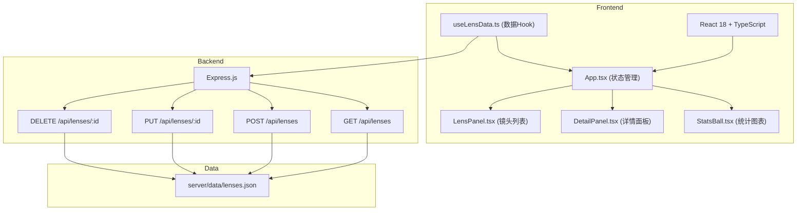
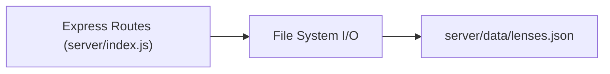
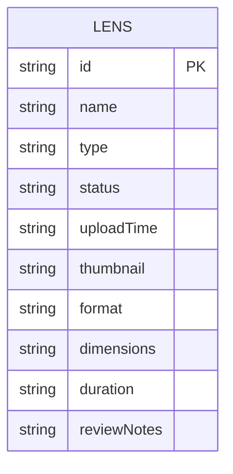

## 1. 架构设计



## 2. 技术描述
- **前端**：React@18 + TypeScript + Vite
- **初始化工具**：vite-init
- **后端**：Express@4
- **数据存储**：JSON 文件持久化（server/data/lenses.json）
- **HTTP 客户端**：axios
- **唯一 ID**：uuid

## 3. 路由定义

| 路由 | 用途 |
|-------|---------|
| / | 主应用界面（单页应用） |

## 4. API 定义

### 4.1 类型定义

```typescript
type LensStatus = 'pending' | 'approved' | 'reshoot';
type LensType = 'video' | 'image';

interface Lens {
  id: string;
  name: string;
  type: LensType;
  status: LensStatus;
  uploadTime: string;
  thumbnail?: string;
  format?: string;
  dimensions?: string;
  duration?: string;
  reviewNotes?: string;
}
```

### 4.2 接口规范

| 方法 | 路径 | 请求 | 响应 | 描述 |
|------|------|------|------|------|
| GET | /api/lenses | - | Lens[] | 获取全部镜头列表 |
| POST | /api/lenses | Partial<Lens> (multipart/form-data) | Lens | 上传新镜头 |
| PUT | /api/lenses/:id | { status: LensStatus, reviewNotes?: string } | Lens | 更新镜头状态/评审意见 |
| DELETE | /api/lenses/:id | - | { success: boolean } | 删除指定镜头 |

## 5. 服务端架构图



## 6. 数据模型

### 6.1 数据模型定义



### 6.2 初始数据

`server/data/lenses.json` 初始化包含若干示例镜头数据，覆盖三种状态（pending/approved/reshoot）和两种类型（video/image），便于前端演示。
