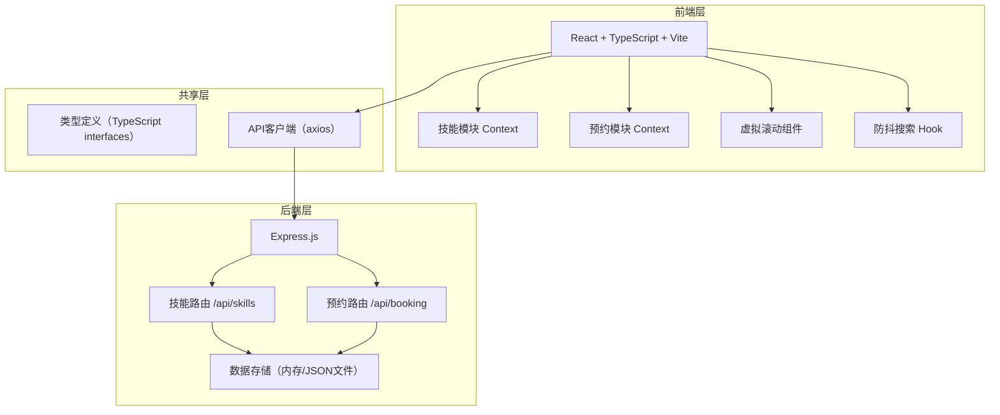
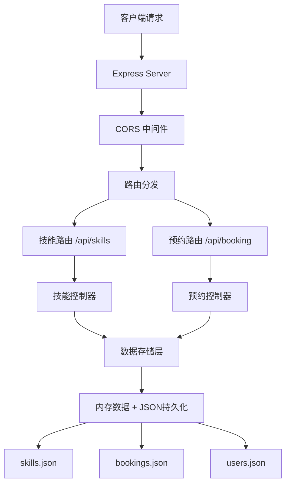
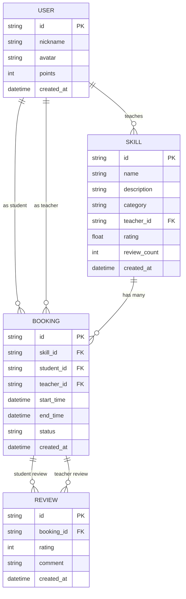

## 1. 架构设计



## 2. 技术栈描述

### 前端技术栈
- **框架**：React 18 + TypeScript
- **构建工具**：Vite 5
- **状态管理**：React Context（技能模块和预约模块独立Context）
- **HTTP客户端**：axios
- **图标库**：lucide-react
- **样式方案**：CSS Modules / Tailwind CSS（待定，根据用户需求使用内联样式和CSS变量）

### 后端技术栈
- **框架**：Express.js
- **中间件**：cors
- **工具库**：uuid（生成唯一ID）
- **数据存储**：内存存储 + JSON文件持久化
- **认证**：bcrypt + jsonwebtoken

### 核心工具
- **类型安全**：TypeScript 严格模式，target ES2020
- **代码规范**：ESLint + Prettier
- **开发工具**：concurrently（同时运行前后端）

## 3. 目录结构

```
├── package.json
├── vite.config.ts
├── tsconfig.json
├── index.html
├── src/
│   ├── main.tsx
│   ├── App.tsx
│   ├── types/
│   │   └── index.ts
│   ├── api/
│   │   ├── client.ts
│   │   ├── skills.ts
│   │   └── booking.ts
│   ├── skills/
│   │   ├── SkillContext.tsx
│   │   ├── SkillBoard.tsx
│   │   ├── SkillForm.tsx
│   │   └── SkillCard.tsx
│   ├── booking/
│   │   ├── BookingContext.tsx
│   │   ├── BookingCalendar.tsx
│   │   └── EvaluationPanel.tsx
│   ├── components/
│   │   ├── Leaderboard.tsx
│   │   ├── VirtualList.tsx
│   │   ├── SearchBar.tsx
│   │   └── StarRating.tsx
│   ├── hooks/
│   │   ├── useDebounce.ts
│   │   └── useVirtualScroll.ts
│   └── utils/
│       └── index.ts
├── backend/
│   ├── server.js
│   ├── routes/
│   │   ├── skills.js
│   │   └── booking.js
│   ├── models/
│   │   ├── Skill.js
│   │   ├── Booking.js
│   │   └── User.js
│   └── data/
│       └── store.js
```

## 4. 路由定义

| 路由路径 | 页面/组件 | 功能描述 |
|-----------|-----------|----------|
| / | 主页面 | 技能展示板 + 排行榜 + 导航 |
| /skills | 技能列表 | 技能展示板（主视图） |
| /booking | 预约管理 | 预约日历 + 我的课程 |

## 5. API 定义

### 5.1 类型定义

```typescript
// User
interface User {
  id: string;
  nickname: string;
  avatar: string;
  points: number;
  createdAt: string;
}

// Skill
interface Skill {
  id: string;
  name: string;
  description: string;
  category: string;
  teacherId: string;
  teacher: User;
  rating: number;
  reviewCount: number;
  createdAt: string;
}

// Booking
interface Booking {
  id: string;
  skillId: string;
  skill: Skill;
  studentId: string;
  student: User;
  teacherId: string;
  teacher: User;
  startTime: string;
  endTime: string;
  status: 'pending' | 'completed' | 'cancelled';
  studentReview?: Review;
  teacherReview?: Review;
  createdAt: string;
}

// Review
interface Review {
  id: string;
  rating: number;
  comment?: string;
  createdAt: string;
}

// TimeSlot
interface TimeSlot {
  date: string;
  startTime: string;
  endTime: string;
  status: 'available' | 'booked' | 'expired';
  bookingId?: string;
}
```

### 5.2 技能 API

**GET /api/skills**
- 描述：获取技能列表，支持搜索
- 请求参数：
  - `search` (可选): 搜索关键词
  - `category` (可选): 类别过滤
  - `page` (可选): 页码
  - `limit` (可选): 每页数量
- 响应：
```typescript
{
  success: true;
  data: Skill[];
  total: number;
}
```

**POST /api/skills**
- 描述：发布新技能
- 请求体：
```typescript
{
  name: string;        // 技能名称，最多30字
  description: string; // 详细描述，最多500字
  category: string;  // 类别
  teacherId: string;
}
```
- 响应：
```typescript
{
  success: true;
  data: Skill;
}
```

### 5.3 预约 API

**GET /api/booking**
- 描述：获取预约时段
- 请求参数：
  - `teacherId` (可选): 教授者ID
  - `skillId` (可选): 技能ID
  - `startDate` (可选): 开始日期
  - `endDate` (可选): 结束日期
- 响应：
```typescript
{
  success: true;
  data: Booking[];
}
```

**GET /api/booking/timeslots**
- 描述：获取可预约时段
- 请求参数：
  - `teacherId`: 教授者ID
  - `skillId`: 技能ID
- 响应：
```typescript
{
  success: true;
  data: TimeSlot[];
}
```

**POST /api/booking**
- 描述：创建预约
- 请求体：
```typescript
{
  skillId: string;
  studentId: string;
  startTime: string;
  endTime: string;
}
```
- 响应：
```typescript
{
  success: true;
  data: Booking;
}
```

**POST /api/booking/evaluate**
- 描述：提交评价
- 请求体：
```typescript
{
  bookingId: string;
  reviewerId: string;  // 评价者ID
  revieweeId: string; // 被评价者ID
  rating: number;   // 1-5
  comment?: string;
}
```
- 响应：
```typescript
{
  success: true;
  data: {
    booking: Booking;
    user: User; // 更新后的用户信息
  };
}
```

**GET /api/users**
- 描述：获取用户排行榜
- 响应：
```typescript
{
  success: true;
  data: User[]; // Top10用户，按积分降序排列
}
```

## 6. 服务器架构



## 7. 数据模型

### 7.1 ER图



### 7.2 核心模块设计

#### 技能模块 (skills.js
- GET /api/skills
  - 验证请求参数
  - 从数据存储查询技能列表
  - 支持搜索关键词模糊匹配
  - 按创建时间倒序排列
  - 返回分页结果

- POST /api/skills
  - 验证请求体（名称≤30字，描述≤500字
  - 验证类别是否在预设列表中
  - 生成唯一ID
  - 保存到数据存储
  - 返回创建的技能对象

#### 预约模块 (booking.js)
- GET /api/booking
  - 获取用户的预约列表
  - 支持按技能、教授者过滤
  - 返回预约详情（包含关联的技能和用户信息）

- GET /api/booking/timeslots
  - 生成未来7天的可预约时段
  - 每日9:00-18:00，每30分钟一个时段
  - 排除12:00-13:00午餐时间
  - 标记已预约和已过期时段
  - 返回时段列表

- POST /api/booking
  - 验证时段是否可预约
  - 验证用户不能预约自己的技能
  - 创建预约记录
  - 更新时段状态
  - 返回预约详情

- POST /api/booking/evaluate
  - 验证预约已完成（时间已过当前时间
  - 验证评价者是预约双方之一
  - 验证评分在1-5之间
  - 保存评价
  - 更新用户积分（授课者获得评分对应积分，学员获得1分参与分
  - 更新技能平均评分
  - 返回更新后的预约和用户信息

## 8. 性能优化

### 8.1 前端性能
- **虚拟滚动**：技能列表超过50条时启用虚拟滚动，仅渲染可视区域卡片
- **防抖搜索**：搜索输入防抖500ms，减少API请求
- **组件懒加载**：非核心组件按需加载
- **状态分离**：技能和预约模块独立Context，避免不必要重渲染
- **请求缓存**：API响应缓存，重复请求使用缓存

### 8.2 后端性能
- **内存存储**：使用内存存储，避免频繁IO操作
- **索引优化**：对常用查询字段建立索引
- **批量操作**：支持批量查询和批量更新
- **连接池**：数据库连接池管理（如后续升级为真实数据库

## 9. 安全考虑

### 9.1 输入验证
- 所有用户输入进行长度和格式验证
- SQL注入防护（使用参数化查询
- XSS防护（转义用户输入
- CSRF防护（使用token验证

### 9.2 数据安全
- 敏感数据加密存储
- API访问日志记录
- 权限控制（用户只能操作自己的数据
