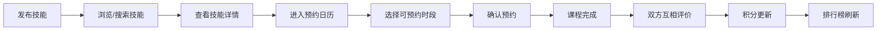

## 1. 产品概述

团队技能互换平台是一个面向团队内部的技能共享与学习平台，旨在促进团队成员之间的知识交流，通过一对一技能交换课程实现共同成长。

- 主要解决团队内部知识壁垒问题，让每个成员都能分享自己的专长并学习他人技能
- 目标用户为团队所有成员，通过积分激励机制鼓励积极参与技能分享
- 产品价值在于构建学习型团队文化，提升团队整体技能水平

## 2. 核心功能

### 2.1 用户角色

| 角色 | 注册方式 | 核心权限 |
|------|----------|----------|
| 普通用户 | 系统预设账号登录 | 发布技能、浏览技能、预约课程、评价课程、查看排行榜 |

### 2.2 功能模块

1. **技能展示板**：展示所有可预约技能卡片，支持搜索过滤，点击展开详情
2. **技能发布表单**：创建新技能条目，包含名称、描述、类别选择
3. **预约日历**：以周为单位显示可预约时段，点击预约课程
4. **评价面板**：课程结束后进行星级评分和文字评论
5. **积分排行榜**：侧边栏显示Top10用户积分排名

### 2.3 页面详情

| 页面名称 | 模块名称 | 功能描述 |
|-----------|-------------|---------------------|
| 主页面 | 技能展示板 | 网格布局展示技能卡片，支持关键词搜索（防抖500ms），搜索结果高亮 |
| 主页面 | 技能发布表单 | 弹窗形式展示，填写技能信息并提交 |
| 主页面 | 预约日历 | 水平滚动周视图，彩色时段块显示预约状态 |
| 主页面 | 评价面板 | 星级评分组件，文字评论输入框 |
| 主页面 | 排行榜侧边栏 | 固定右侧，显示Top10用户积分排名 |

## 3. 核心流程

用户发布技能 → 其他用户浏览搜索技能 → 点击技能查看详情 → 点击预约进入日历视图 → 选择可预约时段 → 确认预约 → 课程结束后双方互相评价 → 积分更新并刷新排行榜

## 4. 用户界面设计

### 4.1 设计风格
- **主题**：深色主题，主背景#0F172A，卡片背景#1E293B，边框#334155
- **主色调**：蓝色#3B82F6（交互元素）、绿色#22C55E（可预约）、红色#EF4444（已预约）、金色#F59E0B（评分/火焰）
- **按钮风格**：圆角12px，悬停0.3s过渡动画
- **字体**：展示字体使用Space Grotesk，正文字体使用Inter，建立清晰的字体层次
- **布局**：卡片式布局，自适应网格，右侧固定排行榜侧边栏
- **图标**：使用lucide-react图标库

### 4.2 页面设计概述

| 页面名称 | 模块名称 | UI元素 |
|-----------|-------------|----------|
| 主页面 | 技能展示板 | 自适应网格（PC 4列/平板2列/手机1列），卡片悬停效果，关键词高亮 |
| 主页面 | 技能发布表单 | 模态弹窗，输入框焦点动画，表单验证提示 |
| 主页面 | 预约日历 | 水平滚动容器，60x40px时段块，颜色状态区分，悬停上浮阴影 |
| 主页面 | 评价面板 | 星级动画（缩放0.2s），灰色→金色过渡 |
| 主页面 | 排行榜侧边栏 | 固定宽度260px，火焰图标装饰，列表项悬停背景变浅 |

### 4.3 响应性
- **设计原则**：Desktop-first，移动端自适应
- **断点**：PC（≥1280px）4列，平板（≥768px）2列，手机（<768px）1列
- **侧边栏**：移动端转为底部抽屉或顶部标签页
- **触控优化**：最小点击区域44x44px，手势滑动支持日历切换

### 4.4 动画与交互
- **统一过渡**：所有状态变化使用0.3s ease
- **卡片展开**：平滑高度过渡，内容淡入
- **星级评分**：悬停缩放1.1倍，选中金色填充
- **搜索结果**：淡入动画，无结果时显示提示
- **时段块**：可预约悬停上浮2px，阴影加深
