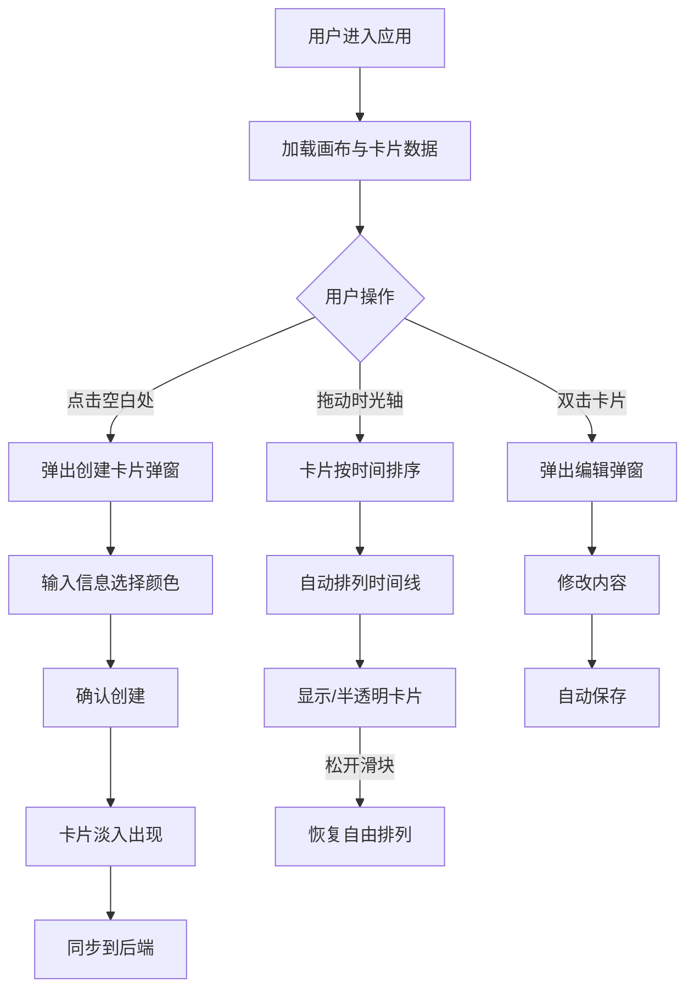

## 1. 产品概述

灵感脉搏是一款面向创意团队的无限画布白板应用，通过引入时间维度，让灵感卡片的创建和演进过程可追溯、可回放。

- **核心价值**：解决普通白板缺乏时间维度的痛点，通过时光轴回溯功能，帮助团队追溯想法的演进脉络
- **目标用户**：创意团队、产品团队、设计团队
- **使用场景**：头脑风暴、创意发散、项目复盘

## 2. 核心功能

### 2.1 用户角色

| 角色 | 注册方式 | 核心权限 |
|------|----------|----------|
| 普通用户 | 无需注册 | 创建、编辑、删除卡片，使用时光轴回溯功能 |

### 2.2 功能模块

1. **无限画布模块**：支持拖拽平移、滚轮缩放，无边界限制
2. **卡片管理模块**：创建、编辑、删除、拖拽灵感卡片
3. **时光轴模块**：时间范围滑块，按时间排序重排卡片
4. **数据持久化模块**：后端API保存卡片和画布状态

### 2.3 页面详情

| 页面名称 | 模块名称 | 功能描述 |
|----------|----------|----------|
| 主画布页 | 无限画布 | 鼠标拖拽平移、滚轮缩放（0.5x-3x）、以鼠标为中心缩放 |
| 主画布页 | 卡片创建 | 点击空白处弹窗创建卡片，支持标题（30字）、内容（200字）、颜色选择（12色） |
| 主画布页 | 卡片交互 | 拖拽移动、双击编辑、删除确认、淡入淡出动画 |
| 主画布页 | 时光轴 | 左上角时间滑块，拖动时卡片按时间排列，松开恢复自由模式 |

## 3. 核心流程

### 3.1 创建卡片流程
用户点击画布空白处 → 弹出创建弹窗 → 输入标题和内容 → 选择颜色 → 确认创建 → 卡片以淡入动画出现 → 数据同步到后端

### 3.2 时光轴回溯流程
用户拖动时光轴滑块 → 卡片按创建时间排序 → 自动排列成时间线（每行5张）→ 时间点前的卡片正常显示，之后的半透明 → 松开滑块 → 恢复自由排列

## 4. 用户界面设计

### 4.1 设计风格

- **主色调**：深色主题，画布背景 `#0F172A`
- **卡片样式**：白色圆角矩形（16px），浅灰边框 `#E2E8F0`，阴影 `0 2px 8px rgba(0,0,0,0.15)`
- **时光轴**：背景 `#1E293B`，滑块 `#6366F1`（浅紫色）
- **字体**：系统字体栈（Inter, sans-serif）
- **动效风格**：
  - 卡片创建：淡入 0.3s ease-out
  - 卡片拖拽：半透明 opacity 0.7
  - 卡片放置：弹性回弹 0.2s cubic-bezier(0.34, 1.56, 0.64, 1)
  - 时光轴滑动：卡片位置平滑过渡 linear 0.1s

### 4.2 页面设计概述

| 页面名称 | 模块名称 | UI 元素 |
|----------|----------|---------|
| 主画布页 | 无限画布 | 深色背景、变换矩阵实现平移缩放、无边界 |
| 主画布页 | 灵感卡片 | 白色圆角卡片、标题内容、创建/编辑时间、删除按钮、颜色标识 |
| 主画布页 | 时光轴 | 左上角固定、圆角轨道、圆形滑块、时间戳显示 |
| 主画布页 | 创建/编辑弹窗 | 模态框、半透明遮罩、表单输入、颜色选择器 |

### 4.3 响应式设计

- 桌面端优先设计
- 画布内容自适应窗口大小
- 时光轴组件在宽度小于768px时缩小到宽度160px
- 触摸设备优化：支持触摸拖拽和双指缩放

### 4.4 性能指标

- 画布拖拽和卡片拖拽帧率保持在30FPS以上
- 缩放平移更新频率不小于30次/秒
- 时光轴滑动时卡片重排延迟不超过100ms

