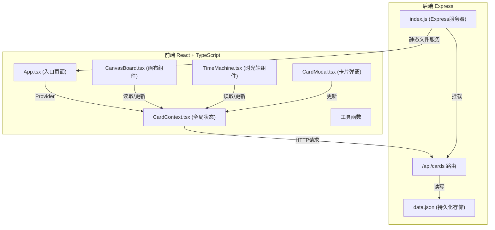

## 1. 架构设计



## 2. 技术说明

- **前端**：React 18 + TypeScript + Vite
- **构建工具**：Vite 5 + @vitejs/plugin-react
- **状态管理**：React Context (CardContext)
- **HTTP客户端**：Axios
- **后端**：Express 4 + CORS
- **数据存储**：JSON文件持久化
- **唯一ID**：uuid

## 3. 目录结构

```
auto169/
├── package.json
├── vite.config.js
├── tsconfig.json
├── index.html
├── src/
│   ├── context/
│   │   └── CardContext.tsx      # 全局状态管理
│   ├── components/
│   │   ├── CanvasBoard.tsx      # 无限画布组件
│   │   ├── TimeMachine.tsx      # 时光轴组件
│   │   ├── CardItem.tsx         # 卡片组件
│   │   └── CardModal.tsx        # 卡片编辑弹窗
│   ├── pages/
│   │   └── App.tsx              # 主应用页面
│   ├── types/
│   │   └── card.ts              # 类型定义
│   └── utils/
│       └── api.ts               # API封装
├── server/
│   ├── index.js                 # Express服务器
│   └── data.json                # 数据持久化文件
```

## 4. 数据模型

### 4.1 Card 数据结构

```typescript
interface Card {
  id: string;
  title: string;
  content: string;
  color: string;
  x: number;
  y: number;
  createdAt: string;
  updatedAt: string;
}
```

### 4.2 Context 状态

```typescript
interface CardContextType {
  cards: Card[];
  selectedCard: Card | null;
  timeLineStamp: number;
  timeLineMode: boolean;
  isDragging: boolean;
  
  addCard: (card: Omit<Card, 'id' | 'createdAt' | 'updatedAt'>) => void;
  updateCardPosition: (id: string, x: number, y: number) => void;
  updateCardContent: (id: string, data: Partial<Pick<Card, 'title' | 'content' | 'color'>>) => void;
  deleteCard: (id: string) => void;
  setSelectedCard: (card: Card | null) => void;
  setTimeLineStamp: (timestamp: number) => void;
  setTimeLineMode: (mode: boolean) => void;
}
```

## 5. API 定义

### 5.1 GET /api/cards

获取所有卡片列表

**响应**：
```json
{
  "success": true,
  "data": [
    {
      "id": "uuid",
      "title": "卡片标题",
      "content": "卡片内容",
      "color": "#FFFFFF",
      "x": 100,
      "y": 200,
      "createdAt": "2024-01-01T12:00:00.000Z",
      "updatedAt": "2024-01-01T12:00:00.000Z"
    }
  ]
}
```

### 5.2 POST /api/cards

创建新卡片

**请求体**：
```json
{
  "title": "卡片标题",
  "content": "卡片内容",
  "color": "#FFFFFF",
  "x": 100,
  "y": 200
}
```

**响应**：
```json
{
  "success": true,
  "data": {
    "id": "uuid",
    "title": "卡片标题",
    "content": "卡片内容",
    "color": "#FFFFFF",
    "x": 100,
    "y": 200,
    "createdAt": "2024-01-01T12:00:00.000Z",
    "updatedAt": "2024-01-01T12:00:00.000Z"
  }
}
```

### 5.3 PUT /api/cards/:id

更新卡片

**请求体**：
```json
{
  "title": "新标题",
  "content": "新内容",
  "color": "#FF0000",
  "x": 150,
  "y": 250
}
```

### 5.4 DELETE /api/cards/:id

删除卡片

**响应**：
```json
{
  "success": true
}
```

## 6. 核心模块说明

### 6.1 CanvasBoard.tsx (画布组件)

**职责**：
- 实现无限画布，使用CSS变换矩阵（transform）实现平移和缩放
- 处理鼠标拖拽平移、滚轮缩放
- 渲染所有卡片
- 处理卡片拖拽
- 点击空白处触发创建卡片

**数据流向**：
- 从 CardContext 读取 cards、timeLineMode、timeLineStamp
- 调用 updateCardPosition、setSelectedCard 等方法

### 6.2 TimeMachine.tsx (时光轴组件)

**职责**：
- 渲染时间轴滑块
- 计算时间范围（最早卡片创建时间到当前）
- 拖动时按时间排序卡片并重新计算位置
- 显示当前时间戳

**数据流向**：
- 从 CardContext 读取 cards、timeLineStamp、timeLineMode
- 调用 setTimeLineStamp、setTimeLineMode 方法

### 6.3 CardContext.tsx (全局状态)

**职责**：
- 管理卡片数组状态
- 管理时光轴状态
- 提供增删改查方法
- 同步后端API

**数据流向**：
- 向下游组件（Canvas、TimeMachine）提供数据和方法
- 向上通过API同步到后端

## 7. 性能优化

- 使用 `requestAnimationFrame` 节流画布平移和缩放
- 卡片拖拽使用 CSS transform 而非 top/left
- 时光轴滑动时使用 `will-change: transform` 优化
- 避免在拖拽过程中触发重排（reflow）
- 合理使用 React.memo 减少不必要的重渲染

