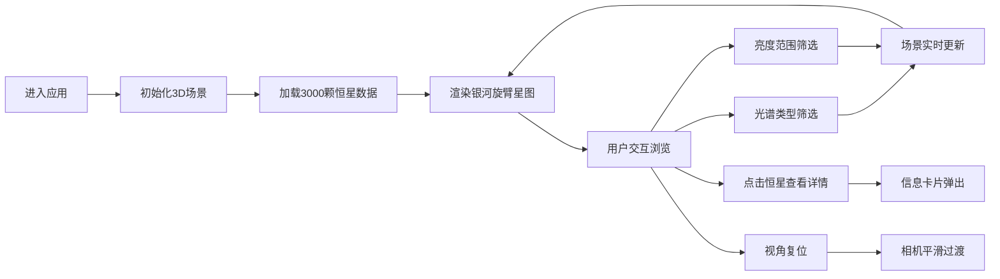

## 1. 产品概述

交互式3D恒星分类与色彩分布可视化应用，为天文科普工作者和爱好者提供沉浸式的银河系恒星探索体验。

- **核心价值**：通过三维空间直观展示恒星的相对亮度、光谱颜色分布和银河旋臂结构，解决静态星图缺乏空间感的问题
- **目标用户**：天文科普工作者、天文爱好者、学生及教育机构
- **使用场景**：科普教学、个人探索、展览展示

## 2. 核心功能

### 2.1 用户角色
| 角色 | 注册方式 | 核心权限 |
|------|----------|----------|
| 普通用户 | 无需注册 | 浏览3D星图、筛选恒星、查看恒星详情 |

### 2.2 功能模块
1. **三维星图渲染**：银河旋臂形态的3000颗恒星粒子系统，支持旋转缩放
2. **光谱类型筛选**：按O/B/A/F/G/K/M光谱类型过滤恒星
3. **亮度范围筛选**：双滑块控制视星等范围
4. **恒星信息交互**：点击恒星查看详细信息卡片
5. **视角复位**：一键恢复初始观察视角

### 2.3 页面详情
| 页面名称 | 模块名称 | 功能描述 |
|-----------|-------------|---------------------|
| 主页面 | 顶部导航栏 | 应用名称、视角复位按钮 |
| 主页面 | 左侧筛选面板 | 光谱型多选、亮度范围滑块 |
| 主页面 | 中央3D视口 | Three.js渲染的恒星粒子系统 |
| 主页面 | 右侧信息卡片 | 恒星详细数据展示（选中时弹出） |

## 3. 核心流程

用户进入应用 → 初始化3D场景加载恒星数据 → 鼠标拖拽旋转/滚轮缩放浏览 → 通过筛选面板过滤恒星 → 点击恒星查看详情 → 点击复位按钮回到初始视角

## 4. 用户界面设计

### 4.1 设计风格
- **主色调**：深空蓝 #0a0a1e（背景），星点白 #ffffff，光谱色带（蓝→蓝白→白→黄白→黄→橙→红）
- **辅助色**：面板背景 #1a1a2e，文字浅灰 #c0c0c0
- **按钮风格**：圆角8px，半透明背景，选中时白色高亮边框
- **字体**：现代无衬线字体，标题加粗，正文清晰可读
- **布局风格**：三栏布局（左筛选+中视口+右信息卡），卡片式面板，毛玻璃效果
- **动效**：0.2s颜色过渡、0.3s fade-in动画、脉冲缩放动画、阻尼惯性旋转

### 4.2 页面设计概述
| 页面名称 | 模块名称 | UI元素 |
|-----------|-------------|-------------|
| 主页面 | 顶部导航 | 居中标题（字间距2px）、右侧复位按钮（圆形36px） |
| 主页面 | 左侧筛选面板 | 宽280px，圆角16px，光谱型按钮4列2行网格，双滑块亮度筛选 |
| 主页面 | 3D视口 | 深蓝色背景，粒子恒星，轨道控制器阻尼0.9 |
| 主页面 | 信息卡片 | 半透明毛玻璃，rgba(10,10,30,0.8)，backdrop-filter blur(12px) |

### 4.3 响应式
- **桌面端**：三栏布局，左侧280px筛选面板，右侧300px信息卡
- **移动端**（<768px）：左侧面板折叠为抽屉（全屏60%宽度，毛玻璃背景），右侧信息卡变为底部浮层
- **触控优化**：支持双指缩放、单指旋转

### 4.4 3D场景指引
- **环境**：深蓝色深空背景 #0a0a1e，无额外HDRI
- **光照设置**：环境光 + 方向光，确保恒星粒子清晰可见
- **相机设置**：透视相机，视角45度，初始距离原点40单位，朝向银河中心
- **构图与焦点**：银河旋臂结构为视觉中心，恒星按光谱型呈现不同颜色和大小
- **交互与动画**：轨道控制器（阻尼0.9）、选中恒星脉冲动画（周期1s，放大1.5倍）、相机动画（0.8s ease-in-out复位）
- **性能要求**：≥55fps，≥2500颗恒星粒子，使用Points材质优化，筛选更新≤100ms
