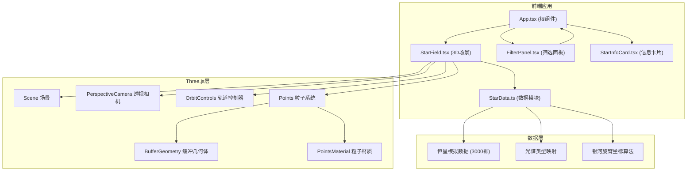

## 1. 架构设计



## 2. 技术描述
- **前端框架**：React@18 + TypeScript
- **构建工具**：Vite@5 + @vitejs/plugin-react
- **3D渲染**：three@0.160 + @react-three/fiber@8 + @react-three/drei@9
- **样式方案**：原生CSS + CSS Modules（或styled-components）
- **状态管理**：React useState/useReducer（组件内状态）
- **数据来源**：前端模拟生成（3000颗恒星，符合真实光谱分布比例）

## 3. 文件结构与调用关系

```
src/
├── App.tsx              # 根组件，状态管理，布局容器
│   ├── StarField.tsx    # ← 接收filter状态，输出3D场景，触发onStarClick
│   ├── FilterPanel.tsx  # ← 接收filter状态，输出onFilterChange
│   └── StarInfoCard.tsx # ← 接收selectedStar状态，输出onClose
├── StarData.ts          # 恒星数据生成模块（纯函数，无依赖）
├── types.ts             # TypeScript类型定义（可选）
├── main.tsx             # 应用入口
└── index.css            # 全局样式
```

**数据流向**：
1. `StarData.ts` 生成恒星数组 → `App.tsx` 初始化加载
2. `App.tsx` filter状态 → `StarField.tsx` 重新计算粒子属性
3. `FilterPanel.tsx` 用户交互 → `App.tsx` 更新filter状态
4. `StarField.tsx` 点击恒星 → `App.tsx` 更新selectedStar → `StarInfoCard.tsx` 显示

## 4. 核心数据模型

### 4.1 恒星数据接口
```typescript
interface Star {
  id: number;
  name: string;
  spectralType: 'O' | 'B' | 'A' | 'F' | 'G' | 'K' | 'M';
  apparentMagnitude: number;  // 视星等 -1.5 ~ 10
  distance: number;           // 距离 光年 80~10000
  temperature: number;        // 温度 K
  position: { x: number; y: number; z: number };  // 三维坐标
}
```

### 4.2 筛选状态接口
```typescript
interface FilterState {
  spectralTypes: string[];    // 选中的光谱类型数组
  magnitudeRange: [number, number];  // 亮度范围 [min, max]
}
```

### 4.3 光谱类型映射
```typescript
const SPECTRAL_MAP = {
  O: { color: '#9bb0ff', tempMin: 30000, tempMax: 50000, ratio: 0.001 },
  B: { color: '#aabfff', tempMin: 10000, tempMax: 30000, ratio: 0.005 },
  A: { color: '#cad7ff', tempMin: 7500, tempMax: 10000, ratio: 0.02 },
  F: { color: '#f8f7ff', tempMin: 6000, tempMax: 7500, ratio: 0.05 },
  G: { color: '#fff4ea', tempMin: 5000, tempMax: 6000, ratio: 0.1 },
  K: { color: '#ffd2a1', tempMin: 3500, tempMax: 5000, ratio: 0.2 },
  M: { color: '#ffcc6f', tempMin: 2400, tempMax: 3500, ratio: 0.624 },
};
```

## 5. 性能优化策略

1. **粒子系统**：使用 `THREE.Points` + `BufferGeometry` 批量渲染，避免单独Mesh
2. **筛选更新**：通过修改 `BufferAttribute` 数组实现高效更新，而非重建几何体
3. **材质复用**：单粒子材质配合着色器或顶点颜色实现多样效果
4. **阻尼控制**：OrbitControls 启用 damping 提升手感同时控制帧率
5. **响应式降级**：移动端适当减少粒子数量保证流畅度
