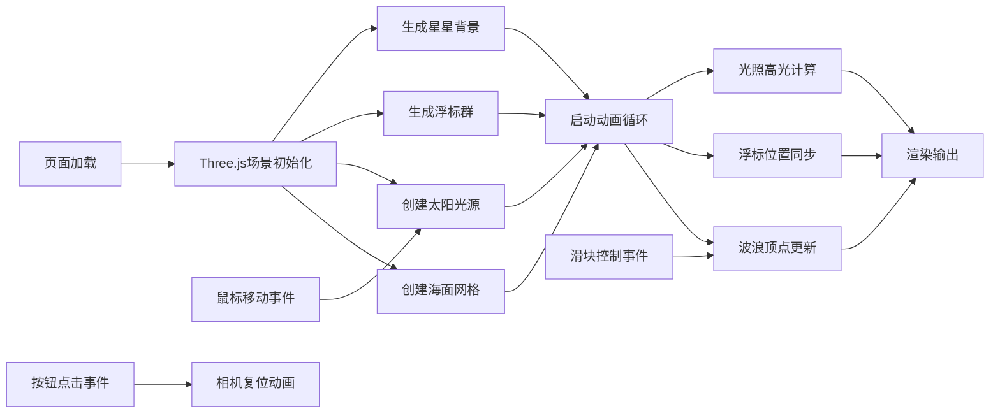

## 1. 产品概述

本项目是一个基于Three.js的3D海洋场景模拟器，提供实时海面波动、阳光反射效果的可视化参考示例。解决开发者在实现海洋物理动态与光照效果时缺少可直接运行的模块化参考的问题，可作为教学示例或项目集成基础模块。

## 2. 核心功能

### 2.1 功能模块
1. **海面渲染模块**：无限延伸海面、正弦波叠加、颜色渐变
2. **光照系统模块**：动态太阳光源、Blinn-Phong高光、鼠标交互控制
3. **浮标系统模块**：随机分布浮标、波浪同步浮动、摇摆动画
4. **控制面板模块**：波浪参数滑块、重置视角按钮、毛玻璃UI
5. **环境背景模块**：夜空渐变背景、闪烁星星

### 2.2 页面详情
| 页面名称 | 模块名称 | 功能描述 |
|---------|---------|---------|
| 主场景 | 海面渲染 | 100x100细分网格，叠加正弦波实时更新顶点Y轴，浅蓝到深蓝渐变 |
| 主场景 | 光照系统 | 太阳随鼠标X轴0-360度旋转，Y固定30单位，镜面反射高光随视角变化 |
| 主场景 | 浮标系统 | 若干半透明小球，半径0.5，随机三色，随波浪起伏+摇摆 |
| 主场景 | 控制面板 | 左下角固定，波浪幅度/频率滑块，重置视角按钮 |
| 主场景 | 环境背景 | 夜空渐变（#0A0E27→#1E3A5F），随机白色星星 |

## 3. 核心流程

用户打开页面 → 3D场景初始化（海面、太阳、浮标、星星、相机）→ 渲染循环启动 → 波浪顶点实时更新 → 浮标位置与波浪同步 → 用户交互：
- 鼠标移动：太阳水平旋转，高光流动
- 滑块调整：波浪幅度/频率实时变化
- 按钮点击：相机平滑归位
- 轨道控制器：自由拖拽视角

## 4. 用户界面设计

### 4.1 设计风格
- **主色调**：深海蓝（#0F2B5B）、浅海蓝（#4A90D9）、天空蓝（#3B82F6）
- **强调色**：浮标橙（#F59E0B）、浮标红（#EF4444）、浮标绿（#10B981）
- **UI风格**：半透明毛玻璃效果（背景#FFFFFF 透明度0.1），圆角12px
- **字体**：现代无衬线字体，清晰可辨
- **整体氛围**：科幻海洋主题，UI与3D场景融合

### 4.2 页面设计概览
| 页面名称 | 模块名称 | UI元素 |
|---------|---------|--------|
| 主场景 | 控制面板 | 毛玻璃容器(圆角12px)、滑块(轨道6px#334155, 滑块16px→20px#3B82F6, 0.2s过渡)、按钮(渐变#3B82F6→#2563EB, 圆角8px, 悬停+20%亮度, 按下下沉1px) |
| 主场景 | 海面 | 颜色渐变#4A90D9→#0F2B5B，波峰波谷平滑过渡 |
| 主场景 | 星星 | 随机位置，大小0.1-0.3，白色，透明度0.3-1.0 |
| 主场景 | 浮标 | 半透明(0.5)三色小球，随波起伏 |

### 4.3 响应式设计
- 全屏渲染，自适应窗口大小
- 控制面板固定左下角，不受窗口尺寸影响
- 支持鼠标拖拽旋转视角（OrbitControls）

### 4.4 3D场景指引
- **环境**：夜空渐变背景，星空粒子营造深邃氛围
- **光照**：主光源为动态方向光（太阳），配合环境光提供基础照明
- **相机**：PerspectiveCamera，初始位置合理俯瞰海面，支持轨道控制
- **后处理**：高光区域产生波光流动效果，通过Blinn-Phong模型实现
- **交互**：鼠标X轴控制太阳方位，滑块控制波浪参数，所有响应延迟<50ms

## 5. 性能指标
- 稳定帧率：≥55 FPS，目标60 FPS
- 顶点更新：优化循环或GPU计算
- 交互延迟：鼠标响应≤50ms
