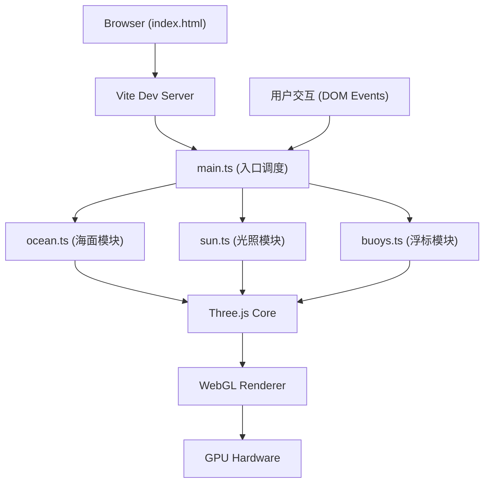

## 1. 架构设计



## 2. 技术描述

- **前端框架**：原生 TypeScript（不使用 React），按模块文件组织
- **3D 引擎**：Three.js 原生，直接操作 Scene / Mesh / Material / Light
- **构建工具**：Vite 5.x，HMR 热更新
- **类型系统**：TypeScript 5.x，strict 严格模式，target ES2020
- **控制器**：Three.js OrbitControls（轨道相机控制）
- **UI 实现**：原生 DOM + 内联 CSS，毛玻璃使用 backdrop-filter

## 3. 文件组织结构

| 文件 | 职责 |
|------|------|
| package.json | 依赖声明：three, typescript, vite, @types/three；脚本：dev |
| vite.config.js | 构建配置，入口 index.html |
| tsconfig.json | TS配置，严格模式，ES2020 |
| index.html | 全屏渲染容器，背景黑色，挂载canvas |
| src/main.ts | 场景/相机/渲染器初始化，动画循环，控制面板DOM与事件绑定，OrbitControls，窗口Resize |
| src/ocean.ts | PlaneGeometry 100x100 网格生成，叠加正弦波顶点更新，MeshPhongMaterial（浅蓝→深蓝渐变顶点色或Fresnel） |
| src/buoys.ts | 随机生成 N 个 SphereGeometry 浮标，位置跟随波浪高度，Z/X 摇摆 |
| src/sun.ts | DirectionalLight 动态太阳，位置随鼠标X旋转 (0~360°)，Y=30，高光参数控制 |

## 4. 核心模块 API 定义

### 4.1 Ocean 模块
```typescript
interface OceanParams {
  amplitude: number;   // 波浪幅度 0.5~3.0 默认1.5
  frequency: number;   // 波浪频率 0.5~2.0 默认1.0
}

class Ocean {
  mesh: THREE.Mesh;
  params: OceanParams;
  constructor(scene: THREE.Scene);
  update(time: number): void;  // 每帧调用，更新顶点Y
  setAmplitude(v: number): void;
  setFrequency(v: number): void;
  getHeightAt(x: number, z: number, time: number): number;  // 供浮标查询高度
}
```

### 4.2 Sun 模块
```typescript
class DynamicSun {
  light: THREE.DirectionalLight;
  visualMesh: THREE.Mesh;   // 可视化太阳球
  constructor(scene: THREE.Scene);
  setAngleByMouseX(normalizedX: number): void;  // 0~1 -> 0~360°
  getDirection(): THREE.Vector3;
}
```

### 4.3 Buoys 模块
```typescript
interface BuoyData {
  mesh: THREE.Mesh;
  baseX: number;
  baseZ: number;
  swayOffset: number;   // 摇摆相位偏移
  swayAmplitude: number;
}

class BuoySystem {
  buoys: BuoyData[];
  constructor(scene: THREE.Scene, count: number);
  update(time: number, ocean: Ocean): void;
}
```

## 5. 性能优化策略

### 5.1 波浪顶点更新
- 使用 `BufferGeometry` + `position attribute` 直接操作 `Float32Array`，避免 new 对象
- 单层 for 循环遍历所有顶点，使用局部变量缓存 Math 函数结果
- 叠加 4~6 个不同频率/相位/方向的正弦波产生 Gerstner-like 效果

### 5.2 渲染优化
- 海面 `MeshPhongMaterial` 开启顶点色或使用 onBeforeCompile 注入渐变着色逻辑
- 浮标共享单一 SphereGeometry 实例
- 星星使用 Points + BufferGeometry 批量渲染

### 5.3 交互
- 鼠标事件使用 requestAnimationFrame 节流，确保 ≤50ms 响应
- 相机复位使用线性插值（lerp）平滑过渡

## 6. UI 样式规范（内联CSS）

| 元素 | 样式 |
|------|------|
| 控制面板 | position:fixed; left:24px; bottom:24px; padding:20px; border-radius:12px; background:rgba(255,255,255,0.1); backdrop-filter:blur(12px); color:white; font-family:sans-serif; |
| 滑块轨道 | height:6px; background:#334155; border-radius:3px; outline:none; |
| 滑块圆点 | width:16px; height:16px; border-radius:50%; background:#3B82F6; cursor:pointer; transition:all 0.2s; hover→width/height:20px; |
| 按钮 | background:linear-gradient(135deg,#3B82F6,#2563EB); border-radius:8px; border:none; color:white; font-size:14px; padding:8px 16px; cursor:pointer; transition:all 0.15s; hover→filter:brightness(1.2); active→transform:translateY(1px); |
