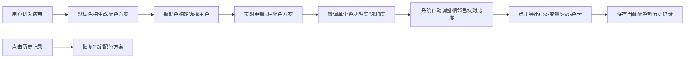

## 1. 产品概述
色彩韵律是一款面向设计师的交互式配色板应用，基于孟塞尔色彩理论提供专业的色彩搭配方案。用户通过环形色相轮选取主色后，系统自动生成5种和谐配色方案，支持实时微调并导出为CSS变量和SVG色卡，大幅提升设计师的配色效率。

## 2. 核心功能

### 2.1 功能模块
1. **色相轮交互模块**：环形渐变色相轮，支持拖拽选取色相，实时显示色值和色名
2. **配色生成模块**：基于选中色相生成5种专业配色方案
3. **色块微调模块**：每个色块支持明度和饱和度独立调节，自动维持对比度
4. **导出功能模块**：一键导出CSS变量代码和SVG色卡文件
5. **历史记录模块**：记录最近10次配色方案，支持一键恢复

### 2.2 页面详情
| 页面名称 | 模块名称 | 功能描述 |
|-----------|-------------|---------------------|
| 主页面 | 色相轮区域 | 320px环形色相轮，可拖动手柄选取色相，显示十六进制值和色名 |
| 主页面 | 配色方案面板 | 展示5种配色方案（单色、互补、三角、分裂互补、类似色），每种4个色块 |
| 主页面 | 色块微调区域 | 每个色块附明度/饱和度滑块，实时更新颜色，自动维持对比度 |
| 主页面 | 导出面板 | 右上角固定面板，含导出CSS变量和SVG色卡两个按钮 |
| 主页面 | 历史记录面板 | 左侧可折叠面板，展示最近10次配色记录 |

## 3. 核心流程



## 4. 用户界面设计

### 4.1 设计风格
- **主色调**：深色背景 #0F172A，卡片背景 #FFFFFF，强调色 #10B981（导出CSS）和 #6366F1（导出SVG）
- **布局风格**：左右两栏布局，左侧历史面板+中间色相轮区域+右侧配色面板
- **字体**：使用 Space Grotesk 作为显示字体，Inter 作为正文字体（需引入Google Fonts）
- **动效**：所有按钮hover时scale 1.05放大0.2s过渡，色相轮手柄拖拽0.1s平滑跟随
- **卡片设计**：圆角12px，1px浅灰边框 #E2E8F0，色块占60%高度

### 4.2 页面设计概述
| 页面名称 | 模块名称 | UI元素 |
|-----------|-------------|-------------|
| 主页面 | 色相轮区域 | 320px直径环形渐变，中心白色手柄(12px半径，2px深灰边框)，下方显示十六进制值和色名 |
| 主页面 | 配色方案卡片 | 180px宽卡片，gap 12px，色块占60%高度，颜色信息40%居中显示12px深灰文字 |
| 主页面 | 滑块控件 | 轨道宽160px高6px，圆角3px，渐变背景从白色到当前色块颜色 |
| 主页面 | 导出面板 | 右上角固定，背景#0F172A，圆角8px，内边距12px，两个彩色按钮 |
| 主页面 | 历史面板 | 左侧默认展开，宽200px，背景#1E293B，圆角0 8px 8px 0，可折叠 |

### 4.3 响应式
- **桌面端(>=1024px)**：左右三栏布局（历史+色相轮+配色面板）
- **平板端(768px-1023px)**：两栏布局，色相轮和配色面板堆叠
- **移动端(<768px)**：单栏布局，色相轮宽度100%，色块卡片宽度100%
- 所有触摸操作支持，滑块和拖拽区域优化触控体验

### 4.4 性能要求
- 色块微调时调色板重渲染响应时间 < 50ms
- 色相轮拖拽帧率 >= 55fps
- 使用 useMemo/useCallback 优化重渲染
```
