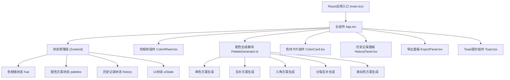

## 1. 架构设计



## 2. 技术描述
- **前端框架**：React@18 + TypeScript@5 + Vite@5
- **构建工具**：Vite@5 + @vitejs/plugin-react@4
- **状态管理**：Zustand@4（轻量级，性能优异）
- **样式方案**：TailwindCSS@3 + CSS Modules（复杂组件使用）
- **图标库**：Lucide React
- **字体**：Google Fonts (Space Grotesk + Inter)

## 3. 核心文件结构
```
d:\Pro\tasks\auto171\
├── package.json
├── index.html
├── tsconfig.json
├── vite.config.js
├── tailwind.config.js
├── postcss.config.js
└── src/
    ├── main.tsx              # 应用入口
    ├── App.tsx               # 主组件，布局与状态协调
    ├── ColorWheel.tsx        # 环形色相轮组件
    ├── ColorCard.tsx         # 单个色块卡片组件
    ├── PaletteGenerator.ts   # 配色方案生成算法
    ├── store/
    │   └── usePaletteStore.ts # Zustand状态管理
    ├── components/
    │   ├── HistoryPanel.tsx  # 历史记录面板
    │   ├── ExportPanel.tsx   # 导出功能面板
    │   └── Toast.tsx         # Toast提示组件
    ├── utils/
    │   ├── colorUtils.ts     # 颜色转换工具函数
    │   └── contrastUtils.ts  # 对比度计算工具
    └── types/
        └── index.ts          # TypeScript类型定义
```

## 4. 类型定义
```typescript
// 颜色HSL表示
interface HSLColor {
  h: number;      // 色相 0-360
  s: number;      // 饱和度 0-100
  l: number;      // 明度 0-100
}

// 单个色块
interface ColorSwatch {
  id: string;
  hsl: HSLColor;
  hex: string;
  rgb: string;
}

// 配色方案
interface Palette {
  id: string;
  name: string;       // 单色、互补、三角、分裂互补、类似色
  colors: ColorSwatch[];
}

// 历史记录
interface HistoryItem {
  id: string;
  timestamp: number;
  hue: number;
  palettes: Palette[];
}

// 应用状态
interface PaletteState {
  hue: number;
  palettes: Palette[];
  history: HistoryItem[];
  toast: { show: boolean; message: string };
  setHue: (hue: number) => void;
  updateColor: (paletteId: string, colorId: string, hsl: Partial<HSLColor>) => void;
  saveToHistory: () => void;
  restoreFromHistory: (item: HistoryItem) => void;
  showToast: (message: string) => void;
}
```

## 5. 核心算法

### 5.1 配色方案生成算法
```typescript
// 基于孟塞尔色彩理论的5种配色方案
function generatePalettes(hue: number): Palette[] {
  return [
    generateMonochromatic(hue),    // 单色：同一色相不同明度
    generateComplementary(hue),    // 互补：色相+180度
    generateTriadic(hue),          // 三角：正三角120度
    generateSplitComplementary(hue), // 分裂互补：±150度
    generateAnalogous(hue),        // 类似色：±30度
  ];
}
```

### 5.2 对比度维持算法
```typescript
// 调整相邻色块亮度对比度不小于30%
function ensureContrast(colors: HSLColor[]): HSLColor[] {
  // 计算相对亮度
  const getLuminance = (hsl: HSLColor) => hsl.l / 100;
  // 对比度 = |L1 - L2| / max(L1, L2)
  // 递归调整直到所有相邻对比度 >= 30%
}
```

### 5.3 颜色转换算法
```typescript
function hslToHex(h: number, s: number, l: number): string
function hslToRgb(h: number, s: number, l: number): string
function hexToHsl(hex: string): HSLColor
function getColorName(h: number, s: number, l: number): string
```

## 6. 性能优化策略

1. **色相轮拖拽优化**：
   - 使用 `requestAnimationFrame` 处理拖拽更新
   - 节流事件处理，确保 >= 55fps
   - 缓存Canvas绘制，避免全量重绘

2. **色块微调优化**：
   - 使用 `useCallback` 包装事件处理函数
   - 使用 `useMemo` 缓存计算结果
   - 色块组件使用 `React.memo` 防止不必要重渲染
   - 状态更新使用批量更新减少重渲染次数

3. **状态管理优化**：
   - Zustand支持selector，组件只订阅所需状态
   - 避免在渲染中创建新对象/数组

## 7. 响应式断点
```css
/* 桌面端 >= 1024px */
@media (min-width: 1024px) { ... }

/* 平板端 768px - 1023px */
@media (min-width: 768px) and (max-width: 1023px) { ... }

/* 移动端 < 768px */
@media (max-width: 767px) { ... }
```
