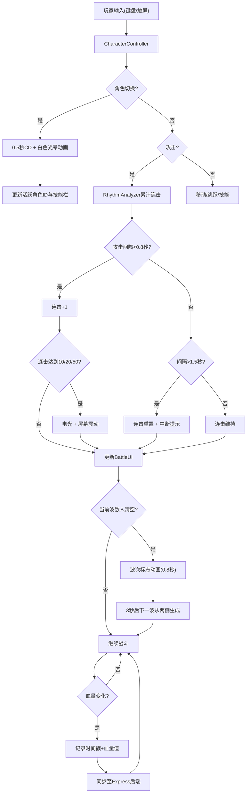

## 1. 产品概述

节奏裂隙是一款结合动作节奏与多角色切换的横版过关游戏，玩家在三位风格迥异的角色间灵活切换，通过连续攻击维持连击节奏，在波次推进的敌人中生存并突破关卡。
- 面向独立游戏团队，提供分模块可复用的工程模板，解决角色切换逻辑、技能联动和战斗节奏监控的代码组织难题
- 模块化架构，角色控制与战斗节奏分析完全解耦，可独立开发和替换

## 2. 核心功能

### 2.1 用户角色

| 角色 | 注册方式 | 核心权限 |
|------|----------|----------|
| 玩家 | 直接进入 | 控制角色、切换角色、施放技能、查看战斗数据 |

### 2.2 功能模块

1. **游戏主场景**：角色动画渲染、敌人AI、攻击特效、波次推进
2. **角色控制模块**：三位角色切换、技能施放、移动与跳跃
3. **战斗节奏模块**：连击评价、血量时间轴、伤害记录
4. **战斗UI**：连击计数器、血条、技能栏、波次信息
5. **数据后端**：角色状态持久化、关卡进度与连击记录存储

### 2.3 页面详情

| 页面名称 | 模块名称 | 功能描述 |
|----------|----------|----------|
| 游戏主场景 | GameScene | 订阅角色Context与节奏Context，每帧合成场景渲染至Canvas，包含角色动画、敌人AI和攻击特效 |
| 战斗界面 | BattleUI | 显示连击计数器（48px金色数字）、红色渐变血条、技能冷却图标，血条受击时白色闪烁，连击>20时蓝色阴影 |
| 角色控制器 | CharacterController | 接收键盘/触屏输入，管理角色移动、跳跃、技能施放，切换角色时0.5秒CD+0.3秒白色光晕动画 |
| 节奏分析器 | RhythmAnalyzer | 每0.1秒检测攻击间隔，<0.8秒累加连击，>1.5秒重置连击并显示中断提示，10/20/50连击触发电光和屏幕震动 |
| 血量时间轴 | HealthTimeline | 后端记录血量变化（时间戳+血量值），战斗结束后导出JSON，界面左下角展示时间轴曲线图 |

## 3. 核心流程

玩家进入游戏后，通过键盘或触屏操控当前活跃角色移动和攻击。攻击事件触发节奏分析器累计连击，连击评价实时反馈到战斗UI。玩家可在三位角色间切换以应对不同战斗场景。每波敌人（3-5小怪+1小Boss）清空后，3秒后下一波从两侧随机生成包围玩家。战斗中血量变化被实时记录，战后可导出分析。

## 4. 界面设计

### 4.1 设计风格

- 主色调：深空蓝色渐变背景（#0A0B1E → #1A1B3E），营造太空裂隙氛围
- 辅助色：金色连击数字（#F59E0B）、紫色技能栏渐变（#6366F1 → #8B5CF6）、红色血条渐变（#EF4444 → #DC2626）
- 角色风格：等轴插画风格（Isometric Illustration）
- 按钮样式：圆形技能图标（48px，圆角50%），半透明背景，选中时紫色渐变+2px白色发光边框
- 字体：连击数字48px粗体金色，波次信息12px加粗白色
- 布局：全屏Canvas游戏场景 + 浮动UI叠加层

### 4.2 页面设计概览

| 页面名称 | 模块名称 | UI元素 |
|----------|----------|--------|
| 游戏主场景 | GameScene | 深空蓝渐变背景、等轴角色精灵、敌人精灵、攻击特效、白色光晕动画、电光特效、屏幕震动 |
| 战斗界面 | BattleUI | 连击计数器(48px金色，>20时2px蓝色阴影)、红色渐变血条(受击白色闪烁0.2秒)、技能栏(3个圆形图标48px，底部居中)、波次信息(右上12px白色加粗) |
| 血量时间轴 | HealthTimeline | 左下角曲线图、JSON导出按钮 |
| 触屏手势 | TouchGesture | 左半屏滑动移动、右半屏点击技能、上滑跳跃、下滑切换角色、白色渐隐轨迹线(0.5秒) |

### 4.3 响应式设计

- 桌面优先设计，支持键盘操控
- 移动端（宽度<768px）：
  - 技能栏图标缩小至36px横向排列
  - 连击数字缩小至32px
  - 启用触屏手势操控（左半屏滑动移动，右半屏技能）
- 所有动画过渡（角色光晕、波次切换、连击中断）持续0.3-0.8秒，使用ease-out缓动

### 4.4 动画规范

| 动画类型 | 持续时间 | 缓动函数 | 触发条件 |
|----------|----------|----------|----------|
| 角色切换光晕 | 0.3秒 | ease-out | 角色切换瞬间 |
| 血条受击闪烁 | 0.2秒 | ease-out | 受到攻击时 |
| 连击中断提示 | 0.5秒淡入+0.5秒淡出 | ease-out | 连击重置时 |
| 波次标志上浮 | 0.8秒 | ease-out | 清波后 |
| 波次信息淡入淡出 | 0.5秒 | ease-out | 波次切换时 |
| 触屏轨迹渐隐 | 0.5秒 | ease-out | 手势划出后 |
| 10/20/50连击电光 | 0.5秒 | ease-out | 连击里程碑 |
| 屏幕震动 | 0.3秒 | ease-out | 连击里程碑 |
