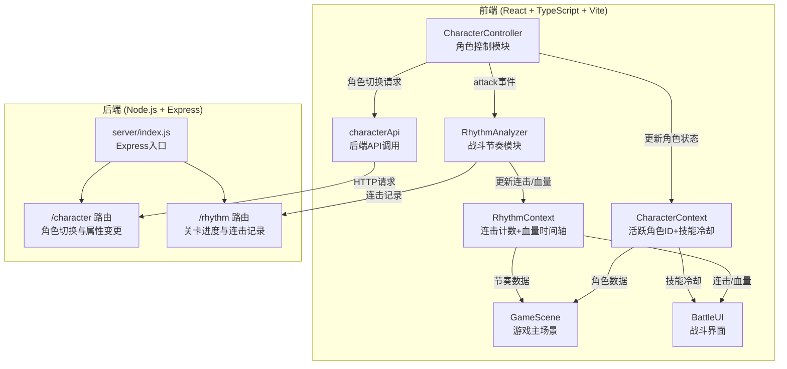
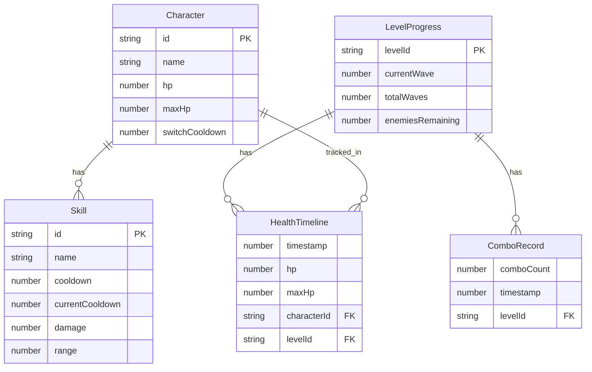

## 1. 架构设计



### 数据流向详述

1. **输入层**：CharacterController监听键盘/触屏输入 → 更新角色内部状态
2. **Context层**：CharacterController写入CharacterContext（活跃角色ID、技能冷却数据）；RhythmAnalyzer写入RhythmContext（连击计数、血量时间轴）
3. **渲染层**：GameScene订阅两个Context → 每帧合成场景 → Canvas渲染；BattleUI订阅RhythmContext → 更新UI显示
4. **持久化层**：CharacterController通过characterApi发送HTTP请求至Express后端；RhythmAnalyzer通过rhythm路由保存连击记录

## 2. 技术说明

- 前端：React@18 + TypeScript + Vite + CSS Modules（不使用Tailwind，游戏场景需精细CSS控制）
- 初始化工具：vite-init (react-express-ts 模板)
- 后端：Express@4 + Node.js
- 数据库：内存数据存储（游戏原型阶段），战后导出JSON文件
- 状态管理：React Context（两个独立Context分别服务角色模块和节奏模块）

## 3. 路由定义

| 路由 | 用途 |
|------|------|
| / | 游戏主页面（Vite开发服务器） |
| GET /api/character/:id | 获取指定角色状态 |
| PUT /api/character/:id | 更新角色属性（切换/技能冷却） |
| GET /api/character | 获取所有角色列表 |
| GET /api/rhythm/progress/:levelId | 获取关卡进度 |
| POST /api/rhythm/combo | 保存连击记录 |
| GET /api/rhythm/health-timeline/:levelId | 获取血量时间轴数据 |
| POST /api/rhythm/health-timeline | 保存血量时间轴数据 |

## 4. API定义

### 4.1 角色相关类型

```typescript
interface Character {
  id: 'berserker' | 'ranger' | 'sage';
  name: string;
  hp: number;
  maxHp: number;
  skills: Skill[];
  switchCooldown: number;
  position: { x: number; y: number };
}

interface Skill {
  id: string;
  name: string;
  cooldown: number;
  currentCooldown: number;
  damage: number;
  range: number;
}
```

### 4.2 节奏相关类型

```typescript
interface ComboRecord {
  comboCount: number;
  timestamp: number;
  levelId: string;
}

interface HealthTimelinePoint {
  timestamp: number;
  hp: number;
  maxHp: number;
  characterId: string;
}

interface LevelProgress {
  levelId: string;
  currentWave: number;
  totalWaves: number;
  enemiesRemaining: number;
  comboRecord: number;
}
```

### 4.3 请求/响应Schema

```typescript
// PUT /api/character/:id
interface UpdateCharacterRequest {
  hp?: number;
  activeSkill?: string;
  switchTriggered?: boolean;
}
interface UpdateCharacterResponse {
  character: Character;
  saved: boolean;
}

// POST /api/rhythm/combo
interface SaveComboRequest {
  comboCount: number;
  levelId: string;
  timestamp: number;
}
interface SaveComboResponse {
  saved: boolean;
  bestCombo: number;
}

// POST /api/rhythm/health-timeline
interface SaveHealthTimelineRequest {
  levelId: string;
  timeline: HealthTimelinePoint[];
}
interface SaveHealthTimelineResponse {
  saved: boolean;
  pointCount: number;
}
```

## 5. 服务端架构图


### 5.1 文件职责

| 文件 | 职责 |
|------|------|
| server/index.js | Express入口，挂载路由和中间件 |
| server/routes/character.js | 角色路由：切换、属性变更查询 |
| server/routes/rhythm.js | 节奏路由：关卡进度、连击记录、血量时间轴 |
| server/store/gameStore.js | 内存数据存储，管理角色状态和战斗记录 |

## 6. 数据模型

### 6.1 数据模型定义



### 6.2 初始数据

三位预设角色初始数据：
- 近战狂战士(berserker)：HP 150, 技能为重击(30伤害, 1.5秒CD)、旋风斩(20伤害, 3秒CD)、战吼(0伤害, 5秒CD增益)
- 远程游侠(ranger)：HP 100, 技能为精准射击(25伤害, 1秒CD)、多重箭(15伤害×3, 4秒CD)、闪避(0伤害, 2秒CD位移)
- 治疗贤者(sage)：HP 80, 技能为治疗术(恢复30HP, 3秒CD)、圣光弹(15伤害, 2秒CD)、护盾(减伤50%, 8秒CD)

## 7. 文件结构与调用关系

```
节奏裂隙/
├── package.json                          # 依赖：react, react-dom, typescript, vite, @vitejs/plugin-react, axios, express, cors
├── vite.config.js                        # Vite构建配置，代理/api至Express
├── tsconfig.json                         # 严格模式，target ES2020
├── index.html                            # 入口页面
├── src/
│   ├── main.tsx                          # React入口，挂载App
│   ├── App.tsx                           # 根组件，包裹Context Provider
│   ├── contexts/
│   │   ├── CharacterContext.tsx           # 角色Context：活跃角色ID + 技能冷却数据
│   │   └── RhythmContext.tsx              # 节奏Context：连击计数 + 血量时间轴数据
│   ├── modules/
│   │   ├── character/
│   │   │   └── CharacterController.tsx    # 角色控制：键盘/触屏输入 → 角色状态 → CharacterContext
│   │   └── rhythm/
│   │       └── RhythmAnalyzer.tsx         # 节奏分析：attack事件 → 连击累计 → RhythmContext
│   ├── scenes/
│   │   └── GameScene.tsx                 # 主场景：订阅两Context → Canvas渲染
│   ├── components/
│   │   └── BattleUI.tsx                  # 战斗UI：订阅RhythmContext → 连击/血条/技能栏
│   ├── api/
│   │   └── characterApi.ts               # 后端API：CharacterController调用 → Express
│   └── types/
│       └── game.ts                       # 共享类型定义
├── server/
│   ├── index.js                          # Express入口：挂载/character和/rhythm路由
│   ├── routes/
│   │   ├── character.js                  # 角色路由：切换与属性变更
│   │   └── rhythm.js                     # 节奏路由：关卡进度与连击记录
│   └── store/
│       └── gameStore.js                  # 内存数据存储
```

### 调用关系

- `CharacterController` → 写入 `CharacterContext` → 被订阅于 `GameScene`、`BattleUI`
- `CharacterController` → 发出attack事件 → `RhythmAnalyzer` → 写入 `RhythmContext` → 被订阅于 `GameScene`、`BattleUI`
- `CharacterController` → 调用 `characterApi` → HTTP请求 → Express `/character` 路由
- `RhythmAnalyzer` → 调用 `rhythmApi` → HTTP请求 → Express `/rhythm` 路由
- `GameScene` → 订阅两Context → Canvas渲染循环
- `BattleUI` → 订阅 `RhythmContext` + `CharacterContext` → UI更新

## 8. 性能约束

- 同屏≤50个独立单位时稳定60fps（使用requestAnimationFrame + 对象池）
- 连击评价CPU单次计算≤0.5ms（纯数值运算，无DOM操作）
- Canvas渲染使用分层策略：背景层(静态) + 角色层(动态) + 特效层(临时)
- 触屏轨迹线使用CSS animation而非JS逐帧绘制，降低CPU开销
