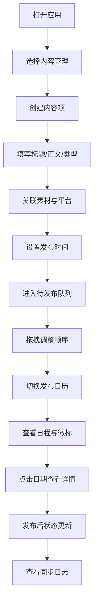

## 1. 产品概述
跨平台内容发布管理应用，帮助独立创作者和小团队统一管理多平台（Twitter、Instagram、YouTube等）的内容发布计划、素材资源和同步进度，解决手动记录日程、重复上传和状态不同步导致的效率低下与发布混乱问题。

## 2. 核心功能

### 2.1 用户角色
| 角色 | 注册方式 | 核心权限 |
|------|----------|----------|
| 独立创作者 | 无需注册（本地使用） | 创建/编辑/删除内容项、管理素材、查看日历与日志 |

### 2.2 功能模块
1. **内容管理页面**：内容卡片列表、创建内容弹窗、拖拽排序、平台关联与预览、状态指示器、同步日志抽屉
2. **发布日历页面**：月份日历视图、日期详情展开面板、发布数量徽标
3. **素材管理页面**：素材网格视图、批量上传（拖拽区域）、进度条、素材关联与删除

### 2.3 页面详情
| 页面名称 | 模块名称 | 功能描述 |
|----------|----------|----------|
| 内容管理 | 内容卡片列表 | 以卡片形式展示待发布内容，包含标题、摘要、素材缩略图、类型标签、平台关联 |
| 内容管理 | 添加内容弹窗 | 创建新内容项，填写标题、正文、选择类型标签、上传/关联素材、选择目标平台 |
| 内容管理 | 拖拽排序队列 | 通过拖拽调整发布顺序，行高80px，拖拽时有阴影和位移动画 |
| 内容管理 | 平台预览框 | 选择平台后右侧弹出该平台原生风格预览 |
| 内容管理 | 状态指示器 | 卡片右上角显示发布状态圆点（待发布/发布中/已发布/失败） |
| 内容管理 | 同步日志抽屉 | 面板底部可折叠抽屉，按时间倒序显示跨平台同步日志 |
| 发布日历 | 月份视图 | 显示当月日历，每个日期格子上方显示发布数量徽标 |
| 发布日历 | 日期详情面板 | 点击日期格展开当日所有发布项详细列表 |
| 发布日历 | 日期选择器 | 扁平化日历，默认选中当天，可选未来30天 |
| 素材管理 | 资源库网格 | 120x120px网格展示素材，悬停显示操作覆盖层 |
| 素材管理 | 批量上传区 | 渐变虚线边框拖拽区域，拖入时变色并显示提示文字 |
| 素材管理 | 上传进度条 | 线性渐变进度条，显示百分比 |

## 3. 核心流程

用户打开应用 → 在左侧导航选择"内容管理" → 点击添加内容 → 填写标题/正文/类型 → 关联素材与目标平台 → 设置发布时间 → 内容进入待发布队列 → 可拖拽调整发布顺序 → 切换到"发布日历"查看日程 → 日历格子显示发布数量徽标 → 点击日期查看详情 → 发布后状态自动更新 → 在同步日志抽屉查看各平台发布结果

## 4. 用户界面设计

### 4.1 设计风格
- 主色调：#6366F1（靛蓝紫），辅助色：#8B5CF6（浅紫）
- 深色主题：主背景#111827，卡片背景#1F2937，文字主色#F9FAFB，次要文字#9CA3AF
- 按钮风格：圆角8px，悬停亮度提升20%，点击缩放0.95
- 字体：中文使用系统默认（微软雅黑/PingFang），英文使用Outfit作为显示字体，搭配Noto Sans SC作为正文字体
- 布局风格：左侧固定导航栏 + 主内容区域，卡片式布局
- 图标风格：线性图标，20px，选中时带渐变背景

### 4.2 页面设计概览
| 页面名称 | 模块名称 | UI元素 |
|----------|----------|--------|
| 内容管理 | 左侧面板 | 宽350px，背景#1F2937，圆角12px，内边距16px，淡入+上移动画 |
| 内容管理 | 内容卡片 | 标题50字符、摘要150字可展开、素材缩略图80x80圆角8px悬停放大1.1倍、类型标签圆角6px #6366F1白字12px |
| 内容管理 | 拖拽队列 | 行高80px，边距8px，拖拽半透明阴影+0.15s位移动画 |
| 内容管理 | 平台预览 | 模拟平台原生UI风格，右侧弹出 |
| 内容管理 | 状态指示器 | 圆点10px，渐变色：待发布#6B7280、发布中#3B82F6呼吸动画、已发布#10B981、失败#EF4444红色叹号 |
| 内容管理 | 同步日志抽屉 | 高200px，可折叠，弹性动画0.3s |
| 发布日历 | 月份视图 | 响应式宽度，日期格子上方徽标（1-2绿#10B981、3-4黄#F59E0B、5+红#EF4444） |
| 发布日历 | 日期选择器 | 扁平化日历，默认选中当天，选中日期圆点标记 |
| 素材管理 | 资源库网格 | 每项120x120px，圆角8px，悬停覆盖层含"删除"和"关联内容"按钮 |
| 素材管理 | 上传区域 | 渐变虚线边框，拖入背景#374151+"松手上传"，进度条渐变#6366F1→#8B5CF6 |

### 4.3 响应式设计
- 桌面端（最小宽度1024px）：左侧固定导航栏 + 主内容区域并排布局
- 移动端（最小宽度375px）：左侧导航收起为底部Tab栏，主内容全宽展示，面板折叠为可展开抽屉
- 触摸优化：拖拽排序支持触摸手势，按钮尺寸不小于44px触摸目标

### 4.4 动画规范
- 卡片/面板加载：淡入+上移，持续0.3s，ease-out缓动
- 按钮悬停：亮度提升20%
- 按钮点击：缩放0.95，持续0.1s
- 导航Tab切换：选中时0.3s从左至右滑动条动画
- 素材缩略图悬停：放大1.1倍，0.2s过渡
- 拖拽项：半透明阴影+0.15s上下位移
- 同步日志抽屉：弹性动画0.3s
- 发布中状态：呼吸动画
