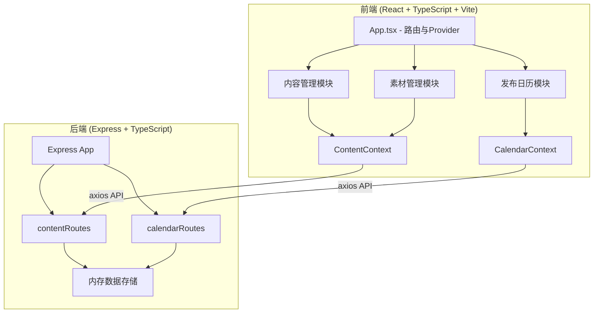
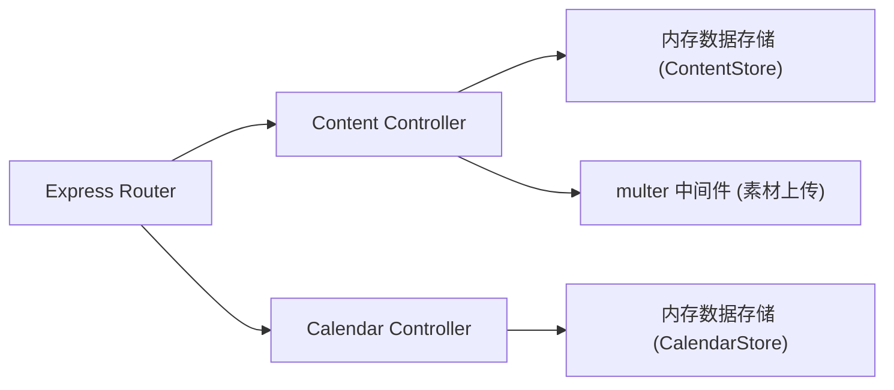
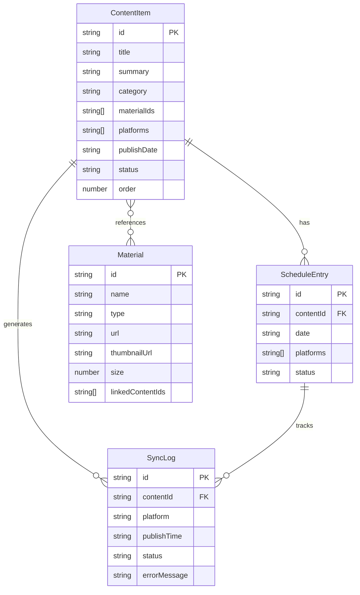

## 1. 架构设计



## 2. 技术说明
- 前端：React@18 + TypeScript + Vite + react-beautiful-dnd + date-fns + axios
- 初始化工具：Vite
- 后端：Express@4 + TypeScript（使用ts-node运行或编译为JS）
- 数据库：内存数据存储（使用Map/数组模拟，服务重启后数据重置）
- 样式方案：CSS Modules + CSS变量（深色主题）

## 3. 路由定义
| 路由 | 用途 |
|------|------|
| / | 内容管理主页面（默认） |
| /calendar | 发布日历页面 |
| /materials | 素材管理页面 |

## 4. API定义

### 4.1 内容管理API
| 方法 | 路径 | 说明 | 请求体 | 响应 |
|------|------|------|--------|------|
| GET | /api/content | 获取所有内容项 | - | ContentItem[] |
| POST | /api/content | 创建内容项 | CreateContentDTO | ContentItem |
| PUT | /api/content/:id | 更新内容项 | UpdateContentDTO | ContentItem |
| DELETE | /api/content/:id | 删除内容项 | - | { success: boolean } |
| PUT | /api/content/:id/status | 更新发布状态 | { status: PublishStatus } | ContentItem |
| PUT | /api/content/reorder | 拖拽排序 | { orderedIds: string[] } | { success: boolean } |

### 4.2 素材管理API
| 方法 | 路径 | 说明 | 请求体 | 响应 |
|------|------|------|--------|------|
| GET | /api/materials | 获取素材列表（分页） | ?page=1&limit=20 | { items: Material[], total: number } |
| POST | /api/materials/upload | 上传素材 | FormData (multipart) | Material |
| DELETE | /api/materials/:id | 删除素材 | - | { success: boolean, linkedContent: number } |
| POST | /api/materials/:id/link | 关联内容项 | { contentId: string } | { success: boolean } |

### 4.3 发布日历API
| 方法 | 路径 | 说明 | 请求体 | 响应 |
|------|------|------|--------|------|
| GET | /api/calendar/:year/:month | 获取月度发布日程 | - | CalendarDay[] |
| POST | /api/calendar/schedule | 安排发布 | { contentId: string, date: string, platforms: string[] } | ScheduleEntry |
| PUT | /api/calendar/schedule/:id | 更新日程 | UpdateScheduleDTO | ScheduleEntry |
| GET | /api/calendar/logs | 获取同步日志 | ?contentId=xxx | SyncLog[] |
| POST | /api/calendar/simulate-publish/:id | 模拟发布 | - | SyncLog[] |

### 4.4 TypeScript类型定义

```typescript
type ContentCategory = '文章' | '短视频' | '图文'
type PublishStatus = '待发布' | '发布中' | '已发布' | '失败'
type Platform = 'Twitter' | 'Instagram' | 'YouTube'

interface ContentItem {
  id: string
  title: string
  summary: string
  category: ContentCategory
  materialIds: string[]
  platforms: Platform[]
  publishDate: string | null
  status: PublishStatus
  order: number
  createdAt: string
  updatedAt: string
}

interface Material {
  id: string
  name: string
  type: 'image' | 'video'
  url: string
  thumbnailUrl: string
  size: number
  linkedContentIds: string[]
  createdAt: string
}

interface CalendarDay {
  date: string
  items: ScheduleEntry[]
  count: number
}

interface ScheduleEntry {
  id: string
  contentId: string
  date: string
  platforms: Platform[]
  status: PublishStatus
}

interface SyncLog {
  id: string
  contentId: string
  platform: Platform
  publishTime: string
  status: '成功' | '失败'
  errorMessage?: string
}
```

## 5. 服务端架构图



## 6. 数据模型

### 6.1 数据模型定义



### 6.2 文件组织
```
project-root/
├── package.json
├── index.html
├── vite.config.js
├── tsconfig.json
├── src/
│   ├── App.tsx
│   ├── context/
│   │   └── AppContext.tsx
│   ├── content/
│   │   └── ContentManager.tsx
│   ├── calendar/
│   │   └── CalendarModule.tsx
│   ├── services/
│   │   └── api.ts
│   └── ...
├── server/
│   ├── app.ts (编译后为 app.js)
│   ├── routes/
│   │   ├── contentRoutes.ts
│   │   └── calendarRoutes.ts
│   └── package.json
```
