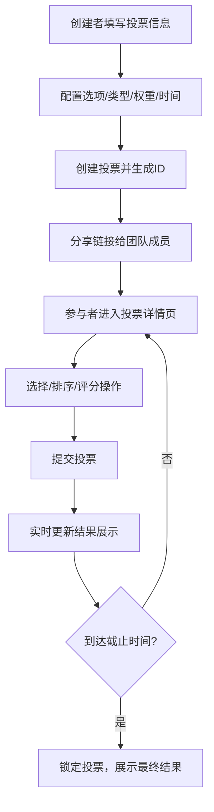

## 1. 产品概述

团队共识利器是一款面向远程办公团队的在线投票决策工具，解决传统投票工具功能单一、缺乏实时反馈和防刷票机制的痛点。支持权重投票、时间限制、四种投票类型（单选/多选/排名/评分），通过实时结果展示和热力图分析帮助团队做出公平、即时的决策。

## 2. 核心功能

### 2.1 用户角色
| 角色 | 参与方式 | 核心权限 |
|------|----------|----------|
| 投票创建者 | 创建投票链接分享 | 创建投票、设置权重规则、查看完整统计 |
| 投票参与者 | 通过ID或链接进入 | 根据权限参与投票、查看实时结果 |

### 2.2 功能模块
1. **投票创建页**：投票表单、选项管理、权重规则配置、时间设置
2. **投票详情页**：投票信息展示、倒计时、投票交互、实时结果展示
3. **结果展示模块**：票数统计、百分比进度条、环形图、热力图分析

### 2.3 页面详情
| 页面名称 | 模块名称 | 功能描述 |
|----------|----------|----------|
| 投票创建页 | 投票表单 | 收集标题、描述、投票类型、权重规则、截止时间 |
| 投票创建页 | 选项管理 | 动态添加/删除选项（2-10个），输入框聚焦动画 |
| 投票详情页 | 投票信息 | 展示标题、描述、剩余时间倒计时（脉冲动画） |
| 投票详情页 | 投票交互 | 根据类型渲染单选/多选/排名拖拽/评分滑块 |
| 投票详情页 | 实时结果 | 票数统计、进度条动画、环形图展示 |
| 投票详情页 | 热力图分析 | 按权重组展示选项支持倾向矩阵 |

## 3. 核心流程

用户创建投票 → 配置选项和规则 → 生成投票链接分享 → 参与者通过链接进入 → 根据投票类型完成选择/排序/评分 → 提交投票 → 实时更新结果统计 → 截止时间到达自动锁定投票

## 4. 用户界面设计

### 4.1 设计风格
- **主背景色**：#0F172A（深色主题）
- **卡片背景**：#1E293B
- **文字主色**：#F1F5F9
- **辅助色**：#94A3B8
- **主按钮渐变**：#3B82F6 → #2563EB
- **成功色**：#10B981
- **警告色**：#EF4444
- **预设色板**：#3B82F6, #10B981, #F59E0B, #EF4444, #8B5CF6, #EC4899
- **按钮圆角**：8px
- **卡片圆角**：8px
- **热力块**：40x40px，圆角4px

### 4.2 页面设计概述
| 页面名称 | 模块名称 | UI元素 |
|----------|----------|--------|
| 投票创建页 | 表单区域（50%宽） | 深色输入框，聚焦时边框变色动画（0.3s），渐变提交按钮 |
| 投票创建页 | 选项添加区 | 动态添加/删除选项，输入框聚焦放大+边框变色 |
| 投票详情页 | 顶部区域 | 投票标题、倒计时（红色#EF4444，每秒缩放1.05脉冲动画） |
| 投票详情页 | 中间区域 | 选项列表（排名类型可拖拽，圆角8px，背景#F8FAFC，拖拽缩放1.05+阴影） |
| 投票详情页 | 底部区域 | ResultBoard实时结果（进度条动画0.5s ease-out，环形图，热力图矩阵） |
| 投票详情页 | 结束横幅 | 背景#FEF3C7，文字#D97706，圆角8px |

### 4.3 响应式
- **桌面端（>1024px）**：投票区与结果区并排显示
- **平板（768-1024px）**：垂直排列
- **手机（<768px）**：全屏单列，选项卡片宽度自适应
- **触摸优化**：按钮和输入框最小触摸目标44px

## 5. 性能约束
- 页面初始加载时间 ≤ 2秒（渐进式加载）
- 实时结果WebSocket推送延迟 ≤ 500ms
- 热力图渲染帧率稳定60fps（100个单元格以内）
