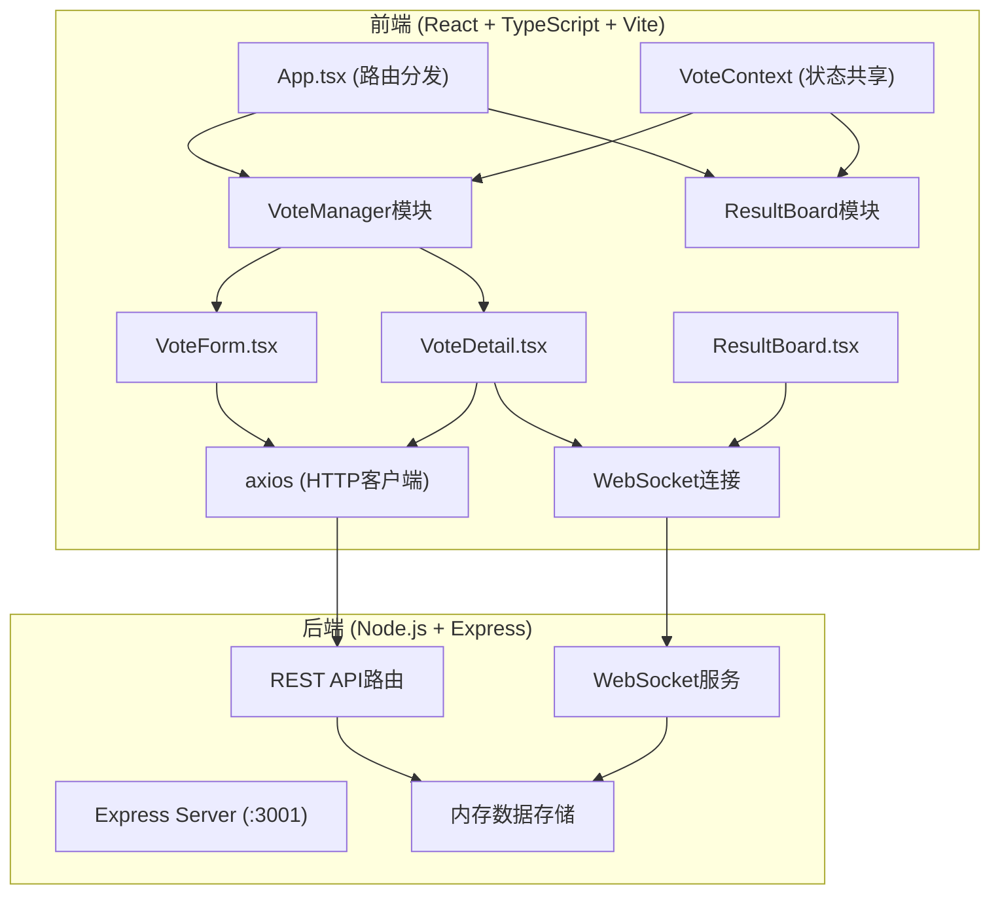
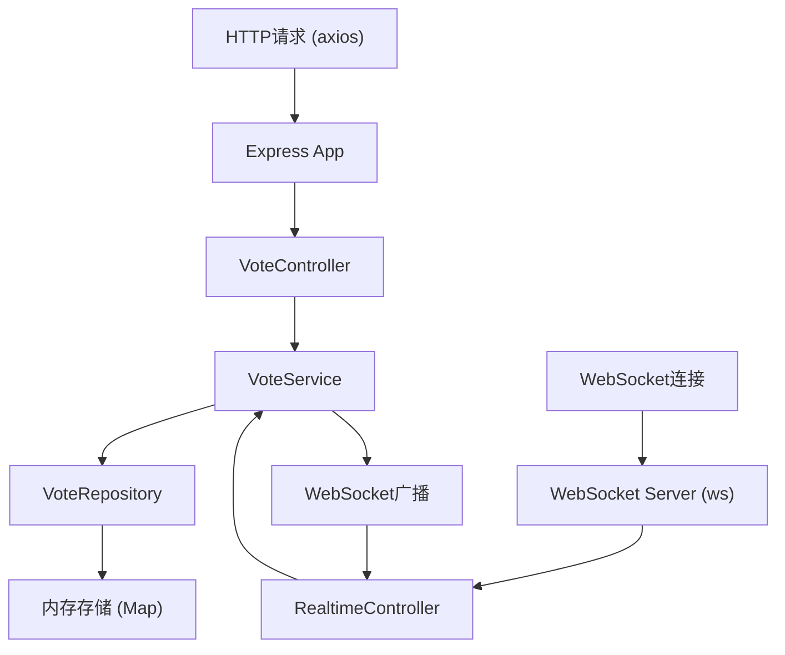
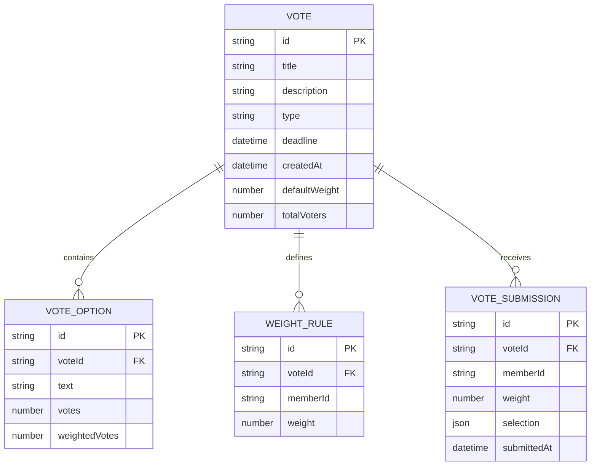

## 1. 架构设计



## 2. 技术描述
- **前端**：React 18 + TypeScript + Vite + React Router v6
- **图表库**：Recharts（环形图）
- **HTTP客户端**：axios
- **实时通信**：原生WebSocket API + ws库（后端）
- **后端**：Express 4 + ws（WebSocket服务）
- **初始化工具**：vite init
- **数据库**：内存存储（开发阶段）
- **样式方案**：原生CSS + CSS Modules

## 3. 路由定义
| 路由 | 页面组件 | 用途 |
|------|----------|------|
| / | VoteForm | 投票创建页 |
| /vote/:id | VoteDetail | 投票详情与参与页 |

## 4. API 定义

### 4.1 TypeScript 类型定义
```typescript
type VoteType = 'single' | 'multiple' | 'ranking' | 'rating';

interface VoteOption {
  id: string;
  text: string;
  votes: number;
  weightedVotes: number;
}

interface WeightRule {
  memberId: string;
  weight: number;
}

interface Vote {
  id: string;
  title: string;
  description: string;
  type: VoteType;
  options: VoteOption[];
  weightRules: WeightRule[];
  defaultWeight: number;
  deadline: string;
  createdAt: string;
  totalVoters: number;
}

interface VoteSubmission {
  memberId: string;
  selections: string[] | { optionId: string; rank: number }[] | { optionId: string; score: number }[];
}

interface VoteResult {
  optionId: string;
  votes: number;
  weightedVotes: number;
  percentage: number;
}

interface HeatmapCell {
  optionId: string;
  weightGroup: string;
  count: number;
}
```

### 4.2 REST API 接口
| 方法 | 路径 | 请求体 | 响应 | 用途 |
|------|------|--------|------|------|
| GET | /api/votes | - | Vote[] | 获取投票列表 |
| POST | /api/vote | { title, description, type, options, weightRules, defaultWeight, deadline } | Vote | 创建投票 |
| GET | /api/vote/:id | - | Vote | 获取投票详情 |
| POST | /api/vote/:id/vote | VoteSubmission | { success: boolean } | 提交投票 |
| GET | /api/vote/:id/results | - | VoteResult[] | 获取投票结果 |
| GET | /api/vote/:id/heatmap | - | HeatmapCell[] | 获取热力图数据 |

## 5. 服务器架构图



## 6. 数据模型

### 6.1 数据模型定义


## 7. 文件结构与数据流

```
项目根目录/
├── package.json
├── index.html
├── vite.config.js
├── tsconfig.json
├── server/                     # 后端Express服务
│   ├── index.js                # 服务器入口，初始化Express和WebSocket
│   ├── controllers/
│   │   ├── VoteController.js   # REST API路由处理
│   │   └── RealtimeController.js # WebSocket消息处理
│   ├── services/
│   │   └── VoteService.js      # 业务逻辑层
│   └── repositories/
│       └── VoteRepository.js   # 数据访问层（内存存储）
└── src/
    ├── main.tsx                # React渲染入口
    ├── App.tsx                 # 主应用，路由分发
    ├── types/
    │   └── index.ts            # TypeScript类型定义
    ├── context/
    │   └── VoteContext.tsx     # 全局状态Context
    ├── api/
    │   └── index.ts            # axios API封装
    ├── modules/
    │   ├── VoteManager/
    │   │   ├── VoteForm.tsx    # 投票创建表单
    │   │   └── VoteDetail.tsx  # 投票详情页
    │   └── ResultBoard/
    │       └── ResultBoard.tsx # 实时结果展示
    └── styles/
        └── global.css          # 全局样式
```

### 数据流说明
1. **创建投票**：VoteForm → axios POST /api/vote → VoteController → VoteService → VoteRepository → 广播更新 → 跳转/vote/:id
2. **参与投票**：VoteDetail → axios GET /api/vote/:id获取详情 → 用户操作 → axios POST /api/vote/:id/vote → 服务端广播 → ResultBoard实时更新
3. **实时更新**：服务端WebSocket推送 → ResultBoard接收 → 更新票数/百分比/环形图/热力图
