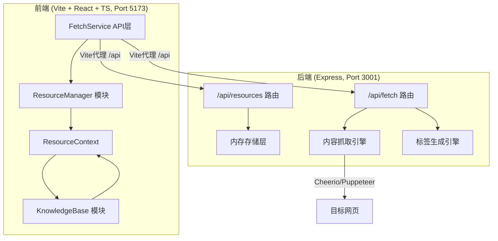
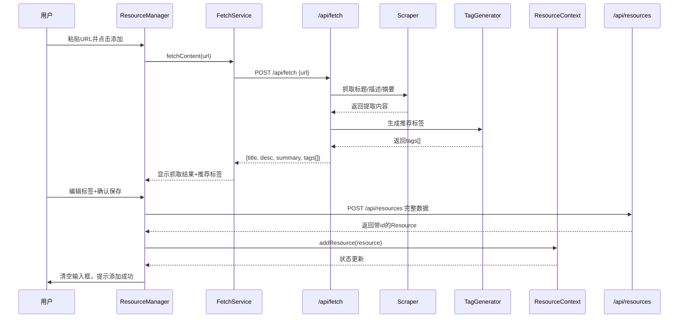
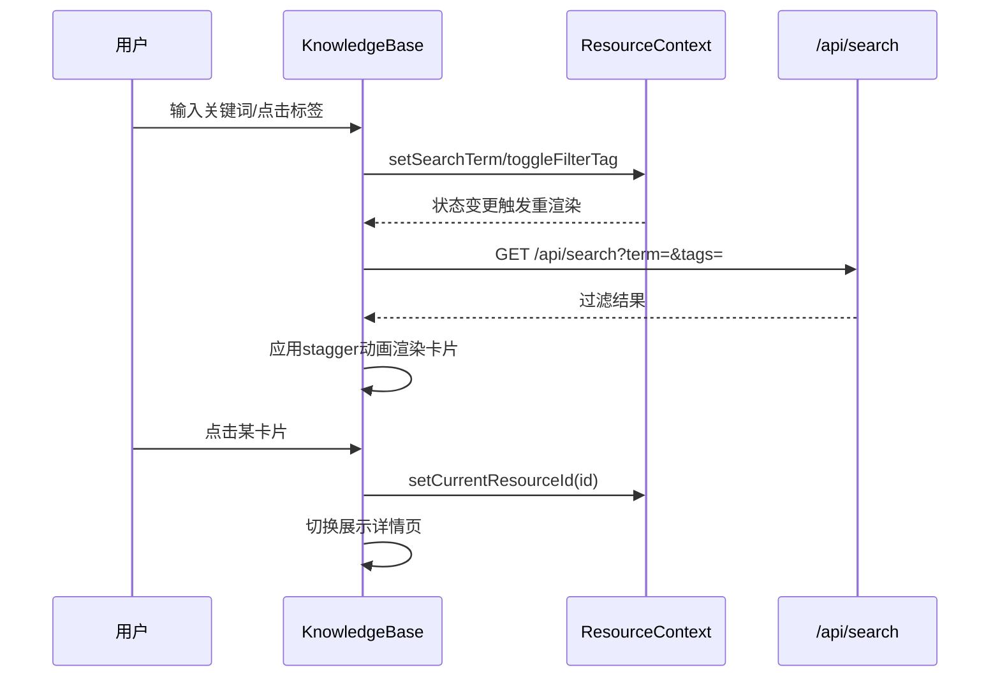
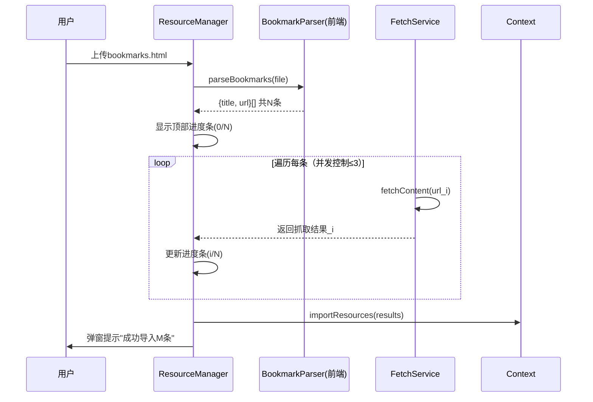

# 智能知识库资源管理系统 - 技术架构文档

## 1. 整体架构

### 1.1 架构概览



### 1.2 架构决策

| 决策 | 理由 |
|------|------|
| 前后端分离 | 便于独立部署和扩展，Vite热更新提升开发效率 |
| Context + Hooks 状态管理 | 两模块共享状态场景简单，避免Redux过度设计 |
| 内存存储 | 快速原型开发，后续可替换为文件/数据库持久化 |
| Cheerio轻量抓取 | 标题描述抓取足够高效，Puppeteer仅用于截图 |
| 关键词提取算法 | 轻量TF-IDF变体，满足3秒性能目标 |

---

## 2. 项目文件结构

```
auto179/
├── package.json                          # 统一管理前后端依赖
├── index.html                            # Vite入口页面
├── vite.config.js                        # Vite配置 + 代理
├── tsconfig.json                         # TypeScript严格模式
├── src/
│   ├── context/
│   │   └── ResourceContext.tsx           # 共享状态Context
│   ├── modules/
│   │   ├── ResourceManager/
│   │   │   ├── index.tsx                 # 资源管理UI入口
│   │   │   ├── FetchService.ts           # 后端API调用封装
│   │   │   └── styles.module.css         # 模块样式（可选）
│   │   └── KnowledgeBase/
│   │       └── index.tsx                 # 知识库展示UI入口
│   └── main.tsx                          # React应用入口
└── server/
    ├── index.ts                          # Express应用入口
    ├── routes/
    │   ├── fetch.ts                      # 抓取/标签路由
    │   └── resources.ts                  # 存储/查询路由
    └── utils/
        ├── scraper.ts                    # Cheerio内容抓取
        ├── tagGenerator.ts               # 标签关键词提取
        └── bookmarkParser.ts             # 书签HTML解析
```

---

## 3. 数据模型设计

### 3.1 Resource 资源实体

```typescript
interface Resource {
  id: string;                    // UUID v4
  url: string;                   // 原始URL
  domain: string;                // 来源域名（派生）
  favicon: string;               // favicon URL
  title: string;                 // 页面标题
  description: string;           // 页面描述/Meta描述
  summary: string;               // 自动生成的内容摘要
  tags: string[];                // 标签数组（3-5个）
  screenshotUrl?: string;        // 页面截图URL（详情页用）
  notes?: string;                // 用户自定义笔记
  createdAt: number;             // 创建时间戳
}
```

### 3.2 Context 共享状态

```typescript
interface ResourceState {
  resources: Resource[];
  currentResourceId: string | null;
  searchTerm: string;
  filterTags: string[];
  sortBy: 'time' | 'title' | 'domain';
}

interface ResourceActions {
  addResource: (r: Omit<Resource, 'id' | 'createdAt'>) => void;
  removeResource: (id: string) => void;
  updateResource: (id: string, updates: Partial<Resource>) => void;
  setCurrentResourceId: (id: string | null) => void;
  setSearchTerm: (term: string) => void;
  toggleFilterTag: (tag: string) => void;
  clearFilters: () => void;
  importResources: (rs: Resource[]) => void;
}

type ResourceContextType = ResourceState & ResourceActions;
```

---

## 4. 核心流程设计

### 4.1 URL添加资源流程



### 4.2 搜索与筛选流程



### 4.3 书签批量导入流程



---

## 5. 模块详细设计

### 5.1 ResourceContext

**文件**：`src/context/ResourceContext.tsx`

- 使用 `createContext<ResourceContextType | null>(null)` 定义
- Provider 内部使用 `useReducer` 管理状态
- 导出 `useResourceContext()` 自定义Hook，空值检查
- 初始状态从 `localStorage` 持久化恢复（可选优化）

### 5.2 FetchService

**文件**：`src/modules/ResourceManager/FetchService.ts`

- axios实例配置 baseURL: `/api`
- `fetchContent(url: string)` → `POST /api/fetch`
- `submitTags(url: string, tags: string[])` → `POST /api/tags`
- `getResources()` → `GET /api/resources`
- `searchResources(params)` → `GET /api/search`
- `createResource(data)` → `POST /api/resources`
- `deleteResource(id)` → `DELETE /api/resources/:id`
- 统一错误处理：返回 `{ ok: boolean, data?, error? }` 格式

### 5.3 ResourceManager 模块

**文件**：`src/modules/ResourceManager/index.tsx`

核心子组件（文件内组织）：
- **UrlInputSection**：URL输入 + 添加按钮，loading状态
- **PreviewCard**：显示抓取到的标题/描述/摘要
- **TagEditor**：标签容器，支持增删改，每个标签带编辑/删除按钮
- **ImportSection**：书签文件上传 + 进度条显示

**关键状态**：
- `urlInput`：输入框值
- `fetching`：是否正在抓取
- `previewData`：抓取结果预览
- `editingTags`：用户编辑中的标签
- `importProgress`：导入进度 `{current, total, percentage}`

### 5.4 KnowledgeBase 模块

**文件**：`src/modules/KnowledgeBase/index.tsx`

核心子组件：
- **SearchBar**：固定顶部，带渐变背景+阴影，防抖搜索
- **FilterTree**：多级筛选（标签/时间/域名），可折叠
- **CardGrid**：响应式网格容器，stagger动画
- **ResourceCard**：单个卡片组件，hover动效
- **DetailView**：详情页，截图+摘要+笔记+操作按钮
- **HamburgerMenu**：平板端筛选树折叠

**样式实现**：
- 使用CSS Grid + `auto-fill minmax(280px, 320px)` 实现响应式
- stagger动画通过 `animation-delay: calc(index * 0.05s)`
- 骨架屏通过 `linear-gradient` 背景动画实现

### 5.5 fetch.ts 路由

**文件**：`server/routes/fetch.ts`

| 端点 | 方法 | 输入 | 输出 |
|------|------|------|------|
| `/api/fetch` | POST | `{url: string}` | `{title, description, summary, tags[], favicon, domain}` |
| `/api/tags` | POST | `{url, tags[]}` | `{success: true}` |

抓取流程：
1. `axios.get(url)` 获取HTML（超时5s）
2. Cheerio加载HTML，提取 `<title>`, `<meta name="description">`
3. 提取正文前500字符作为摘要（p标签拼接）
4. 调用标签生成引擎获得tags[]
5. 从URL解析domain，构造favicon URL（google s2服务）

### 5.6 resources.ts 路由

**文件**：`server/routes/resources.ts`

| 端点 | 方法 | 输入 | 输出 |
|------|------|------|------|
| `/api/resources` | GET | - | `Resource[]` |
| `/api/resources` | POST | Resource（无id/时间） | 带id和时间的Resource |
| `/api/search` | GET | query: `{searchTerm, filterTags}` | 过滤后的`Resource[]` |
| `/api/resources/:id` | DELETE | param: id | `{success: true}` |

**搜索算法**（内存中）：
- searchTerm：在title/summary/description中做不区分大小写的includes匹配
- filterTags：所有标签必须包含在资源tags中（AND逻辑）
- 结果按createdAt倒序排列，默认限制50条

### 5.7 工具模块

**scraper.ts**：
- `extractTitle($: CheerioAPI): string`
- `extractDescription($: CheerioAPI): string`
- `extractSummary($: CheerioAPI, maxLen=300): string`

**tagGenerator.ts**：
- 停用词表（中英文常见词）
- 分词策略：对英文按空格，对中文用简单2-gram切分
- 词频统计，取Top 3-5个关键词
- 长度过滤（2-15字符）

**bookmarkParser.ts**（前端）：
- `parseBookmarkHTML(html: string): Array<{title, url}>`
- 解析 `<DT><A HREF="...">title</A>` 结构
- 递归处理文件夹层级

---

## 6. API接口规范

### 6.1 统一响应格式

```typescript
// 成功响应
{
  success: true,
  data: T,
  timestamp: number
}

// 错误响应
{
  success: false,
  error: {
    code: string,
    message: string
  },
  timestamp: number
}
```

### 6.2 错误码

| code | 说明 |
|------|------|
| `INVALID_URL` | URL格式非法或不可访问 |
| `FETCH_TIMEOUT` | 抓取超时（>5s） |
| `EMPTY_CONTENT` | 页面无有效内容 |
| `RESOURCE_NOT_FOUND` | 资源ID不存在 |
| `INVALID_INPUT` | 请求参数校验失败 |

---

## 7. 性能优化策略

### 7.1 前端优化
- 搜索防抖：`debounce(300ms)` 避免频繁API调用
- 卡片虚拟化：资源>500条时启用 `react-window`（预留）
- 图片懒加载：favicon和截图使用loading="lazy"
- Memo优化：`React.memo(ResourceCard)` 避免不必要重渲染
- 上下文拆分：后续可按state/action拆分Context

### 7.2 后端优化
- 抓取超时控制：5秒硬超时
- User-Agent模拟：避免被目标站点拦截
- 书签导入并发控制：`Promise.all` 限制为3并发
- 搜索结果缓存：相同查询10秒内返回缓存
- 错误降级：抓取失败返回基本信息（URL+domain）而非报错

---

## 8. 构建与部署

### 8.1 启动命令
```bash
# 安装依赖
npm install

# 开发模式（同时启动前后端）
npm run dev
```

### 8.2 脚本设计
`package.json` 中使用 `concurrently` 或自定义脚本：
- `dev:frontend`: `vite` (端口5173)
- `dev:backend`: `tsx watch server/index.ts` (端口3001)
- `dev`: 同时启动两者

### 8.3 Vite代理配置
```js
// vite.config.js
proxy: {
  '/api': {
    target: 'http://localhost:3001',
    changeOrigin: true
  }
}
```

---

## 9. 测试策略

| 测试类型 | 覆盖范围 |
|----------|----------|
| 单元测试 | 标签生成算法、书签解析、搜索过滤函数 |
| 集成测试 | 完整URL添加流程（mock目标站点） |
| E2E测试 | 手动验证：添加、搜索、导入、详情页流转 |
| 性能测试 | 5000条资源搜索响应时间压测 |
