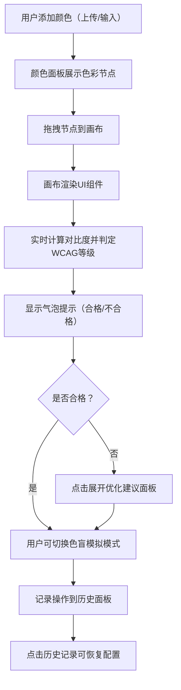

## 1. 产品概述

色彩无障碍评估工具是一款面向设计师和前端开发者的在线Web应用，用于评估和可视化网页设计稿的色彩无障碍性（遵循WCAG AA/AAA标准）。

- 主要解决设计师和前端开发者在制作页面时因色彩对比度不足导致文本难以阅读、按钮状态无法区分的问题
- 目标用户：UI设计师、前端开发者、无障碍测试人员
- 产品价值：将手动色彩检查过程自动化、可视化，大幅提升设计效率和页面可访问性质量

## 2. 核心功能

### 2.1 功能模块

1. **颜色面板模块**：颜色输入（上传图片/HEX/RGB/HSL）、色彩节点展示（圆形48px）、节点拖拽、碰撞弹性回弹、自动搭配建议
2. **画布预览模块**：UI组件预览（按钮、标题、正文、输入框、链接）、实时对比度计算、WCAG等级气泡提示、优化建议面板
3. **色盲模拟模块**：全色盲/红色盲/绿色盲/蓝色盲滤镜切换、对比度重新计算、模拟模式时间戳记录
4. **历史记录模块**：操作历史记录（最近20条）、检查时间/对比度/状态展示、一键恢复历史配置

### 2.2 页面详情

| 页面名称 | 模块名称 | 功能描述 |
|-----------|-------------|---------------------|
| 主页面 | 左侧颜色面板（260px） | 颜色输入、节点渲染、拖拽逻辑、碰撞检测、搭配建议生成 |
| 主页面 | 中央画布预览区 | UI组件预览、对比度实时计算、无障碍等级判定、气泡提示、优化建议展开面板 |
| 主页面 | 色盲模拟控制 | 下拉选择模拟类型、CSS滤镜应用、时间戳滚动记录 |
| 主页面 | 右侧历史面板（280px） | 操作历史列表（倒序）、状态展示、点击恢复配置、5秒轮询更新 |

## 3. 核心流程

用户从颜色面板添加颜色 → 拖拽颜色节点到画布 → 画布实时渲染UI组件并计算对比度 → 用户查看气泡提示和等级 → 不合格组件点击展开优化建议 → 用户可切换色盲模拟模式查看效果 → 所有操作自动记录到历史面板 → 可随时恢复历史配置

## 4. 用户界面设计

### 4.1 设计风格

- 主题：浅色主题，背景色#FAFAFA
- 主色调：浅蓝#64B5F6（选中光环、交互反馈）、绿色#81C784（合格状态）、红色#E57373（不合格状态）
- 连接线：半透明#E0E0E080
- 按钮样式：圆角设计，具备悬停、按下、选中状态，过渡动画0.3s ease
- 字体：现代无衬线字体，建立清晰的层级体系
- 布局：三栏式布局，左260px + 中央弹性 + 右280px，最小宽度1024px
- 动画：选中光环脉动1.2s周期、气泡0.5s fade-in、碰撞弹性回弹

### 4.2 页面设计概述

| 页面名称 | 模块名称 | UI元素 |
|-----------|-------------|-------------|
| 主页面 | 颜色面板 | 圆形色彩节点（48px）、选中光环脉动、拖拽光标、半透明连接线、颜色输入表单 |
| 主页面 | 画布预览区 | 按钮/标题/正文/输入框/链接组件、悬浮气泡提示（对比度+等级+状态）、毛玻璃优化面板（圆角12px） |
| 主页面 | 色盲模拟区 | 下拉选择器、滤镜效果应用、提示文字、时间戳滚动条 |
| 主页面 | 历史面板 | 时间倒序列表、状态标签（通过/失败）、点击交互 |

### 4.3 响应式设计

- 桌面优先（Desktop-first）
- 最小适配宽度：1024px
- 窄屏下左右面板折叠为顶部标签栏，中央画布全屏展示
- 触控设备优化：扩大色彩节点触控区域，拖拽手势流畅
