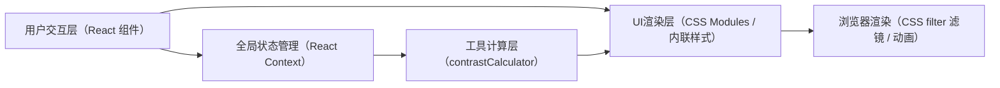

## 1. 架构设计



## 2. 技术描述

- 前端框架：React 18 + TypeScript
- 构建工具：Vite 5 + @vitejs/plugin-react
- 语言标准：TypeScript Strict模式，target ES2020
- 状态管理：React Context API（AppContext）
- 样式方案：CSS内联样式 + 原生CSS动画（不引入Tailwind）
- 后端：无（纯前端应用）
- 数据存储：内存状态（历史记录最多20条）

## 3. 文件组织结构

```
auto18/
├── package.json
├── vite.config.js
├── tsconfig.json
├── index.html
└── src/
    ├── main.tsx
    ├── App.tsx
    ├── context/
    │   └── AppContext.ts
    ├── components/
    │   ├── ColorPanel.tsx
    │   ├── CanvasPreview.tsx
    │   └── HistoryPanel.tsx
    └── utils/
        └── contrastCalculator.ts
```

## 4. 模块接口定义

### 4.1 类型定义

```typescript
// 颜色数据结构
interface ColorItem {
  id: string;
  hex: string;
  name?: string;
  position?: { x: number; y: number };
}

// 对比度结果
interface ContrastResult {
  ratio: number;
  level: 'AAA' | 'AA' | 'Fail';
  isPass: boolean;
}

// 历史记录
interface HistoryRecord {
  id: string;
  timestamp: number;
  colors: ColorItem[];
  contrastScore: number;
  status: 'pass' | 'fail';
  selectedIndex: number;
}

// 色盲模拟模式
type ColorBlindMode = 'none' | 'achromatopsia' | 'protanopia' | 'deuteranopia' | 'tritanopia';

// 全局状态
interface AppState {
  colors: ColorItem[];
  selectedColorId: string | null;
  history: HistoryRecord[];
  colorBlindMode: ColorBlindMode;
  timestampLog: number[];
}
```

### 4.2 工具模块 API

```typescript
// contrastCalculator.ts
function calculateContrastRatio(hex1: string, hex2: string): number;
function getWCAGLevel(ratio: number, isLargeText?: boolean): 'AAA' | 'AA' | 'Fail';
function hexToRgb(hex: string): { r: number; g: number; b: number };
function getLuminance(r: number, g: number, b: number): number;
function generateColorSuggestions(foreground: string, background: string): string[];
```

### 4.3 Context API

```typescript
// AppContext.ts
const AppContextProvider: React.FC<{ children: React.ReactNode }>;
const useAppContext: () => {
  state: AppState;
  addColor: (hex: string) => void;
  removeColor: (id: string) => void;
  updateColorPosition: (id: string, x: number, y: number) => void;
  selectColor: (id: string | null) => void;
  setColorBlindMode: (mode: ColorBlindMode) => void;
  addHistory: (record: Omit<HistoryRecord, 'id' | 'timestamp'>) => void;
  restoreHistory: (id: string) => void;
};
```

## 5. 核心算法

### 5.1 WCAG对比度计算
- 依据：WCAG 2.1 标准公式
- 步骤：HEX转RGB → 计算相对亮度 → 对比度比率公式 (L1 + 0.05) / (L2 + 0.05)
- 等级判定：≥7:1 AAA，≥4.5:1 AA（正文），≥3:1 AA（大文本）

### 5.2 碰撞检测与弹性回弹
- 计算节点圆心距与半径之和
- 当距离小于半径和时，按比例反向调整位置
- 添加阻尼系数实现弹性效果

### 5.3 色盲模拟滤镜
- 全色盲：`filter: grayscale(100%)`
- 红色盲：`filter: hue-rotate(-20deg) saturate(80%)`
- 绿色盲：`filter: hue-rotate(10deg) saturate(70%)`
- 蓝色盲：`filter: hue-rotate(180deg) saturate(85%)`
