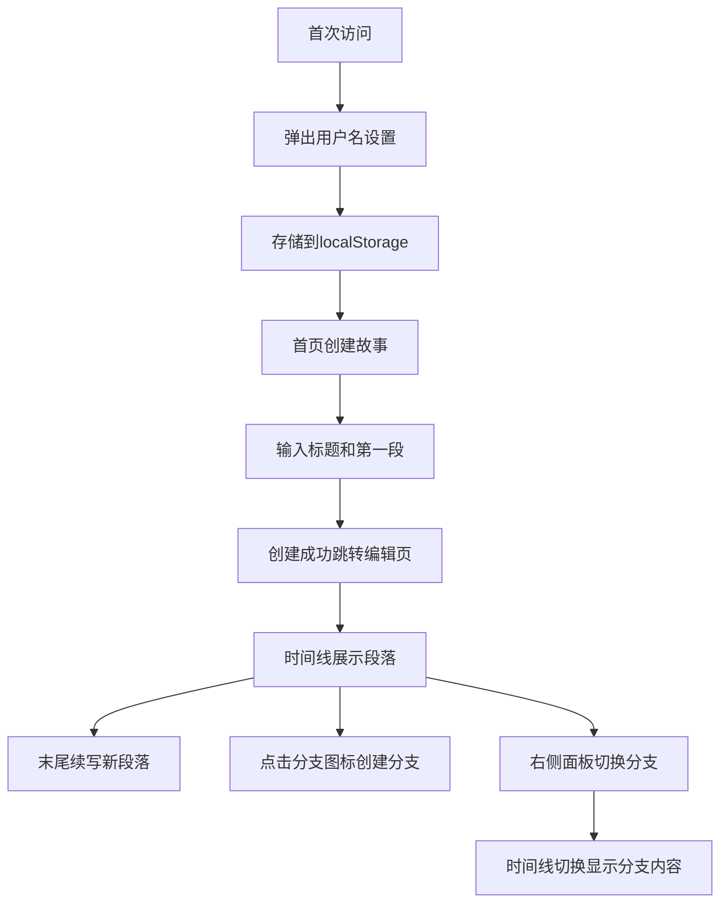

## 1. 产品概述
AI故事接龙是一个多人协作续写故事的平台，用户可以创建故事、分段续写、管理故事分支，系统自动保存完整历史记录。
- 解决单人创作思路局限问题，通过多人协作激发创意，实现故事的多元化发展
- 目标用户为创意写作者、故事爱好者以及需要团队协作创作的群体
- 产品价值在于提供流畅的协作体验和清晰的分支管理，让故事创作更有趣

## 2. 核心特性

### 2.1 用户角色
| 角色 | 注册方法 | 核心权限 |
|------|----------|----------|
| 普通用户 | 浏览器首次访问时设置用户名（localStorage存储） | 创建故事、续写段落、创建分支、切换分支 |

### 2.2 功能模块
1. **首页**：故事创建表单（标题+第一段）
2. **故事编辑页**：故事标题栏、历史时间线、续写输入区、分支管理面板

### 2.3 页面详情
| 页面名称 | 模块名称 | 功能描述 |
|----------|----------|----------|
| 首页 | 创建故事表单 | 输入故事标题和第一段文字，提交后创建新故事并跳转编辑页 |
| 故事编辑页 | 标题栏 | 显示故事标题，右侧提供"新建故事"按钮 |
| 故事编辑页 | 时间线 | 垂直展示所有续写段落，支持在末尾续写，支持在任意段落后创建分支 |
| 故事编辑页 | 分支管理 | 右侧面板展示所有分支树，支持切换分支查看不同版本 |

## 3. 核心流程
用户首次访问时弹出用户名设置弹窗，输入后存储到localStorage。首页输入故事标题和第一段，点击创建后进入编辑页。在编辑页可以在时间线末尾续写新段落，或点击任意段落的分支图标创建新分支。右侧分支面板显示所有分支，点击可切换时间线显示对应分支内容。

## 4. 用户界面设计

### 4.1 设计风格
- **主色调**：深色主题，背景#0F172A，卡片背景#1E293B，高亮色#3B82F6
- **按钮样式**：圆角8px，背景#3B82F6，悬停时背景变深
- **字体**：系统无衬线字体，标题24px加粗白色，正文14px浅灰色
- **布局**：顶部标题栏60px高，主体左侧70%为时间线区域，右侧300px固定分支面板
- **图标**：使用lucide-react图标库，分支图标使用GitBranch

### 4.2 页面设计概述
| 页面名称 | 模块名称 | UI元素 |
|----------|----------|--------|
| 首页 | 创建表单 | 深色背景居中卡片，标题输入框、段落文本域、创建按钮，带淡入动画 |
| 故事编辑页 | 标题栏 | 固定顶部60px，左侧标题文字，右侧"新建故事"按钮，带阴影 |
| 故事编辑页 | 时间线 | 左侧20px竖线轨道#334155，段落卡片圆角12px，间隔16px，从左侧滑入动画 |
| 故事编辑页 | 分支面板 | 固定右侧300px，背景#1E293B，圆角8px，缩进列表展示分支树，选中项背景#3B82F6 |

### 4.3 响应式
桌面端优先设计，时间线占70%宽度，分支面板固定右侧300px。移动端可考虑分支面板改为底部抽屉（本次需求暂不实现移动端适配）。

### 4.4 动画效果
- 段落卡片进入：从左侧滑入0.4s动画，依次延迟
- 分支切换：时间线整体淡出0.2s再淡入0.2s
- 按钮/卡片悬停：0.2s过渡效果
- 活跃分支节点：0.3s渐入动画
