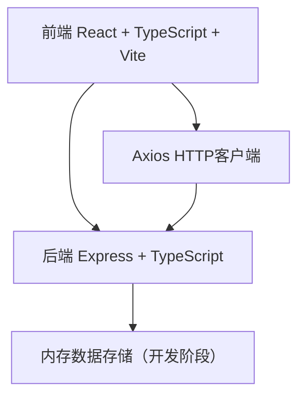
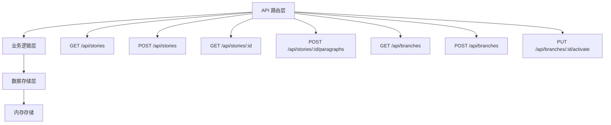
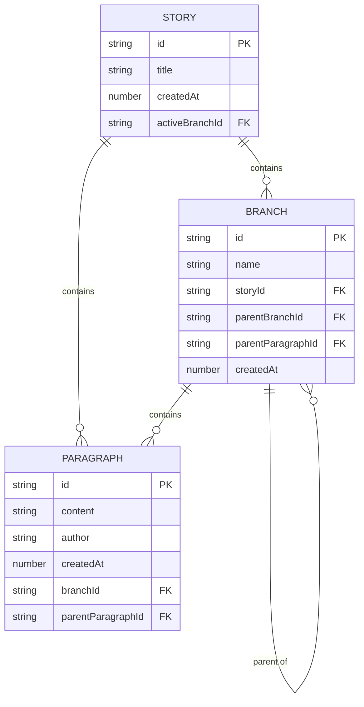

## 1. 架构设计



## 2. 技术描述
- **前端**：React@18 + TypeScript + Vite@5 + Axios + lucide-react（图标）
- **后端**：Express@4 + TypeScript + uuid + cors
- **构建工具**：Vite
- **状态管理**：React useState/useEffect（轻量场景，无需额外状态管理库）
- **数据存储**：开发阶段使用内存存储，生产可扩展为文件存储或数据库

## 3. 路由定义
| 路由 | 用途 |
|------|------|
| / | 首页（创建故事表单） |
| /story/:id | 故事编辑页 |

## 4. API 定义

### 类型定义
```typescript
interface Paragraph {
  id: string;
  content: string;
  author: string;
  createdAt: number;
  branchId: string;
  parentParagraphId: string | null;
}

interface Branch {
  id: string;
  name: string;
  storyId: string;
  parentBranchId: string | null;
  parentParagraphId: string | null;
  createdAt: number;
}

interface Story {
  id: string;
  title: string;
  createdAt: number;
  branches: Branch[];
  paragraphs: Paragraph[];
  activeBranchId: string;
}
```

### API 端点

#### 故事相关
- `GET /api/stories` - 获取所有故事列表
- `GET /api/stories/:id` - 获取单个故事详情
- `POST /api/stories` - 创建新故事
  - 请求体：`{ title: string; firstParagraph: string; author: string }`
  - 响应：`Story` 对象

#### 分支相关
- `GET /api/branches?storyId=xxx` - 获取故事的所有分支
- `POST /api/branches` - 创建新分支
  - 请求体：`{ storyId: string; parentBranchId: string; parentParagraphId: string; author: string }`
  - 响应：`Branch` 对象
- `PUT /api/branches/:id/activate` - 激活分支
  - 请求体：`{ storyId: string }`
  - 响应：更新后的 `Story` 对象

#### 段落相关
- `POST /api/stories/:id/paragraphs` - 续写段落
  - 请求体：`{ content: string; author: string; branchId: string }`
  - 响应：更新后的 `Story` 对象

## 5. 服务器架构图



## 6. 数据模型

### 6.1 数据模型定义



### 6.2 初始化数据
开发阶段服务器启动时初始化示例故事数据，包含2-3个分支和多个段落，便于测试。

## 7. 项目文件结构

```
auto180/
├── package.json
├── index.html
├── vite.config.js
├── tsconfig.json
├── server/
│   └── index.ts          # Express 服务器
├── src/
│   ├── App.tsx           # 主组件
│   ├── StoryTimeline.tsx # 时间线组件
│   ├── BranchManager.tsx # 分支管理组件
│   ├── types.ts          # 类型定义
│   ├── utils.ts          # 工具函数（时间格式化等）
│   └── api.ts            # API 调用封装
└── .trae/
    └── documents/
        ├── PRD.md
        └── Technical Architecture.md
```
