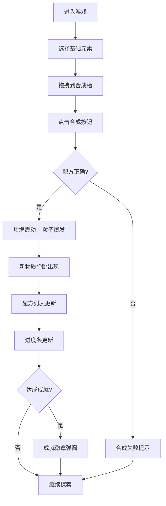

## 1. 产品概述

像素炼金工坊是一款融合材料合成玩法与像素美术生成的休闲创意游戏。玩家在工坊中将基础元素（火、水、土、风）两两组合，通过成功合成解锁新配方，最终目标是发现所有隐藏的传说材料。

- **核心玩法**：拖拽基础元素到合成槽，点击合成按钮产生新物质
- **目标用户**：喜欢收集、探索和像素美术风格的休闲玩家
- **产品价值**：通过精美的像素动画和粒子效果，让简单的合成玩法充满惊喜感和成就感

## 2. 核心功能

### 2.1 功能模块

1. **坩埚展示区**：中央坩埚，展示冒泡液体动画、合成震动效果、粒子爆发动画
2. **元素选择面板**：四个基础元素槽（火、水、土、风），支持拖拽交互
3. **合成系统**：两个合成槽、合成按钮、配方验证逻辑
4. **配方记录**：左侧已解锁配方列表，新配方渐入动画
5. **进度系统**：顶部进度条，显示完成度
6. **成就系统**：成就徽章弹窗，带闪烁动画

### 2.2 页面详情

| 页面名称 | 模块名称 | 功能描述 |
|---------|---------|---------|
| 主界面 | 坩埚展示区 | CSS绘制200x200px坩埚，动态冒泡绿色液体，合成时震动0.5秒，Canvas粒子烟雾效果 |
| 主界面 | 元素选择面板 | 四个60x60px元素槽，拖拽元素到合成槽，半透明跟随图标，松开弹回弹性动画 |
| 主界面 | 合成系统 | 两个合成槽放置元素，绿色像素风合成按钮，悬停变色，点击验证配方 |
| 主界面 | 配方记录 | 左侧列表展示已解锁配方，新项渐入动画 |
| 主界面 | 进度系统 | 顶部渐变条纹进度条，显示已完成/总配方数 |
| 主界面 | 成就系统 | 达成成就时弹出80x80px像素风徽章，闪烁动画 |

## 3. 核心流程

玩家从四个基础元素中选择两个拖入合成槽，点击合成按钮后系统验证配方。若配方正确，坩埚震动并升起彩色粒子，新物质从坩埚中弹跳出现，同时配方列表刷新、进度条更新。若达成新成就，屏幕中央弹出成就徽章。

## 4. 用户界面设计

### 4.1 设计风格

- **主色调**：深色主题，背景#0F172A
- **强调色**：绿色#22C55E（合成按钮）、紫蓝渐变#6366F1到#8B5CF6（进度条）
- **坩埚配色**：底座深褐色#4A3728、锅体铁灰色#6B7280、内部绿色液体
- **像素风格**：所有UI元素采用像素化设计，交互时有2px位移下沉反馈
- **字体**：等宽像素风格字体，营造复古游戏氛围

### 4.2 页面设计概述

| 页面名称 | 模块名称 | UI元素 |
|---------|---------|--------|
| 主界面 | 整体布局 | 960px宽度居中，深色背景，垂直铺满视口 |
| 主界面 | 顶部进度条 | 渐变条纹动画，2秒循环，显示完成数量 |
| 主界面 | 左侧配方列表 | 已解锁配方记录，新项渐入动画 |
| 主界面 | 中央坩埚 | 200x200px CSS绘制，冒泡液体，震动动画 |
| 主界面 | 元素槽 | 四周分布，60x60px，圆角4px，背景#1E293B，边框#374151 |
| 主界面 | 合成槽 | 坩埚上方两个槽位，放置待合成元素 |
| 主界面 | 合成按钮 | 绿色像素风格，悬停#22C55E，点击下沉效果 |

### 4.3 响应式

- 桌面端优先设计，960px固定宽度居中
- 移动端自适应缩放，保证核心玩法可操作

### 4.4 动效设计

- **拖拽反馈**：半透明元素图标跟随鼠标移动
- **弹回动画**：0.3秒弹性动画，元素松开后回到原位
- **坩埚震动**：合成成功时0.5秒震动效果
- **粒子效果**：Canvas粒子系统，60个粒子，上飘速度1-3px/帧
- **结果出现**：0.6秒ease-out弹跳动画
- **成就徽章**：闪烁动画，像素风格边框
- **进度条**：渐变条纹流动动画，2秒循环
