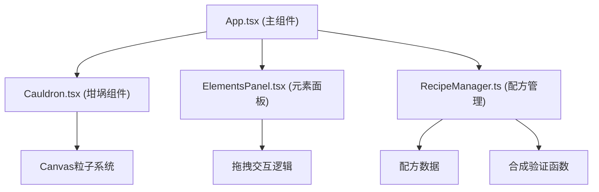

## 1. 架构设计



## 2. 技术描述

- **前端框架**：React@18 + TypeScript
- **构建工具**：Vite
- **样式方案**：原生CSS + CSS Modules（组件内样式）
- **动画方案**：CSS动画 + Canvas 2D粒子系统
- **状态管理**：React useState / useCallback（轻量级，无需状态管理库）

## 3. 文件结构

```
.
├── index.html           # 入口页面
├── package.json         # 项目依赖和脚本
├── tsconfig.json        # TypeScript配置（严格模式）
├── vite.config.js       # Vite构建配置
└── src/
    ├── App.tsx          # 主组件，状态管理和交互协调
    ├── Cauldron.tsx     # 坩埚组件，CSS绘制+粒子效果
    ├── ElementsPanel.tsx # 元素选择面板，拖拽交互
    └── RecipeManager.ts  # 配方管理纯函数模块
```

## 4. 组件设计

### 4.1 Cauldron.tsx

- **职责**：渲染坩埚、冒泡动画、粒子爆发效果
- **Props**：
  - `isShaking: boolean` - 是否震动
  - `resultElement: string | null` - 合成结果元素ID
  - `particleColors: string[]` - 粒子主题色
  - `triggerParticles: boolean` - 触发粒子动画标志
- **内部状态**：粒子数组、动画帧ID
- **核心方法**：粒子更新、Canvas渲染

### 4.2 ElementsPanel.tsx

- **职责**：渲染元素槽、合成槽、处理拖拽交互
- **Props**：
  - `elements: Element[]` - 基础元素列表
  - `slots: (string | null)[]` - 两个合成槽的当前元素
  - `onSlotChange: (slotIndex: number, elementId: string | null) => void` - 槽位变化回调
  - `onSynthesize: () => void` - 合成按钮点击回调
- **内部状态**：拖拽中元素、鼠标位置
- **核心方法**：handleDragStart、handleDragMove、handleDragEnd

### 4.3 RecipeManager.ts

- **职责**：配方数据管理、合成验证、解锁检测
- **类型定义**：Element、Recipe
- **核心函数**：
  - `getAllElements(): Element[]` - 获取所有元素
  - `getAllRecipes(): Recipe[]` - 获取所有配方
  - `synthesize(element1Id: string, element2Id: string): Recipe | null` - 验证合成
  - `getInitialUnlocked(): string[]` - 获取初始解锁的元素

### 4.4 App.tsx

- **职责**：整体状态管理、组件协调
- **状态**：
  - `unlockedRecipes: string[]` - 已解锁配方ID列表
  - `synthesisSlots: (string | null)[]` - 两个合成槽
  - `isShaking: boolean` - 坩埚震动状态
  - `resultElement: string | null` - 当前显示的合成结果
  - `particleColors: string[]` - 粒子颜色
  - `triggerParticles: boolean` - 粒子触发标志
  - `showAchievement: boolean` - 成就弹窗显示状态
- **核心逻辑**：handleSynthesize、handleSlotChange

## 5. 性能要求

- **帧率**：粒子动画保持55fps以上
- **响应时间**：合成计算响应时间不超过30ms
- **优化策略**：
  - 使用requestAnimationFrame进行Canvas动画
  - 粒子数量控制在60个
  - 纯函数计算避免重复渲染
  - 使用useCallback/useMemo优化React渲染

## 6. 数据模型

### 6.1 Element（元素）

```typescript
interface Element {
  id: string;
  name: string;
  color: string;
  icon: string; // emoji或像素图标
  tier: 'basic' | 'common' | 'rare' | 'legendary';
}
```

### 6.2 Recipe（配方）

```typescript
interface Recipe {
  id: string;
  ingredients: [string, string]; // 两个元素ID
  result: string; // 结果元素ID
  isAchievement?: boolean; // 是否为成就配方
}
```
