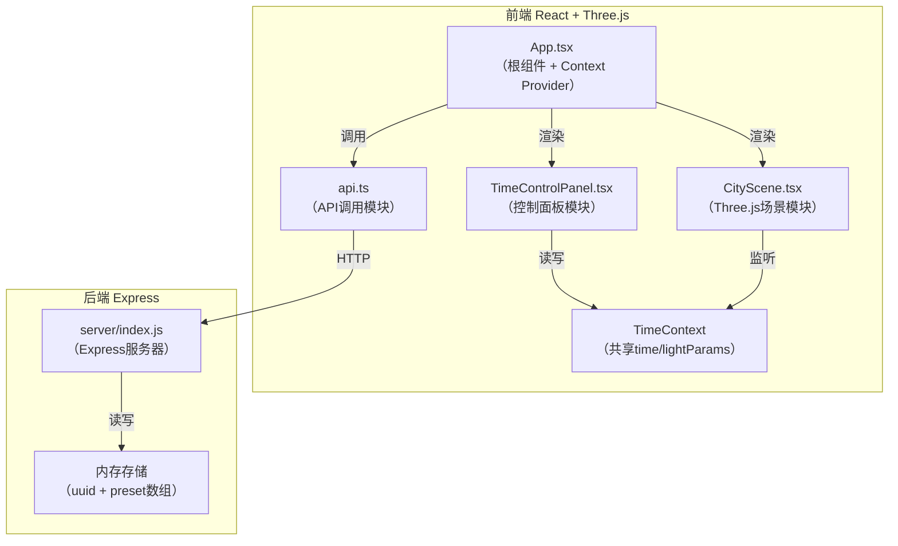
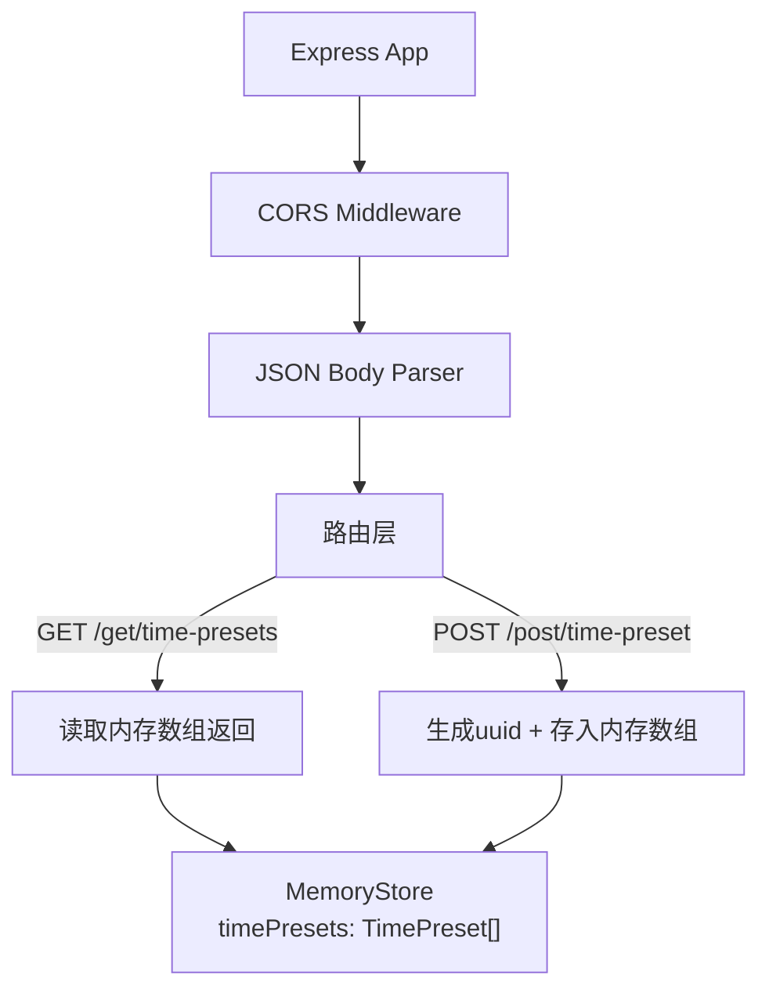
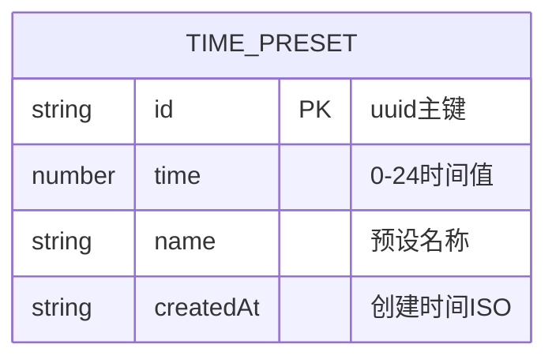

## 1. 架构设计



## 2. 技术描述
- **前端**: React@18 + TypeScript@5 + Vite@5 + @vitejs/plugin-react
- **3D渲染**: three@0.160 + @react-three/fiber@8 + @react-three/drei@9
- **HTTP客户端**: axios@1
- **初始化工具**: vite-init
- **后端**: Express@4 + cors + uuid
- **数据存储**: 后端内存存储（无需数据库）

## 3. 路由定义
| 路由 | 用途 |
|------|------|
| / | 主应用页面（含3D场景和控制面板） |

## 4. API定义

### 4.1 保存预设快照
- **POST** `/post/time-preset`
- **Request Body**:
  ```typescript
  interface TimePresetRequest {
    time: number;        // 0-24 时间值
    name?: string;       // 可选名称
  }
  ```
- **Response**:
  ```typescript
  interface TimePresetResponse {
    id: string;          // uuid
    time: number;
    name: string;
    createdAt: string;   // ISO时间戳
  }
  ```

### 4.2 获取预设列表
- **GET** `/get/time-presets`
- **Response**:
  ```typescript
  interface TimePresetsListResponse {
    data: TimePresetResponse[];
  }
  ```

## 5. 服务器架构图



## 6. 数据模型

### 6.1 数据模型定义


### 6.2 共享类型定义（前端）
```typescript
// src/types/index.ts
export interface LightParams {
  sunPosition: [number, number, number];  // 太阳方向向量
  sunColor: string;                       // 直射光颜色hex
  sunIntensity: number;                   // 直射光强度
  ambientColor: string;                   // 环境光颜色hex
  ambientIntensity: number;               // 环境光强度
  shadowBlur: number;                     // 阴影模糊度 0.1-1.0
  skyColor: string;                       // 天空盒颜色hex
  moonIntensity: number;                  // 月光强度 0-0.3
  moonColor: string;                      // 月光颜色
}

export interface TimePreset {
  id: string;
  time: number;
  name: string;
  createdAt: string;
}

export interface TimeContextValue {
  time: number;
  setTime: (t: number) => void;
  lightParams: LightParams;
  savePreset: () => Promise<void>;
  loadPresets: () => Promise<void>;
  presets: TimePreset[];
  applyPreset: (id: string) => void;
}
```

## 7. 文件结构与调用关系

```
d:\Pro\tasks\auto182/
├── package.json                  # 依赖配置
├── vite.config.js                # Vite构建配置
├── tsconfig.json                 # TS严格模式配置
├── index.html                    # 入口页面
├── server/
│   └── index.js                  # Express后端（REST API）
└── src/
    ├── main.tsx                  # React入口
    ├── App.tsx                   # 根组件，组合模块 + Context Provider
    ├── types/
    │   └── index.ts              # 全局类型定义
    ├── context/
    │   └── TimeContext.tsx       # Context定义 + Provider实现
    ├── utils/
    │   └── lightCalculator.ts    # 光照计算工具（time→LightParams插值）
    ├── components/
    │   ├── TimeControlPanel.tsx  # 控制面板（滑块+预设卡片+保存按钮）
    │   ├── CityScene.tsx         # 3D场景渲染（@react-three/fiber）
    │   ├── Buildings.tsx         # 建筑群子组件
    │   ├── Trees.tsx             # 植被子组件
    │   └── Ground.tsx            # 地面子组件
    └── services/
        └── api.ts                # axios封装，快照CRUD接口调用
```

**数据流向**:
1. 用户交互 → `TimeControlPanel.tsx` → `setTime()` 更新Context
2. Context更新 → `CityScene.tsx` 监听 `time`/`lightParams` → Three.js对象属性更新 → 渲染帧
3. 保存快照: `App.tsx` → `api.ts:savePreset()` → `POST /post/time-preset` → Express → 内存存储
4. 加载快照: `App.tsx` → `api.ts:getPresets()` → `GET /get/time-presets` → Express → 内存读取
5. 还原快照: `applyPreset(id)` → 从presets中查找 → `setTime(preset.time)` → 回到数据流1
