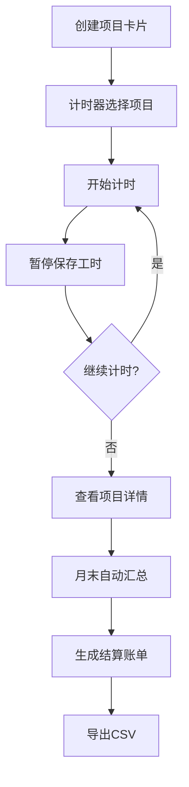

## 1. 产品概述

自由职业者和小型工作室的工时管理与结算平台，解决多项目频繁切换时手动计时出错、工时记录分散、月底结算汇总低效的问题。通过统一的计时器、项目看板和自动账单生成，实现从工时记录到财务结算的一站式管理。

## 2. 核心功能

### 2.1 用户角色

| 角色 | 注册方式 | 核心权限 |
|------|----------|----------|
| 自由职业者/工作室管理员 | 邮箱注册 | 创建/管理项目、记录工时、生成/导出账单 |

### 2.2 功能模块

1. **项目看板页面**：项目卡片列表、筛选搜索栏、详情抽屉面板
2. **时间记录模块**：浮动计时器面板、工时记录时间线
3. **结算页面**：项目列表侧栏、账单表格、CSV导出

### 2.3 页面详情

| 页面名称 | 模块名称 | 功能描述 |
|----------|----------|----------|
| 项目看板 | 筛选栏 | 按状态筛选（进行中/已完成/逾期）、关键词搜索、排序（预算/截止日期） |
| 项目看板 | 项目卡片列表 | 卡片展示项目名称、客户名称、预算金额（千分位格式化）、截止日期 |
| 项目看板 | 详情抽屉 | 右侧滑入面板，含基础信息/工时记录/账单历史三个Tab |
| 时间记录 | 浮动计时器 | 固定右下角计时面板，下拉选项目、开始/暂停计时、实时显示HH:MM:SS |
| 时间记录 | 工时时间线 | 详情面板内时间线形式展示每条工时记录 |
| 结算页面 | 项目列表 | 左侧项目列表，选中高亮，切换查看不同项目账单 |
| 结算页面 | 账单表格 | 右侧账单表格，固定首列，行悬停高亮，合计加粗绿色 |
| 结算页面 | 导出按钮 | 导出当前账单为CSV文件 |

## 3. 核心流程

用户创建项目卡片并设置预算和截止日期 → 在计时器面板选择项目开始计时 → 暂停时自动保存工时记录 → 点击项目卡片查看详情（基础信息/工时记录/账单历史）→ 月末结算模块自动汇总工时生成账单 → 用户在结算页面查看/导出账单CSV

## 4. 界面设计

### 4.1 设计风格

- 主色：#6366F1（Indigo），辅助色：#10B981（绿色，用于结算/开始）、#F59E0B（橙色，用于暂停）
- 暗色侧边栏 #1E293B + 亮色主内容区 #FFFFFF 的双栏布局
- 按钮：圆角8px，悬停有颜色过渡和阴影扩散
- 字体：Inter，字号12px-20px
- 布局：卡片式布局，响应式网格
- 图标：Lucide图标库

### 4.2 页面设计概述

| 页面名称 | 模块名称 | UI元素 |
|----------|----------|--------|
| 全局 | 侧边栏 | 宽240px，背景#1E293B，导航项含3px竖条渐变指示器#6366F1→#8B5CF6，选中文字白色 |
| 项目看板 | 筛选栏 | 高60px，背景#1E293B，状态按钮组圆角8px，搜索框聚焦边框变色0.2s |
| 项目看板 | 项目卡片 | 宽320px，背景#F8FAFC，圆角16px，悬停上移4px+阴影0.3s |
| 项目看板 | 详情抽屉 | 宽600px右滑入，圆角左16px，0.4s cubic-bezier动画，Tab底部指示条0.3s |
| 时间记录 | 计时器面板 | 固定右下角280×180px，毛玻璃#FFFFFFCC，圆角16px，圆形按钮40px |
| 结算 | 项目列表 | 宽300px，背景#F1F5F9，圆角8px，选中项背景#E2E8F0 |
| 结算 | 账单表格 | 白色背景，表头#F8FAFC，行悬停#F8FAFC，合计绿色加粗 |
| 结算 | 导出按钮 | 背景#6366F1，圆角8px，悬停#4F46E5+阴影0.3s |

### 4.3 响应式

- 桌面优先设计，最小宽度1024px
- 最佳体验：1920×1080
- 可用体验：1280×720
- 项目看板网格：minmax(320px, 1fr)，屏幕<768px切换单列
- 自定义滚动条：宽8px，轨道#F1F5F9，滑块#CBD5E1，圆角4px

### 4.4 动画与交互

- 项目卡片悬停：上移4px + 阴影扩散 0.3s
- 详情抽屉滑入：0.4s cubic-bezier(0.22, 1, 0.36, 1)
- Tab指示条：0.3s滑动
- 状态按钮选中：背景#6366F1阴影扩散0.5s
- 计时器按钮按下：缩放0.95恢复
- 日期选择器：毛玻璃效果，选中#6366F1高亮
- 侧边栏指示器：0.3s平滑移动
