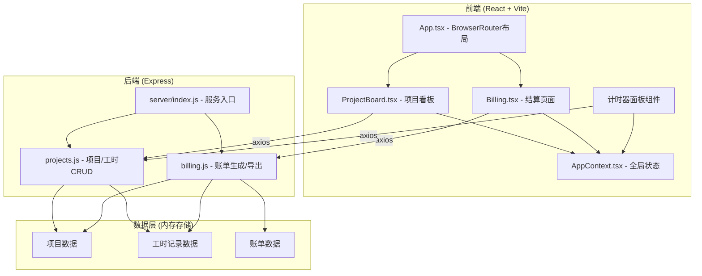
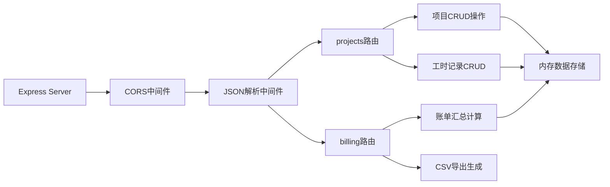
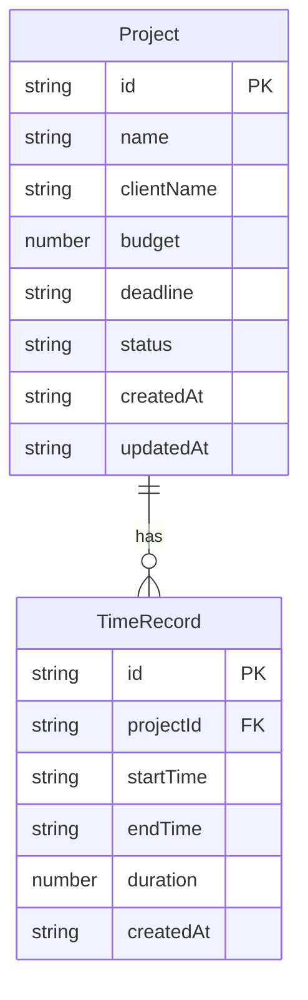

## 1. 架构设计



## 2. 技术说明

- 前端：React 18 + TypeScript + Vite + Tailwind CSS
- 初始化工具：vite-init (react-express-ts模板)
- 后端：Express 4 + cors + uuid
- 数据库：内存存储（Mock数据），无需外部数据库
- 状态管理：React Context（AppContext共享currentProject和userInfo）
- 路由：react-router-dom（前端），Express Router（后端）

## 3. 路由定义

| 前端路由 | 用途 |
|----------|------|
| / | 项目看板页面（卡片列表+筛选+详情面板） |
| /billing | 结算页面（项目列表+账单表格+导出） |

| 后端路由 | 用途 |
|----------|------|
| GET /api/projects | 获取项目列表 |
| POST /api/projects | 创建项目 |
| PUT /api/projects/:id | 更新项目 |
| DELETE /api/projects/:id | 删除项目 |
| GET /api/projects/:id/time-records | 获取项目工时记录 |
| POST /api/time-records | 创建工时记录 |
| GET /api/billing | 获取所有项目账单汇总 |
| GET /api/billing/:projectId | 获取指定项目账单 |
| GET /api/billing/export/csv | 导出账单CSV |

## 4. API定义

### 项目相关

```typescript
interface Project {
  id: string;
  name: string;
  clientName: string;
  budget: number;
  deadline: string;
  status: 'active' | 'completed' | 'overdue';
  createdAt: string;
  updatedAt: string;
}

interface TimeRecord {
  id: string;
  projectId: string;
  startTime: string;
  endTime: string;
  duration: number;
  createdAt: string;
}
```

### 结算相关

```typescript
interface BillingItem {
  projectId: string;
  projectName: string;
  clientName: string;
  totalHours: number;
  budget: number;
  hourlyRate: number;
  totalAmount: number;
  records: TimeRecord[];
}

interface BillingSummary {
  month: string;
  items: BillingItem[];
  grandTotal: number;
}
```

### 请求/响应

```
POST /api/projects
  Request: { name: string; clientName: string; budget: number; deadline: string }
  Response: Project

GET /api/projects?status=active&search=keyword&sort=budget
  Response: Project[]

POST /api/time-records
  Request: { projectId: string; startTime: string; endTime: string; duration: number }
  Response: TimeRecord

GET /api/billing?month=2026-06
  Response: BillingSummary

GET /api/billing/export/csv?month=2026-06
  Response: text/csv
```

## 5. 服务端架构



## 6. 数据模型

### 6.1 数据模型定义



### 6.2 数据定义

使用内存数组存储，服务启动时初始化示例数据：

- 项目示例数据：3-5个不同状态的项目
- 工时记录示例数据：每个项目3-5条记录
- 自动计算项目状态（根据截止日期判断是否逾期）
