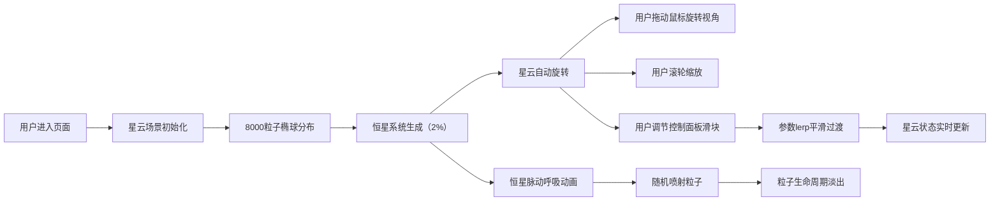

## 1. 产品概述

星云粒子沙盘是一个沉浸式3D交互艺术应用，用户可通过控制面板实时调节星云粒子的各项参数，体验星际尘埃般的视觉效果，用于冥想放松、创意灵感或艺术装置展示。

- 核心价值：提供可交互的沉浸式星云视觉体验，支持自定义参数调节
- 目标用户：冥想爱好者、创意工作者、艺术装置受众
- 使用场景：个人放松、桌面装饰、展览展示

## 2. 核心特性

### 2.1 功能模块

1. **3D星云场景**：8000个粒子组成的椭球星云，深空渐变背景，支持鼠标拖拽旋转和滚轮缩放
2. **实时控制面板**：密度、旋转速度、粒子大小、颜色偏移四项参数滑块调节
3. **恒星系统**：2%比例的高亮恒星粒子，带脉动呼吸动画，随机喷射小粒子
4. **平滑过渡动画**：参数变更时0.5秒lerp插值平滑过渡

### 2.2 页面详情

| 页面名称 | 模块名称 | 功能描述 |
|----------|----------|----------|
| 主页面 | 3D星云场景 | 椭球分布粒子群，Y轴自转，鼠标交互视角控制 |
| 主页面 | 控制面板 | 四个参数滑块，实时数值显示，渐变轨道样式 |
| 主页面 | 恒星系统 | 高亮脉动恒星，随机喷射粒子效果 |

## 3. 核心流程

## 4. 用户界面设计

### 4.1 设计风格
- **整体风格**：沉浸式暗色主题，深空氛围，极简UI不干扰视觉焦点
- **主色调**：深空蓝紫渐变背景（#0A0A1A到#1A1A3A）
- **强调色**：蓝紫#6366F1、粉红#EC4899、绿青#10B981、橘黄#F59E0B
- **控件风格**：毛玻璃半透明材质（rgba(30,30,50,0.8)），蓝色边框（#3B82F6）
- **字体**：现代无衬线字体，简洁易读

### 4.2 页面设计概览

| 页面名称 | 模块名称 | UI元素 |
|----------|----------|--------|
| 主页面 | 3D场景 | 全屏视口，深空渐变背景，粒子星云，恒星发光效果 |
| 主页面 | 控制面板 | 右侧固定280px宽，圆角16px，毛玻璃背景，蓝色边框，四个滑块带数值显示 |

### 4.3 响应式设计
- 桌面优先设计，支持1920x1080和1366x768分辨率
- 控制面板固定右侧，不遮挡星云核心视口区域
- 滑块尺寸适配不同屏幕，保持触控友好

### 4.4 3D场景指引
- **环境**：深空渐变背景，无外部HDRI，营造纯净宇宙空间感
- **光照**：粒子自发光为主，辅以微弱环境光
- **相机**：PerspectiveCamera，初始距离适中，轨道控制器限制缩放范围5-50
- **构图**：星云居中悬浮，控制面板右侧叠加，视觉焦点在星云中心
- **交互**：OrbitControls拖拽旋转、滚轮缩放，阻尼效果
- **后期**：粒子发光效果，柔和过渡
- **性能**：8000粒子使用InstancedMesh优化，目标30FPS以上
