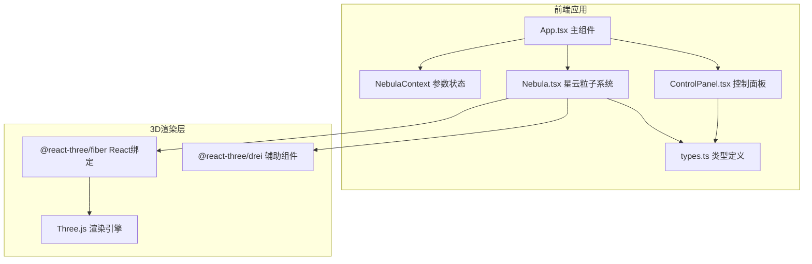

## 1. 架构设计



## 2. 技术描述

- **前端框架**：React@18 + TypeScript@5
- **构建工具**：Vite@5 + @vitejs/plugin-react@4
- **3D引擎**：Three.js@0.160 + @react-three/fiber@8 + @react-three/drei@9
- **状态管理**：React Context API（共享星云参数）
- **样式方案**：内联样式 + CSS变量，不依赖额外UI库

## 3. 目录结构

```
d:\Pro\tasks\auto185/
├── src/
│   ├── App.tsx           # 主组件，组合场景与控制面板，提供Context
│   ├── Nebula.tsx        # 星云粒子系统组件
│   ├── ControlPanel.tsx  # 控制面板组件
│   └── types.ts          # 类型定义
├── index.html            # 入口HTML
├── vite.config.js        # Vite配置
├── tsconfig.json         # TypeScript配置
└── package.json          # 项目依赖
```

## 4. 核心数据类型定义

```typescript
interface NebulaParams {
  density: number;        // 密度 1-10，默认5
  rotationSpeed: number;  // 旋转速度倍率 0.1-2，默认1
  particleSize: number;   // 粒子大小 0.05-0.5，默认0.12
  colorScheme: number;    // 颜色方案 0: 蓝紫->粉红, 1: 绿青->橘黄
}
```

## 5. 性能优化策略

1. **InstancedMesh**：8000个粒子使用实例化网格渲染，减少Draw Call
2. ** lerp插值**：参数变化时使用线性插值平滑过渡，避免突变
3. **帧速率控制**：使用useFrame钩子，确保动画流畅且高效
4. **粒子池化**：喷射粒子复用对象，避免频繁GC
5. **视锥剔除**：Three.js内置视锥剔除优化
