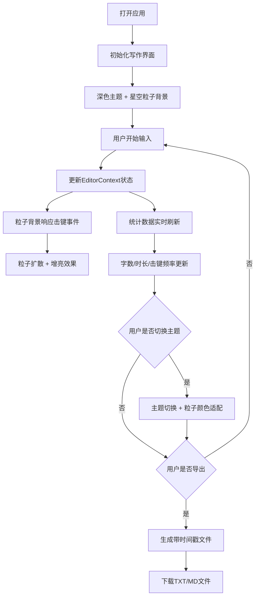

## 1. 产品概述

夜航写作舱是一款为内容创作者打造的沉浸式写作工具，专注于提供无干扰的深夜写作环境。通过动态粒子星海背景与打字节奏的视觉联动，营造深度沉浸的创作氛围，并提供全面的写作数据统计与便捷的导出功能。

- 目标用户：深夜赶稿的作者、博主、编剧等内容创作者
- 核心价值：沉浸感写作环境 + 动态视觉反馈 + 数据统计激励

## 2. 核心功能

### 2.1 功能模块

1. **写作面板**：全屏纯文本编辑区，支持撤销/重做，实时字数统计
2. **动态粒子星海**：Canvas渲染的深空背景，随击键产生扩散波纹
3. **统计数据卡片**：字数、写作时长、击键频率实时展示
4. **文件导出**：支持导出TXT/MD格式，带时间戳命名
5. **主题切换**：深色/浅色双主题，粒子颜色自适应

### 2.2 页面详情

| 页面名称 | 模块名称 | 功能描述 |
|-----------|-------------|---------------------|
| 主写作页 | 写作编辑区 | 全屏居中textarea，无边框设计，等宽字体，支持Ctrl+Z/Y撤销重做 |
| 主写作页 | 粒子背景层 | 300个分层粒子Y轴漂移，击键触发扩散增亮，颜色渐变循环 |
| 主写作页 | 统计悬浮卡片 | 毛玻璃背景，展示字数/时长/击键频率，悬停提升动效 |
| 主写作页 | 导出按钮 | 圆形云下载图标，旋转动画+toast成功提示 |
| 主写作页 | 主题切换 | 深色/浅色切换，0.4s过渡动画，粒子颜色自动适配 |

## 3. 核心流程

用户打开应用 → 进入全屏写作界面（默认深色主题 + 星空背景）→ 开始打字 → 背景粒子随击键产生动态波纹 → 统计数据实时更新 → 完成写作后点击导出按钮 → 选择TXT/MD格式 → 下载带时间戳文件。

## 4. 用户界面设计

### 4.1 设计风格
- **主色调（深色）**：背景#0B0E14，文字#E2E8F0，粒子渐变#1E3A8A→#7C3AED
- **主色调（浅色）**：背景#F8FAFC，文字#334155，粒子渐变#F59E0B→#EF4444
- **字体**：JetBrains Mono 等宽字体，18px，行高1.8
- **卡片风格**：圆角12px，毛玻璃背景rgba(30,41,59,0.6)
- **按钮风格**：圆形导出按钮，云下载图标
- **动效节奏**：过渡0.2s-0.5s，ease-out曲线

### 4.2 页面设计概述

| 页面名称 | 模块名称 | UI元素 |
|-----------|-------------|-------------|
| 主写作页 | 写作编辑区 | 半透明深色背景rgba(11,14,20,0.85)，2px竖线光标#94A3B8，击键光晕box-shadow inset |
| 主写作页 | 粒子背景层 | 300粒子三层z轴（远0.2透明度/近1.0），Y轴漂移，深蓝→靛紫渐变循环 |
| 主写作页 | 统计卡片 | 右上角悬浮，默认透明度0.7，悬停1.0+上移4px（0.3s ease-out） |
| 主写作页 | 导出按钮 | 圆形，云下载图标，点击旋转360°（0.5s） |
| 主写作页 | Toast提示 | 底部居中，从下方滑入（0.3s），导出成功提示 |

### 4.3 响应式
- **桌面端（≥768px）**：编辑区左右边距40px，顶部80px，底部40px
- **移动端（<768px）**：编辑区左右边距20px，统计卡片高度缩短，次要指标详情展示

## 5. 性能要求

- 击键粒子响应延迟 ≤ 16ms（单帧内响应）
- 快速连续输入（间隔<100ms）时帧率 ≥ 50fps
- 首屏渲染至粒子首次绘制完成 ≤ 800ms
