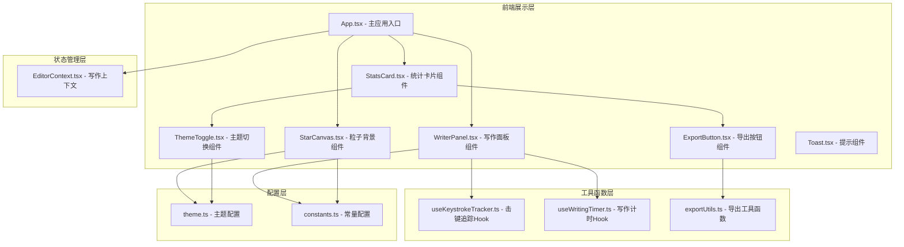
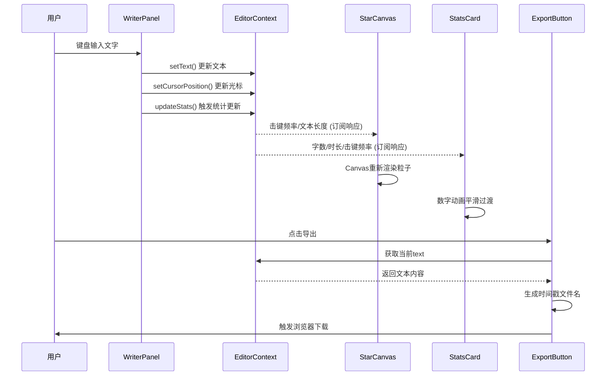

## 1. 架构设计



## 2. 技术描述

- **前端框架**：React@18 + TypeScript@5
- **构建工具**：Vite@5 + @vitejs/plugin-react@4
- **状态管理**：React Context API（EditorContext）
- **渲染技术**：Canvas 2D API（粒子背景）
- **样式方案**：原生CSS + CSS Variables（主题切换）
- **字体方案**：JetBrains Mono（Google Fonts引入）
- **图标方案**：lucide-react

## 3. 文件结构与调用关系

```
项目根目录
├── index.html                              # 入口页面，背景#0B0E14，占满视口
├── package.json                            # 依赖与启动脚本
├── vite.config.js                          # Vite构建配置
├── tsconfig.json                           # TypeScript严格模式配置
└── src/
    ├── main.tsx                            # React渲染入口，挂载App
    ├── App.tsx                             # 主应用组件：主题广播 + 布局
    │   ├── 引入 EditorContext.Provider
    │   ├── 渲染 StarCanvas（背景层）
    │   └── 渲染 WriterPanel（内容层）+ StatsCard
    ├── context/
    │   └── EditorContext.tsx               # 写作状态上下文
    │       ├── 提供：text/cursorPosition/stats
    │       └── 订阅者：StarCanvas + WriterPanel + StatsCard
    ├── components/
    │   ├── StarCanvas.tsx                  # 粒子背景组件
    │   │   ├── 依赖 EditorContext 获取击键频率/文本长度
    │   │   └── 输出 Canvas 2D 渲染帧
    │   ├── WriterPanel.tsx                 # 写作面板组件
    │   │   ├── 提供 textarea 编辑区
    │   │   └── 变更时更新 EditorContext
    │   ├── StatsCard.tsx                   # 统计卡片组件
    │   │   ├── 消费 EditorContext stats
    │   │   ├── 包含 ThemeToggle + ExportButton
    │   │   └── 展示字数/时长/击键频率
    │   ├── ThemeToggle.tsx                 # 主题切换按钮
    │   │   └── 切换全局主题CSS变量
    │   ├── ExportButton.tsx                # 导出按钮
    │   │   ├── 调用 exportUtils 导出文件
    │   │   └── 触发 Toast 成功提示
    │   └── Toast.tsx                       # 底部提示组件
    ├── hooks/
    │   ├── useKeystrokeTracker.ts          # 击键频率追踪Hook
    │   │   └── 计算：间隔<200ms时强度翻倍
    │   └── useWritingTimer.ts              # 写作计时Hook
    │       └── 逻辑：首次按键开始，暂停60s则计时暂停
    ├── utils/
    │   └── exportUtils.ts                  # 文件导出工具
    │       └── 生成：夜航写作舱_YYYYMMDD_HHmmss.txt/.md
    ├── types/
    │   └── index.ts                        # 全局TypeScript类型定义
    └── styles/
        ├── globals.css                     # 全局样式 + CSS变量
        └── theme.css                       # 深色/浅色主题定义
```

## 4. 数据流向



## 5. 关键技术实现点

### 5.1 粒子系统优化
- 使用离屏Canvas减少重绘开销
- 粒子对象池复用，避免频繁GC
- requestAnimationFrame驱动，帧间隔节流

### 5.2 击键响应性能
- 击键事件通过同步更新Context触发粒子响应
- 粒子扩散计算使用增量算法，O(n)时间复杂度
- 高频击键（<100ms间隔）时使用批量合并策略

### 5.3 统计精度控制
- 字数统计：Unicode字符级计数，排除空白可配置
- 写作时长：Date.now()差值计算，暂停阈值60s
- 击键频率：滑动窗口算法，最近5分钟 + 全时段双指标

### 5.4 主题切换实现
- 基于CSS Variables的运行时主题切换
- 粒子颜色插值通过ThemeContext订阅实时更新
- 过渡动画使用transition + opacity双层叠加

## 6. 性能监控指标
- 首屏绘制：Performance API记录 navigationStart → 首次粒子渲染
- 击键响应：performance.now()标记 keydown → canvas帧调度
- 帧率监控：FPS计数器，连续3帧<50fps时降级粒子数量至150
