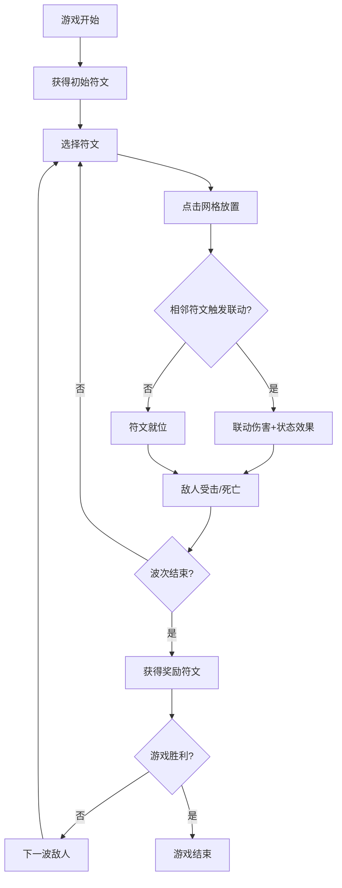

## 1. 产品概述

元素调律是一款基于六边形网格的节奏策略游戏，玩家通过布置不同属性的符文并触发元素联动，在敌人到达终点前消灭它们。游戏融合了塔防、节奏和策略元素，考验玩家的资源分配和临场决策能力。

- 核心目标：在敌人到达终点前利用元素联动消灭全部敌人
- 目标用户：休闲策略游戏爱好者
- 市场价值：提供轻量化、高策略性的网页游戏体验

## 2. 核心功能

### 2.1 功能模块

1. **游戏主界面**：六边形网格战场、HUD信息显示、符文选择栏
2. **符文放置系统**：点击放置、拖拽预览、库存管理
3. **元素联动系统**：相邻符文检测、联动效果触发、伤害与状态计算
4. **敌人管理系统**：敌人生成、路径移动、生命值与状态效果
5. **波次系统**：波次推进、难度递增、奖励符文发放
6. **地形系统**：不同地形影响移动速度和联动效果

### 2.2 页面详情

| 页面名称 | 模块名称 | 功能描述 |
|----------|----------|----------|
| 游戏主界面 | 六边形网格棋盘 | 8x8六边形网格，支持点击放置符文，显示地形和符文状态 |
| 游戏主界面 | 符文选择栏 | 底部展示可用符文，支持点击选择和放置模式 |
| 游戏主界面 | HUD信息显示 | 顶部显示波次、剩余敌人、联动计数、符文库存 |
| 游戏主界面 | 敌人移动渲染 | 敌人沿路径平滑移动，显示血条和状态效果 |
| 游戏主界面 | 联动动画效果 | 元素联动时的扩散光晕动画和粒子效果 |

## 3. 核心流程

玩家进入游戏 → 选择符文 → 放置到网格 → 触发元素联动 → 消灭敌人 → 完成波次 → 获得奖励 → 开始下一波 → 循环直至胜利或失败

## 4. 用户界面设计

### 4.1 设计风格

- **主色调**：深蓝黑色 #0F172A（背景）
- **元素颜色**：
  - 火：#EF4444 红色
  - 水：#3B82F6 蓝色
  - 风：#10B981 绿色
  - 土：#F59E0B 橙色
- **辅助色**：半透明灰色 #334155（网格线）、绿色 #4ADE80（草地）、红色 #DC2626（熔岩）
- **视觉风格**：低多边形扁平风，深色主题
- **字体**：系统默认等宽字体
- **动画**：所有交互反馈 0.2s 过渡动画，敌人移动 0.5s 过渡

### 4.2 页面设计概览

| 页面名称 | 模块名称 | UI 元素 |
|----------|----------|---------|
| 游戏主界面 | 网格棋盘 | 8x8六边形网格、半透明彩色符文图标、地形颜色区分 |
| 游戏主界面 | 符文选择栏 | 底部80px高栏、40x40px符文图标、圆角8px、悬停放大1.1倍、0.2s过渡 |
| 游戏主界面 | HUD左上 | 波次信息、剩余敌人数量 |
| 游戏主界面 | HUD右上 | 符文库存图标 |
| 游戏主界面 | 动画层 | 联动光晕扩散动画、粒子散开效果、敌人血条减少动画 |

### 4.3 响应式设计

- 桌面端（≥768px）：8x8 网格，完整地形效果，固定符文选择栏
- 移动端（<768px）：6x6 网格，隐藏地形效果，可横向滑动符文选择栏
- 触控优化：放置区域点击判定放大，滑动手势支持

### 4.4 动画效果规范

1. **符文放置**：0.2s 淡入缩放动画，3-5个粒子散开
2. **元素联动**：圆形光晕从中心扩大至半径1.5格，透明度从0.8渐降至0，持续2秒
3. **敌人移动**：0.5s 平滑过渡动画
4. **敌人受击**：闪光效果 + 血条减少动画
5. **敌人死亡**：淡出 + 粒子效果
6. **悬停反馈**：符文图标放大1.1倍，0.2s过渡
