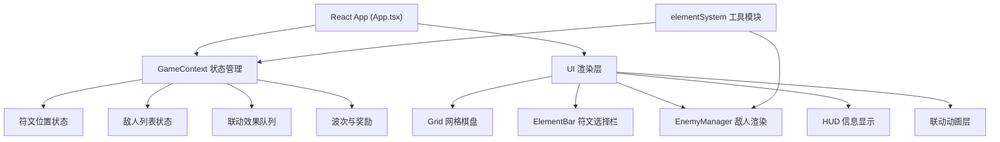

## 1. 架构设计



## 2. 技术描述

- **前端框架**：React 18 + TypeScript
- **构建工具**：Vite
- **状态管理**：React Context API（GameContext）
- **动画引擎**：requestAnimationFrame + CSS Transitions
- **渲染方式**：Canvas（网格和动画效果）+ DOM（HUD和符文选择栏）
- **无后端、无数据库**：纯前端游戏，状态保存在内存中

## 3. 文件结构

```
d:\Pro\tasks\auto196\
├── package.json
├── index.html
├── vite.config.js
├── tsconfig.json
└── src\
    ├── App.tsx                 # 主组件，渲染游戏画布和HUD，管理GameContext
    ├── context\
    │   └── GameContext.tsx     # 游戏状态Context，管理符文、敌人、联动队列
    ├── components\
    │   ├── Grid.tsx            # 8x8六边形网格棋盘，放置符文交互
    │   ├── ElementBar.tsx      # 符文选择栏，展示库存和拖拽预览
    │   ├── EnemyManager.tsx    # 敌人管理，移动控制和碰撞检测
    │   └── HUD.tsx             # 信息显示：波次、敌人、联动计数
    └── utils\
        └── elementSystem.ts    # 符文系统工具：联动逻辑和伤害计算
```

## 4. 数据模型定义

### 4.1 核心类型

```typescript
// 元素类型
type ElementType = 'fire' | 'water' | 'wind' | 'earth';

// 地形类型
type TerrainType = 'normal' | 'grass' | 'lava';

// 六边形网格坐标
interface HexCoord {
  q: number;  // 列
  r: number;  // 行
}

// 符文
interface Rune {
  id: string;
  element: ElementType;
  position: HexCoord;
  placedAt: number;
}

// 敌人状态效果
interface StatusEffect {
  type: 'burn' | 'freeze' | 'stun';
  duration: number;  // 毫秒
  startTime: number;
}

// 敌人
interface Enemy {
  id: string;
  hp: number;
  maxHp: number;
  speed: number;      // 基础速度
  baseSpeed: number;
  pathIndex: number;  // 当前路径索引
  progress: number;   // 当前段路径进度 0-1
  position: { x: number; y: number };
  statusEffects: StatusEffect[];
}

// 元素联动效果
interface ComboEffect {
  id: string;
  position: HexCoord;
  type: ElementType;
  comboType: string;
  startTime: number;
  duration: number;
  radius: number;
  damage: number;
}

// 粒子效果
interface Particle {
  id: string;
  x: number;
  y: number;
  vx: number;
  vy: number;
  life: number;
  maxLife: number;
  color: string;
  size: number;
}

// 游戏状态
interface GameState {
  runes: Rune[];
  enemies: Enemy[];
  comboEffects: ComboEffect[];
  particles: Particle[];
  inventory: Record<ElementType, number>;
  selectedRune: ElementType | null;
  wave: number;
  enemiesRemaining: number;
  enemiesSpawned: number;
  comboCount: number;
  isPlaying: boolean;
  isPaused: boolean;
  terrain: TerrainType[][];  // 8x8 or 6x6
  path: HexCoord[];          // 敌人行进路径
  waveInProgress: boolean;
}
```

## 5. 性能优化策略

1. **Canvas 分层渲染**：静态层（网格、地形、符文）和动态层（敌人、动画）分离，减少重绘区域
2. **requestAnimationFrame 驱动**：统一游戏循环，60FPS 目标
3. **离屏缓存**：静态六边形网格预渲染到离屏 Canvas
4. **状态更新批处理**：使用 useReducer 批量更新状态，减少 React 重渲染
5. **碰撞检测优化**：仅检测联动范围内的敌人，空间分区
6. **粒子数量控制**：限制最大粒子数，自动回收过期粒子
7. **React.memo 优化**：纯组件使用 memo 避免不必要重渲染

## 6. 联动规则定义

| 符文组合 | 联动名称 | 效果 |
|----------|----------|------|
| 火 + 风 | 扩散燃烧 | 燃烧：每秒减15HP，持续3秒；范围扩大 |
| 水 + 土 | 生长障碍 | 眩晕：停止移动1秒；范围内减速 |
| 水 + 风 | 冰霜风暴 | 冰冻：减速50%，持续2秒 |
| 火 + 土 | 熔岩喷发 | 高伤害爆发 + 短暂眩晕 |
| 火 + 火 | 烈焰强化 | 燃烧伤害+50% |
| 水 + 水 | 潮汐涌动 | 范围扩大 + 减速效果增强 |
| 风 + 风 | 飓风加速 | 所有联动范围扩大 |
| 土 + 土 | 岩石崩塌 | 高伤害 + 眩晕1.5秒 |

## 7. 地形效果

| 地形 | 移动速度 | 联动加成 |
|------|----------|----------|
| 普通 | 100% | 无 |
| 草地 | 减慢20% | 水+土联动效果+30% |
| 熔岩 | 加速30% | 火符文燃烧伤害+50% |
