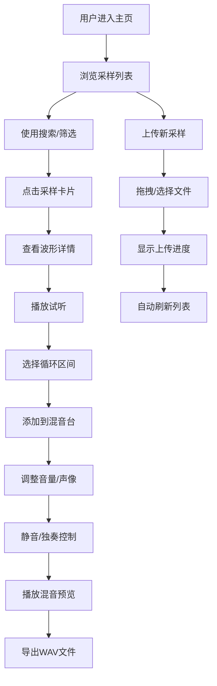

## 1. 产品概述
协作式音乐采样库平台，为音乐制作人和声音设计师提供在线音频采样的上传、管理、共享和混音服务。
- 核心目标：构建一个易用的采样资源库，支持按BPM、调性、标签筛选，在线试听和多轨混音导出
- 目标用户：音乐制作人、声音设计师、DJ、音乐爱好者

## 2. 核心功能

### 2.1 用户角色
| 角色 | 注册方式 | 核心权限 |
|------|----------|----------|
| 普通用户 | 无需注册（演示模式） | 浏览采样、搜索筛选、在线试听、使用混音台、上传采样、导出WAV |

### 2.2 功能模块
1. **采样浏览模块**：网格展示采样卡片、波形缩略图、BPM/调性标签
2. **采样详情模块**：大型波形可视化、播放控制、循环区间选择、添加到混音
3. **混音台模块**：多轨混音（最多6轨）、音量推子、声像旋钮、静音/独奏、导出WAV
4. **搜索筛选模块**：关键词搜索、BPM范围筛选、调性筛选、标签多选
5. **上传模块**：拖拽上传、进度显示、自动刷新列表

### 2.3 页面详情
| 页面名称 | 模块名称 | 功能描述 |
|----------|----------|----------|
| 主页面 | 顶部导航栏 | 搜索框、筛选下拉、上传按钮 |
| 主页面 | 左侧资源浏览面板 | 网格展示采样卡片，波形缩略图，点击跳转详情 |
| 主页面 | 右侧详情区域 | 大型波形可视化、播放控制栏、添加到混音按钮 |
| 主页面 | 底部混音台 | 多轨混音面板、轨道控制、导出按钮 |

## 3. 核心流程

用户访问平台 → 浏览/搜索采样 → 点击采样查看详情 → 试听/选择循环区间 → 添加到混音台 → 调整各轨参数 → 导出WAV文件

## 4. 用户界面设计

### 4.1 设计风格
- **主色调**：紫色 #A78BFA
- **强调色**：粉色 #EC4899
- **错误状态**：红色 #EF4444
- **深色主题**：背景 #09090B，面板 #18181B，次面板 #27272A，边框 #3F3F46
- **文字颜色**：主文字 #FAFAFA，次文字 #D4D4D8，辅助文字 #71717A
- **按钮样式**：圆角8px，主按钮紫色背景，悬停变暗10%
- **过渡动画**：统一0.2s ease-out过渡效果
- **字体**：现代无衬线字体，清晰的层级结构

### 4.2 页面设计概述
| 页面名称 | 模块名称 | UI元素 |
|----------|----------|----------|
| 主页面 | 顶部导航栏 | 固定定位56px高，深色背景，搜索框圆角8px聚焦时紫色边框，上传按钮紫色背景 |
| 主页面 | 左侧浏览面板 | 380px宽，圆角12px，内边距16px，网格布局采样卡片 |
| 主页面 | 采样卡片 | Canvas波形缩略图60px高，悬停时卡片上浮4px，BPM/调性标签圆角6px |
| 主页面 | 右侧详情区 | 最小宽度600px，大型波形200px高，可缩放拖拽选区半透明紫色高亮 |
| 主页面 | 播放控制栏 | 播放/暂停、循环开关、速度滑块0.5x-2x |
| 主页面 | 底部混音台 | 固定200px高，半透明毛玻璃效果，圆角16px，支持最小化 |
| 主页面 | 混音轨道 | 最多6轨，音量推子绿到红渐变，声像圆形旋钮，静音/独奏按钮 |
| 上传弹窗 | 拖拽区域 | 虚线紫色边框，拖入变实线深紫色，进度条紫到粉渐变，0.4s滑入动画 |

### 4.3 响应式设计
- Desktop-first设计，宽度低于768px时左侧面板变为可滑动抽屉
- 抽屉带0.3s滑动动画
- 混音台在移动端保持可操作的最小尺寸
- 触摸操作优化，按钮最小尺寸适配移动端

### 4.4 动效设计
- 页面加载时元素渐入（staggered fade-in）
- 卡片悬停上浮4px + 阴影增强
- 搜索结果0.3s fade-in动画
- 上传弹窗从下方0.4s cubic-bezier滑入
- 旋钮旋转0.1s缓动
- 波形播放进度实时更新
