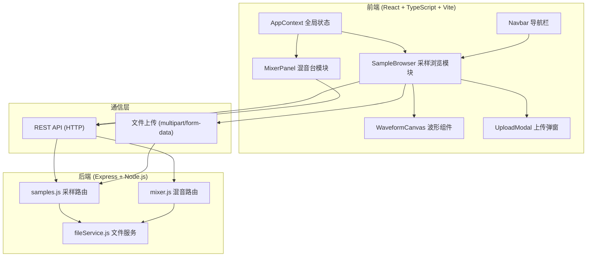
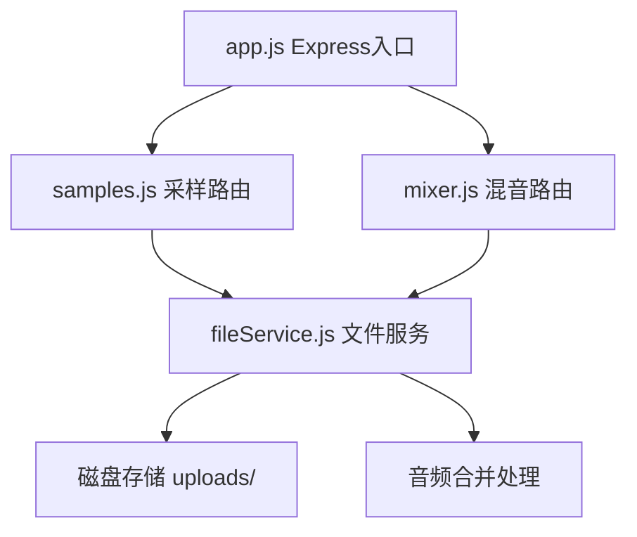

## 1. 架构设计



## 2. 技术描述

- **前端框架**：React@18 + TypeScript
- **构建工具**：Vite@5 + @vitejs/plugin-react
- **状态管理**：React Context API
- **HTTP客户端**：Axios
- **音频播放**：Howler.js
- **波形可视化**：原生Canvas API
- **后端框架**：Express@4
- **文件上传**：Multer
- **跨域处理**：Cors
- **唯一标识**：UUID

## 3. 项目文件结构

```
├── package.json
├── index.html
├── vite.config.js
├── tsconfig.json
├── src/
│   ├── frontend/
│   │   ├── components/
│   │   │   ├── SampleBrowser.tsx    # 采样浏览模块
│   │   │   └── MixerPanel.tsx       # 混音台模块
│   │   └── context/
│   │       └── AppContext.tsx       # 全局状态
│   └── backend/
│       ├── app.js                   # Express入口
│       ├── routes/
│       │   ├── samples.js           # 采样元数据CRUD
│       │   └── mixer.js             # 混音导出
│       └── services/
│           └── fileService.js       # 文件上传/合并
└── uploads/                         # 上传文件存储目录
```

## 4. 前端模块职责

### 4.1 SampleBrowser (采样浏览模块)
- **职责**：网格展示采样卡片、搜索筛选、上传逻辑
- **数据流向**：用户输入 → 防抖300ms → 调用GET API → 更新Context
- **核心功能**：
  - Canvas波形缩略图绘制
  - 卡片悬停动态播放进度
  - 搜索关键词防抖
  - 筛选条件组合查询
  - 拖拽上传处理
  - 上传进度显示

### 4.2 MixerPanel (混音台模块)
- **职责**：多轨混音、播放控制、导出请求
- **数据流向**：从Context读取轨道数据 → 发送混音参数 → 接收导出URL
- **核心功能**：
  - 多轨播放同步控制
  - 音量推子（0-100）
  - 声像旋钮（-50到50）
  - 静音/独奏切换
  - 速度调节（0.5x-2x）
  - WAV导出请求

### 4.3 AppContext (全局状态)
- **职责**：管理选中采样ID、混音轨道数据、搜索关键词
- **状态项**：
  - `samples`: 采样列表
  - `selectedSampleId`: 当前选中采样ID
  - `searchQuery`: 搜索关键词
  - `filters`: 筛选条件（BPM范围、调性、标签）
  - `mixerTracks`: 混音轨道数据（最多6个）

## 5. 路由定义

| 路由路径 | HTTP方法 | 用途 |
|----------|----------|------|
| /api/samples | GET | 获取采样列表（支持搜索和筛选参数） |
| /api/samples/:id | GET | 获取单个采样详情 |
| /api/samples | POST | 上传新采样（multipart/form-data） |
| /api/mixer/export | POST | 混音合并导出WAV |

## 6. API定义

### 6.1 TypeScript类型定义

```typescript
interface Sample {
  id: string;
  name: string;
  filename: string;
  url: string;
  duration: number;
  bpm: number;
  key: string;
  tags: string[];
  waveformData: number[];
  createdAt: string;
}

interface MixerTrack {
  id: string;
  sampleId: string;
  sample: Sample | null;
  volume: number;
  pan: number;
  muted: boolean;
  solo: boolean;
  loopStart: number;
  loopEnd: number;
}

interface AppState {
  samples: Sample[];
  selectedSampleId: string | null;
  searchQuery: string;
  filters: {
    bpmMin: number | null;
    bpmMax: number | null;
    keys: string[];
    tags: string[];
  };
  mixerTracks: MixerTrack[];
}

interface ExportRequest {
  tracks: {
    sampleId: string;
    volume: number;
    pan: number;
    loopStart: number;
    loopEnd: number;
  }[];
}

interface ExportResponse {
  url: string;
  filename: string;
}
```

### 6.2 请求/响应格式

**GET /api/samples**
- Query参数：`search`, `bpmMin`, `bpmMax`, `keys`, `tags`
- 响应：`{ data: Sample[] }`

**POST /api/samples**
- Body: `multipart/form-data` (file + name + bpm + key + tags)
- 响应：`{ data: Sample }`

**POST /api/mixer/export**
- Body: `ExportRequest` JSON
- 响应：`{ data: ExportResponse }`

## 7. 后端架构



### 7.1 后端模块职责

- **app.js**：初始化Express服务器，挂载路由，启用CORS和JSON解析，托管静态文件
- **samples.js**：处理采样列表GET、详情GET、上传POST请求，调用fileService处理文件
- **mixer.js**：接收混音参数，调用fileService进行音频合并，返回下载URL
- **fileService.js**：音频文件存储、读取、合并导出为WAV格式

## 8. 数据模型

### 8.1 内存数据存储（演示模式）

```javascript
// samples.js 内存存储
let samples = [
  {
    id: 'uuid-1',
    name: 'Kick Drum 01',
    filename: 'kick_01.wav',
    url: '/uploads/kick_01.wav',
    duration: 0.5,
    bpm: 120,
    key: 'C',
    tags: ['drum', 'kick', 'bass'],
    waveformData: [0.2, 0.8, 0.5, ...],
    createdAt: '2025-06-21T00:00:00Z'
  }
];
```

## 9. 性能指标

- 搜索响应时间：≤500ms
- 上传完成列表更新：≤300ms
- 防抖搜索：300ms
- 动画过渡：0.1s-0.4s
- 混音轨道上限：6个
