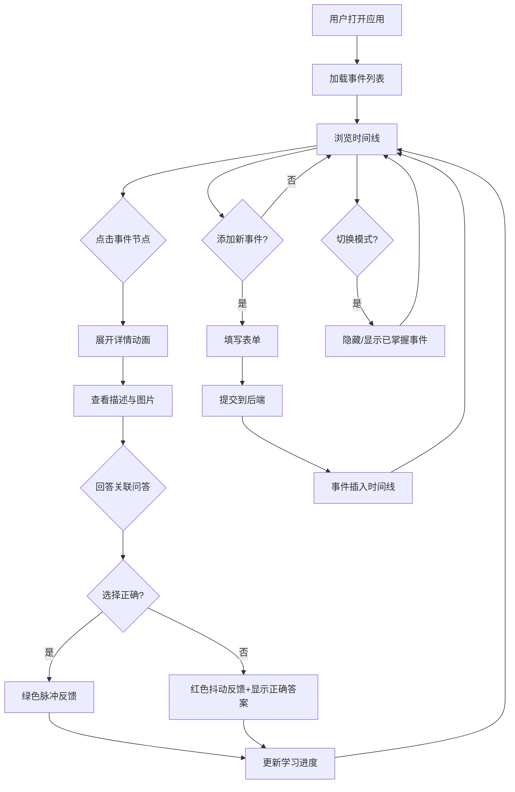

## 1. 产品概述

互动式历史时间线探索与知识问答应用——面向在线教育场景，让学生在垂直时间轴（公元前3000年至今）上浏览、添加历史事件节点，并通过关联单选题进行自测，系统实时追踪学习进度。

- 解决传统教学内容缺乏互动性和即时反馈的问题
- 目标用户为中学及大学历史课程学生，提供沉浸式学习体验

## 2. 核心功能

### 2.1 用户角色

| 角色 | 注册方式 | 核心权限 |
|------|----------|----------|
| 学生 | 无需注册 | 浏览时间线、添加事件、答题自测、查看进度 |

### 2.2 功能模块

1. **时间线主页面**：垂直时间线展示、事件节点交互、问答自测、学习进度追踪
2. **事件添加面板**：左侧固定表单，添加新事件到时间线

### 2.3 页面详情

| 页面名称 | 模块名称 | 功能描述 |
|----------|----------|----------|
| 时间线主页面 | 顶部导航栏 | 应用标题"历史时间线"、已总览事件数、已答题目数、学习进度条、切换模式按钮 |
| 时间线主页面 | 垂直时间线 | 按日期从远到近排列事件节点，点击展开详情（描述+图片+问答），0.3s展开动画 |
| 时间线主页面 | 事件卡片 | 标题、日期、描述（展开后）、图片（懒加载+骨架屏）、关联问答 |
| 时间线主页面 | 问答组件 | 单选题4选项，选择后即时反馈（正确绿色脉冲/错误红色抖动），累计答对题数 |
| 时间线主页面 | 学习进度条 | 渐变色填充#00e676到#00bcd4，整数百分比显示 |
| 事件添加面板 | 事件表单 | 标题输入、日期选择器、描述文本域、图片URL输入、提交按钮 |
| 事件添加面板 | 提交反馈 | 绿色toast提示2s后消失，表单清空 |

## 3. 核心流程

1. 用户打开应用，加载时间线事件列表
2. 用户浏览垂直时间线，点击事件节点展开详情
3. 展开后查看描述、图片，并回答关联问答
4. 系统即时反馈答题结果，更新学习进度
5. 用户可通过左侧表单添加新事件，自动插入正确位置
6. 用户可切换"隐藏已掌握"模式，聚焦未学内容

## 4. 用户界面设计

### 4.1 设计风格

- **主色调**：深蓝黑色背景 #0f0c29，浅青色强调 #64ffda
- **按钮风格**：渐变色 #667eea → #764ba2，圆角8px，hover上移2px
- **字体**：使用 Noto Serif SC 作为标题字体（历史感），Noto Sans SC 作为正文字体
- **布局风格**：顶部固定导航栏，左侧固定表单面板，中间垂直时间线
- **卡片风格**：圆角16px，毛玻璃效果 rgba(255,255,255,0.05)，浅青色描边连接线2px

### 4.2 页面设计概览

| 页面名称 | 模块名称 | UI元素 |
|----------|----------|--------|
| 时间线主页面 | 顶部导航栏 | 固定定位，黑色半透明背景rgba(0,0,0,0.8)，高度60px，标题+进度条+切换按钮 |
| 时间线主页面 | 垂直时间线 | 居中max-w-4xl，虚线连接节点，节点左右浅青色描边线连接时间轴 |
| 时间线主页面 | 事件卡片 | 毛玻璃半透明背景，圆角16px，展开时0.3s cubic-bezier动画 |
| 时间线主页面 | 问答区域 | 选项卡片式，正确#4caf50脉冲动画，错误#f44336抖动0.2s |
| 事件添加面板 | 表单面板 | 左侧固定宽度300px，背景#1e1e2e，圆角8px，渐变色提交按钮 |

### 4.3 响应式

- 桌面端：左侧固定表单面板 + 中间时间线
- 移动端（<768px）：时间线单列卡片，左侧面板收起为悬浮按钮，点击弹出表单
- 触摸优化：卡片点击区域足够大，选项按钮间距充足

### 4.4 性能约束

- 事件列表首次加载 ≤ 800ms
- 展开/收起动画稳定60fps
- 图片懒加载减少首屏资源
