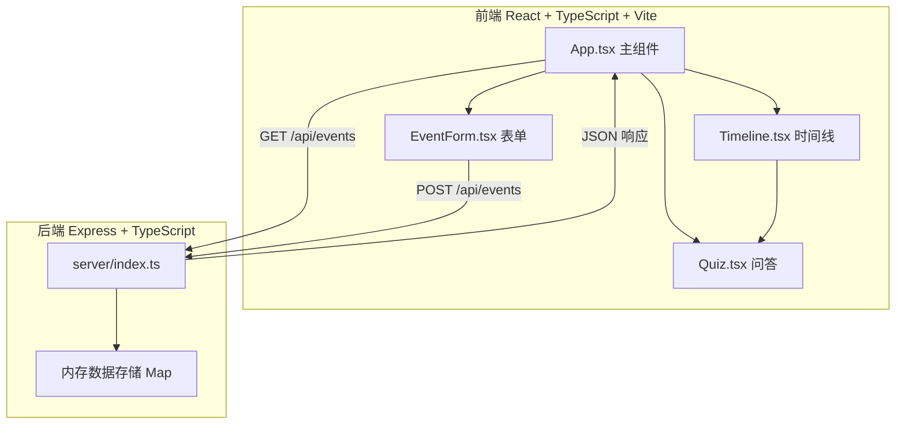
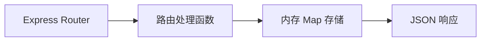
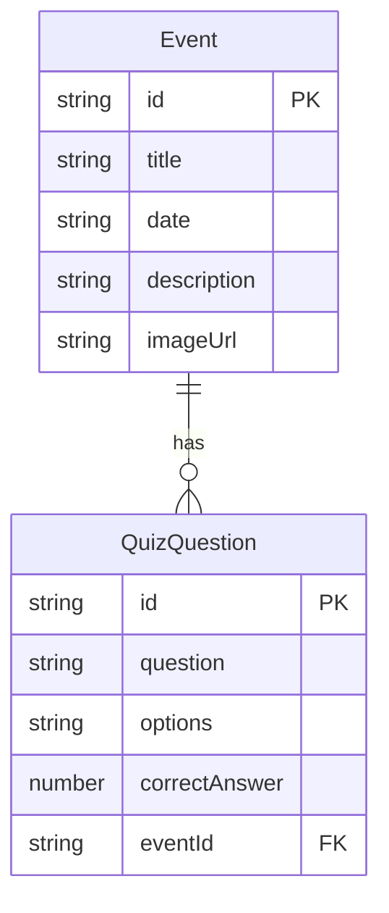

## 1. 架构设计



## 2. 技术说明

- **前端**：React@18 + TypeScript + Vite（端口3000，代理/api到后端5000）
- **初始化工具**：vite-init（react-express-ts模板）
- **后端**：Express@4 + TypeScript + cors + uuid
- **数据库**：内存Map存储（无需外部数据库）
- **状态管理**：zustand

## 3. 路由定义

| 路由 | 用途 |
|------|------|
| / | 时间线主页面（单页应用） |

## 4. API 定义

### 4.1 数据类型

```typescript
interface QuizQuestion {
  id: string;
  question: string;
  options: string[];
  correctAnswer: number;
}

interface Event {
  id: string;
  title: string;
  date: string;
  description: string;
  imageUrl: string;
  questions: QuizQuestion[];
}
```

### 4.2 接口定义

| 方法 | 路径 | 请求体 | 响应 | 用途 |
|------|------|--------|------|------|
| GET | /api/events | - | Event[] | 获取所有事件列表 |
| POST | /api/events | Partial<Event> | Event | 添加新事件 |

### 4.3 请求/响应示例

**GET /api/events**
```json
[
  {
    "id": "1",
    "title": "古埃及金字塔建造",
    "date": "-2560-01-01",
    "description": "吉萨大金字塔建成...",
    "imageUrl": "https://...",
    "questions": [
      {
        "id": "q1",
        "question": "吉萨大金字塔是为哪位法老建造的？",
        "options": ["胡夫", "哈夫拉", "门卡拉", "拉美西斯"],
        "correctAnswer": 0
      }
    ]
  }
]
```

**POST /api/events**
```json
请求体:
{
  "title": "工业革命",
  "date": "1760-01-01",
  "description": "...",
  "imageUrl": "https://...",
  "questions": [...]
}

响应:
{
  "id": "生成的UUID",
  "title": "工业革命",
  "date": "1760-01-01",
  "description": "...",
  "imageUrl": "https://...",
  "questions": [...]
}
```

## 5. 服务端架构图



## 6. 数据模型

### 6.1 数据模型定义



### 6.2 初始数据

后端启动时预置5-8条示例历史事件（覆盖公元前3000年到现代），每条事件关联1-3道问答题，确保应用启动即有丰富的展示内容。

## 7. 文件结构与调用关系

```
project/
├── package.json                    # 依赖和脚本
├── vite.config.js                  # Vite配置，端口3000，代理/api→5000
├── tsconfig.json                   # TypeScript严格模式
├── index.html                      # 入口HTML
├── server/
│   ├── index.ts                    # Express服务端（API路由+内存存储）
│   └── types.ts                    # Event/QuizQuestion类型定义
├── src/
│   ├── main.tsx                    # React入口，挂载App
│   ├── App.tsx                     # 主组件（状态管理+数据获取+布局）
│   ├── store.ts                    # zustand状态管理
│   ├── components/
│   │   ├── Timeline.tsx            # 时间线组件（排序+渲染+展开/收起）
│   │   ├── EventForm.tsx           # 事件表单组件（输入+提交+通知）
│   │   └── Quiz.tsx               # 问答组件（选题+反馈+进度更新）
│   └── styles.css                  # 全局样式
```

**数据流向**：
1. App.tsx 通过 zustand store 管理事件列表和答题状态
2. App.tsx 挂载时调用 GET /api/events 初始化数据
3. EventForm.tsx 提交时调用 POST /api/events，成功后通知 App 更新列表
4. Timeline.tsx 接收 events 数组，按日期排序渲染节点
5. 点击节点展开详情，Quiz.tsx 接收 questions 数组渲染问答
6. Quiz.tsx 答题结果更新 zustand store 中的进度数据
7. 导航栏从 store 读取进度数据展示

## 8. 初始种子数据

预置事件覆盖关键历史时期：
1. 古埃及金字塔建造（约公元前2560年）
2. 古希腊雅典民主制（约公元前508年）
3. 秦始皇统一中国（公元前221年）
4. 文艺复兴（约1400年）
5. 法国大革命（1789年）
6. 工业革命（约1760年）
7. 第二次世界大战结束（1945年）
8. 互联网时代（1990年）
