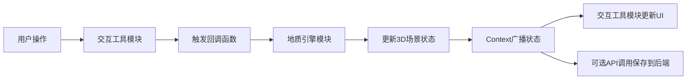

## 1. 产品概述

地质断层交互沙盘是一个基于Web的3D地质教学与演示工具，用户可通过交互式挖掘探索地下岩层结构、断层线和矿脉走向，支持标注和测量功能。

- **主要用途**：地质教学演示、矿产勘查初步可视化、科普教育
- **目标用户**：地质专业师生、矿产勘查人员、科普爱好者
- **产品价值**：将抽象的地质结构具象化，通过游戏化交互降低学习门槛，提升地质知识传播效率

## 2. 核心功能

### 2.1 功能模块

1. **3D地质场景**：60x60单位起伏地形网格，多层岩层结构，两条斜向断层线
2. **挖掘交互系统**：刷子工具挖掘地表土层，面片淡出动画，露出下方岩层
3. **标注系统**：图钉标注点，文字标签，标注列表面板，相机自动飞行
4. **信息状态栏**：实时坐标显示，挖掘/标注统计
5. **重置功能**：确认对话框，场景恢复动画
6. **后端数据服务**：地形数据加载保存，标注数据增删查

### 2.2 页面详情

| 页面名称 | 模块名称 | 功能描述 |
|-----------|-------------|---------------------|
| 主场景页面 | 3D地形渲染 | Three.js渲染起伏地形，颜色从草绿色渐变到深灰色，网格线半透明 |
| 主场景页面 | 相机控制 | 鼠标拖拽旋转视角，滚轮缩放，限制俯仰角0-85度，缩放范围5-100 |
| 主场景页面 | 岩层展示 | 砂岩层、石灰岩层、花岗岩层，波浪状分界线，半透明显示 |
| 主场景页面 | 断层渲染 | 两条斜向断层线，呼吸发光动画，摩擦纹理，提示气泡 |
| 工具栏模块 | 刷子工具 | 圆形图标，48x48px，选中高亮，挖掘模式切换，按住左键涂抹挖掘 |
| 工具栏模块 | 标注工具 | 图钉图标，按下下沉动画，点击地形放置标注点 |
| 标注面板 | 标注列表 | 右侧280px面板，查看所有标注，删除功能，点击飞行到对应位置 |
| 标注面板 | 标注编辑 | 点击标注点弹出输入框，文字显示在球形上方，monospace字体 |
| 状态栏 | 坐标显示 | 底部36px高度，显示鼠标世界坐标X/Z，保留两位小数 |
| 状态栏 | 统计信息 | 已挖掘网格总数，已放置标注数量 |
| 重置模块 | 重置按钮 | 右上角圆形按钮，确认对话框，场景恢复动画 |

## 3. 核心流程

### 3.1 挖掘流程
用户选择刷子工具 → 按住鼠标左键在地形上涂抹 → 射线检测拾取网格面片 → 面片0.3秒淡出动画 → 动态移除顶点组 → 露出下方岩层 → 若触及断层则显示提示气泡

### 3.2 标注流程
用户选择标注工具 → 点击地形位置 → 放置半透明圆柱+球形标注点 → 弹出输入框输入文字 → 文字显示在标注点上方 → 同步到右侧标注列表 → 可删除或点击飞行到该位置

### 3.3 数据流向

## 4. 用户界面设计

### 4.1 设计风格
- **主色调**：深色主题，主背景#0F172A，卡片背景#1E293B
- **强调色**：#3B82F6（蓝色），警告色#EF4444（红色），成功色#10B981（绿色）
- **文字颜色**：#F8FAFC（主色），#94A3B8（次要）
- **按钮样式**：圆角设计，hover/active状态0.2s过渡动画
- **字体**：主文字使用现代无衬线字体，坐标显示使用courier/monospace
- **布局**：左侧工具栏，右侧标注面板，底部状态栏，右上角重置按钮
- **动效**：统一的0.2s过渡，面片淡出，相机飞行cubic-bezier缓动

### 4.2 岩层配色
| 岩层 | 颜色 | 说明 |
|------|------|------|
| 地表土层 | #4ADE80 | 草绿色渐变到底部基岩#334155 |
| 砂岩层 | #D97706 | 橙色系 |
| 石灰岩层 | #A3A3A3 | 灰色系 |
| 花岗岩层 | #78716C | 深灰系 |
| 断层线 | #EF4444 | 红色，呼吸发光动画 |

### 4.3 页面设计概览

| 页面名称 | 模块名称 | UI元素 |
|-----------|-------------|-------------|
| 主场景 | 3D渲染区 | 全屏Three.js画布，地形网格，岩层，断层线 |
| 工具栏 | 工具按钮 | 垂直排列，圆形图标48x48px，#1E293B背景，圆角12px，选中边框#3B82F6 |
| 标注面板 | 列表容器 | 宽度280px，#0F172A背景，圆角8px，内边距12px，标注项列表 |
| 状态栏 | 信息栏 | 高度36px，#1E293B背景，1px#334155分隔线，左右对齐布局 |
| 重置按钮 | 操作按钮 | 圆形直径40px，#EF4444背景，hover变#DC2626，旋转箭头图标 |
| 对话框 | 确认弹窗 | 毛玻璃背景，圆角12px，取消#64748B，确认#EF4444 |
| 标注点 | 3D对象 | 半透明圆柱+球形，#FACC15，文字标签背景#1E293B，圆角6px |

### 4.4 响应式设计
- **桌面端（>768px）**：左侧垂直工具栏，右侧固定标注面板
- **移动端（≤768px）**：工具栏变为底部浮动栏（高度60px，横向滚动），标注面板收起为抽屉式，右下角按钮滑出

### 4.5 3D场景设计指引
- **环境**：深色空间背景，无HDRI，突出地质结构本身
- **光照**：半球光+方向光组合，柔和阴影，清晰展现岩层层次
- **相机**：初始位置(30, 40, 50)，看向场景中心，OrbitControls控制
- **构图**：地形居中，岩层水平面层次分明，断层线斜向穿插形成视觉焦点
- **交互动画**：挖掘面片0.3s淡出，恢复0.5s逐个出现，标注放置缩放动画，相机飞行1.2s
- **后处理**：轻微泛光效果增强断层发光动画，FXAA抗锯齿
- **性能**：网格面片控制在8000以内，挖掘/恢复帧率≥50fps

## 5. 非功能需求
- **性能要求**：交互流畅，挖掘和恢复操作帧率不低于50fps
- **兼容性**：现代浏览器，支持WebGL 2.0
- **可维护性**：模块分离，地质引擎与交互UI独立，通过Context通信
