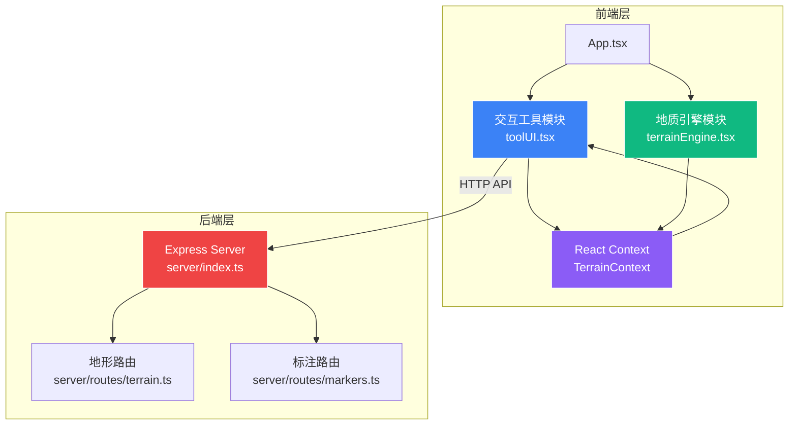
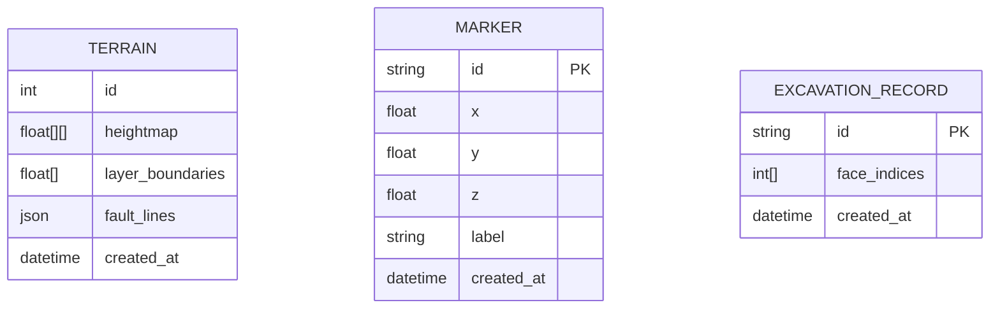

## 1. 架构设计



## 2. 技术描述

### 2.1 前端技术栈
- **核心框架**：React 18 + TypeScript
- **构建工具**：Vite 5.x
- **3D渲染**：Three.js 0.160.x
- **类型定义**：@types/three
- **HTTP客户端**：Axios
- **状态管理**：React Context API

### 2.2 后端技术栈
- **服务框架**：Express 4.x
- **跨域处理**：CORS
- **唯一ID**：uuid
- **端口**：3001

### 2.3 项目初始化
- 使用Vite初始化React + TypeScript项目
- 配置路径别名@指向src目录
- Vite代理配置：/api请求转发到http://localhost:3001

## 3. 模块职责划分

| 模块 | 文件 | 职责 |
|------|------|------|
| 地质引擎模块 | src/terrainEngine.tsx | Three.js场景初始化、地形网格生成、挖掘与恢复逻辑、岩层渲染、断层线渲染、相机控制、Context提供 |
| 交互工具模块 | src/toolUI.tsx | 工具栏渲染、标注管理、重置功能、状态栏显示、API调用 |
| 根组件 | src/App.tsx | 包裹TerrainProvider，内嵌ToolUI，全局样式设置 |
| 入口文件 | src/main.tsx | ReactDOM渲染入口 |
| 地形路由 | server/routes/terrain.ts | GET /api/terrain、POST /api/terrain/save |
| 标注路由 | server/routes/markers.ts | GET /api/markers、POST /api/markers、DELETE /api/markers/:id |
| 服务入口 | server/index.ts | Express服务初始化、挂载路由、启用CORS |

## 4. API 定义

### 4.1 地形数据接口

```typescript
// GET /api/terrain - 加载预置地形数据
interface TerrainData {
  heightmap: number[][];      // 64x64高度数组，值范围0-15
  layerBoundaries: number[];  // 岩层边界Y值列表 [8, 6, 4]
  faultLines: FaultLine[];    // 断层线定义
}

interface FaultLine {
  id: string;
  start: { x: number; z: number };
  end: { x: number; z: number };
  width: number;  // 0.3单位
}

// POST /api/terrain/save - 保存用户挖掘状态
interface SaveTerrainRequest {
  excavatedFaces: number[];   // 被挖掘的面片索引列表
  excavatedAt: string;        // ISO时间戳
}

interface SaveTerrainResponse {
  success: boolean;
  savedId: string;
}
```

### 4.2 标注数据接口

```typescript
// 标注数据模型
interface Marker {
  id: string;
  x: number;
  z: number;
  y: number;       // 地形高度
  label: string;
  createdAt: string;
}

// GET /api/markers - 获取所有标注
// Response: Marker[]

// POST /api/markers - 新增标注
// Request: { x: number; z: number; y: number; label: string }
// Response: Marker

// DELETE /api/markers/:id - 删除指定标注
// Response: { success: boolean }
```

## 5. Context 接口定义

```typescript
interface TerrainContextType {
  // 状态
  mousePosition: { x: number; z: number };
  excavatedCount: number;
  markers: Marker[];
  activeTool: 'brush' | 'marker' | null;
  isDigging: boolean;
  
  // 操作方法
  setActiveTool: (tool: 'brush' | 'marker' | null) => void;
  addMarker: (x: number, z: number, label: string) => Marker;
  removeMarker: (id: string) => void;
  flyToMarker: (id: string, duration?: number) => void;
  resetTerrain: () => Promise<void>;
  getTerrainHeight: (x: number, z: number) => number;
}
```

## 6. 核心技术实现要点

### 6.1 地形网格生成
- 使用PlaneGeometry，细分80x80，共6400个面片（<8000性能要求）
- 每个顶点Y坐标叠加Perlin噪声生成自然起伏
- 顶点颜色从#4ADE80（高）渐变到#334155（低）
- 使用BufferGeometry提高性能

### 6.2 挖掘实现
- Raycaster射线检测拾取地形面片
- BufferGeometry的setIndex动态移除顶点组
- 材质透明度动画实现0.3s淡出效果
- 维护已挖掘面片索引数组，支持恢复

### 6.3 岩层渲染
- 三个额外的半透明平面，分别位于Y=8, Y=6, Y=4
- 每层顶点Y值叠加正弦波生成波浪状分界线
- 材质transparent=true，opacity=0.85
- 颜色分别为#D97706、#A3A3A3、#78716C

### 6.4 断层线渲染
- LineSegments构建断层网格
- 自定义ShaderMaterial实现呼吸发光动画
- uniform time变量控制sin函数周期1秒
- 摩擦纹理使用Canvas生成噪点贴图

### 6.5 相机控制
- OrbitControls，enableDamping=true
- minPolarAngle=0, maxPolarAngle=85°
- minDistance=5, maxDistance=100
- 自定义相机飞行动画，使用cubic-bezier缓动

### 6.6 性能优化
- 面片数量控制在6400（80x80细分）
- BufferGeometry而非Geometry
- 材质复用，避免重复创建
- 挖掘操作批量更新index数组
- requestAnimationFrame帧同步

## 7. 数据模型

### 7.1 ER图



## 8. 文件组织结构

```
auto202/
├── package.json
├── index.html
├── vite.config.js
├── tsconfig.json
├── src/
│   ├── terrainEngine.tsx    # 地质引擎模块
│   ├── toolUI.tsx           # 交互工具模块
│   ├── App.tsx              # 根组件
│   └── main.tsx             # 入口
└── server/
    ├── index.ts             # Express服务入口
    └── routes/
        ├── terrain.ts       # 地形路由
        └── markers.ts       # 标注路由
```
