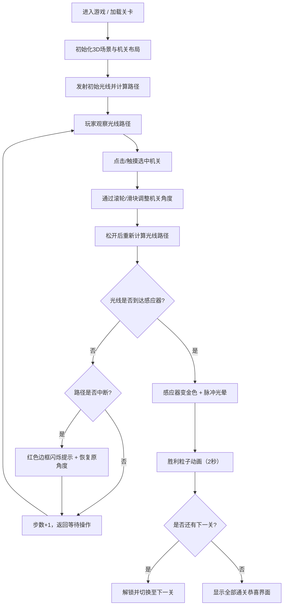

## 1. 产品概述
光影迷阵是一款结合光影反射物理模拟与机关触发机制的等距视角3D迷宫探索解谜游戏。玩家通过操控反射镜、棱镜和半透明挡板等机关，将初始光线引导至终点光感应器以开启出口。

- 目标用户：解谜游戏爱好者、物理模拟游戏玩家、休闲益智类用户
- 产品价值：填补市场上"逼真光影效果"与"复杂谜题设计"难以兼顾的空白，提供沉浸式的光影解谜体验

## 2. 核心功能

### 2.1 功能模块
1. **3D迷宫场景渲染**：等距视角45度俯瞰、深空蓝紫渐变背景、迷宫墙壁与地面
2. **光线物理模拟系统**：白光发射、镜面反射、棱镜色散（红绿蓝三束分光）、半透明挡板透射/反射、光线路径实时绘制
3. **机关交互操控系统**：鼠标/触摸选中机关、滚轮/滑块/拨盘调整旋转角度、角度指示环可视化、机关高亮选中状态
4. **关卡进度系统**：3个内置关卡、关卡切换、步数计数、通关判定、胜利粒子动画
5. **UI状态反馈系统**：HUD信息面板、路径中断警告、通关提示、重置/暂停控制、操作说明

### 2.2 页面详情
| 页面名称 | 模块名称 | 功能描述 |
|----------|----------|----------|
| 游戏主界面 | 3D渲染视口 | Three.js全屏渲染等距视角迷宫、机关、光线、感应器 |
| 游戏主界面 | HUD面板 | 左上角半透明面板：关卡编号、步数、重置按钮、操作说明 |
| 游戏主界面 | 机关操控层 | 机关选中高亮、角度指示环、滑块/拨盘调整控件 |
| 游戏主界面 | 状态反馈层 | 路径中断红色边框闪烁、胜利粒子动画、消息提示 |

## 3. 核心流程

## 4. 用户界面设计

### 4.1 设计风格
- **主色调**：深空蓝紫色渐变背景 (#0f0a1a → #1a1a2e)，金色光线 (#FFD700)，蓝色感应器 (#3B82F6)，激活金色 (#FBBF24)
- **辅助色**：红光 (#FF6B6B)、绿光 (#48DBFB)、蓝光 (实际用#4ECDC4替代，避免与感应器冲突)、黄光 (#FFD93D)
- **按钮风格**：圆角半透明毛玻璃效果，背景rgba(15,15,30,0.7)，圆角12px，边框微透明白色
- **字体**：使用 Orbitron 作为科技感显示字体（标题/数字），配合 Noto Sans SC 作为正文字体
- **布局风格**：全屏沉浸式3D视口，HUD悬浮叠加，响应式适配移动端触控

### 4.2 页面设计详情
| 页面模块 | UI元素 | 设计描述 |
|----------|--------|----------|
| 3D主视口 | 迷宫墙壁 | 深灰紫色低多边形墙体，带微弱环境贴图反光 |
| 3D主视口 | 光线 | 半透明金色发光线条 (#FFD700, 透明度0.8, 线宽3px)，带渐变外发光模糊效果 |
| 3D主视口 | 反射镜 | 银色镜面材质，可绕Y轴旋转，选中时白色虚线圆环脉冲高亮 |
| 3D主视口 | 棱镜 | 透明水晶材质，色散分光，选中时同上高亮 |
| 3D主视口 | 半透明挡板 | 白色磨砂半透明，选中时同上高亮 |
| 3D主视口 | 光感应器 | 直径1单位圆盘，未激活蓝色，激活金色脉冲光晕 |
| HUD面板 | 关卡编号 | 大号Orbitron字体，金色高亮，显示"关卡 N / 3" |
| HUD面板 | 步数计数 | 中等字号，白色，显示"步数: XX" |
| HUD面板 | 重置按钮 | 半透明背景，圆角，悬停发光效果 |
| HUD面板 | 操作说明 | 小号字体，灰色，说明选中/滚轮/重置等操作 |
| 机关操控 | 角度指示环 | 半透明圆环浮于机关上方，每30度刻度标记，当前角度高亮 |
| 机关操控 | 滑块控件 | 选中机关后HUD内出现0-360度滑块，或移动端底部拨盘 |
| 反馈层 | 路径中断 | 全屏红色半透明边框闪烁（周期0.8s），同时HUD显示"路径中断"文字 |
| 反馈层 | 胜利粒子 | 感应器处爆发彩色粒子扩散（2秒），HUD显示"通关！" |

### 4.3 响应式设计
- **桌面端**：全屏3D视口，鼠标左键选中机关，滚轮调整角度，HUD左上角悬浮
- **平板/移动端**：触控点击选中机关，底部弹出圆形角度拨盘拖动调整，HUD适配小屏尺寸，所有触控目标尺寸≥44px
- **断点**：768px以下切换为移动端布局

### 4.4 3D场景设计指引
- **环境氛围**：深空蓝紫色渐变背景，微弱星空粒子点，整体神秘科幻氛围
- **光照设置**：主方向光模拟月光（蓝白色）+ 环境光保证基础可见度 + 发光材质（光线/感应器/粒子）自发光
- **相机设置**：正交相机或透视相机模拟等距视角，角度45度俯视，可适度缩放，禁用旋转固定视角
- **构图焦点**：迷宫中心区域为主活动区，光线视觉上最亮吸引注意力，终点感应器位置具有醒目视觉引导
- **动画效果**：机关旋转平滑过渡（0.3s缓动），光线重算即时更新，选中圆环脉冲透明度动画（0.6→1.0，周期1.5s），胜利粒子系统（速度2单位/秒，2秒后消失）
- **后期处理**：Bloom效果（发光线条和感应器的外发光模糊），轻微Vignette暗角加强沉浸感
