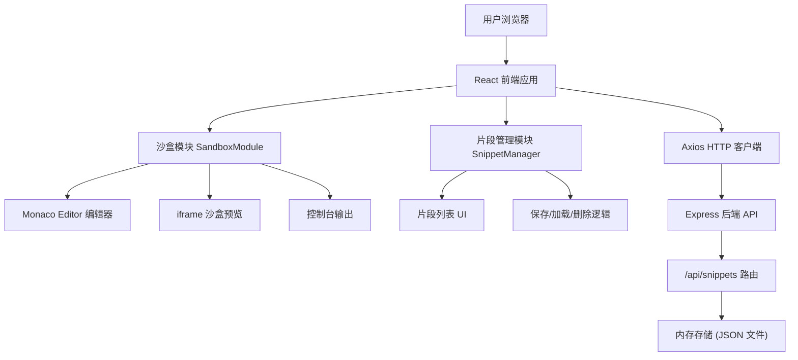
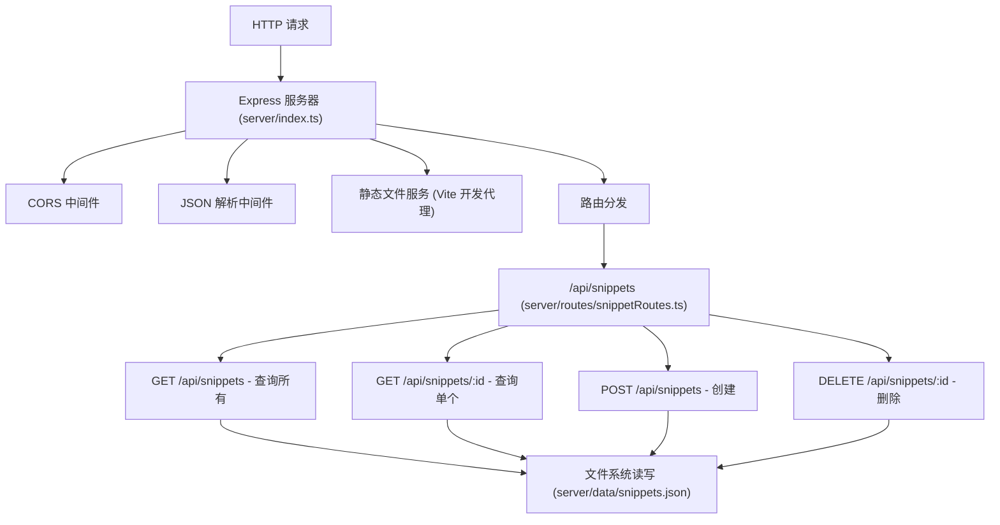

## 1. 架构设计



## 2. 技术描述

- **前端框架**：React 18 + TypeScript 5 + Vite 5
- **构建工具**：Vite 5
- **代码编辑器**：@monaco-editor/react（Monaco Editor 轻量版本）
- **HTTP 客户端**：Axios 1.6+
- **后端框架**：Express 4 + TypeScript 5
- **后端运行时**：ts-node（开发环境）
- **数据存储**：本地 JSON 文件（内存映射）
- **唯一 ID 生成**：uuid 9.0+
- **跨域处理**：cors 2.8+
- **状态管理**：React useState/useEffect（轻量场景，无需额外状态管理库）
- **样式方案**：原生 CSS + CSS 变量

## 3. 目录结构

```
auto205/
├── package.json              # 项目依赖和脚本
├── index.html                # Vite 入口 HTML
├── vite.config.js            # Vite 构建配置
├── tsconfig.json             # TypeScript 配置（严格模式）
├── src/
│   ├── main.tsx             # React 应用入口
│   ├── App.tsx              # 主布局组件
│   ├── SandboxModule.tsx    # 沙盒模块组件
│   ├── SnippetManager.tsx   # 片段管理模块组件
│   └── types.ts             # TypeScript 类型定义
├── server/
│   ├── index.ts             # Express 服务器入口
│   ├── routes/
│   │   └── snippetRoutes.ts # 片段 CRUD 路由
│   └── data/
│       └── snippets.json    # 片段数据存储文件
└── .trae/
    └── documents/
        ├── prd.md
        └── technical-architecture.md
```

## 4. API 定义

### 4.1 TypeScript 类型定义

```typescript
// src/types.ts
export interface CodeSnippet {
  id: string;
  name: string;
  description: string;
  html: string;
  css: string;
  javascript: string;
  createdAt: number;
  updatedAt: number;
}

export interface CreateSnippetRequest {
  name: string;
  description: string;
  html: string;
  css: string;
  javascript: string;
}

export interface ConsoleMessage {
  type: 'log' | 'error' | 'warn' | 'info';
  message: string;
  timestamp: number;
}
```

### 4.2 REST API 接口

| 方法 | 路由 | 用途 | 请求体 | 响应 |
|------|------|------|--------|------|
| GET | `/api/snippets` | 获取所有片段列表 | 无 | `CodeSnippet[]` |
| GET | `/api/snippets/:id` | 获取单个片段详情 | 无 | `CodeSnippet` |
| POST | `/api/snippets` | 创建新片段 | `CreateSnippetRequest` | `CodeSnippet` |
| DELETE | `/api/snippets/:id` | 删除片段 | 无 | `{ success: boolean }` |

### 4.3 API 请求响应示例

**GET /api/snippets 响应：**
```json
[
  {
    "id": "550e8400-e29b-41d4-a716-446655440000",
    "name": "Hello World 示例",
    "description": "一个简单的 HTML/CSS/JS 演示",
    "html": "<div id=\"app\"></div>",
    "css": "#app { color: red; }",
    "javascript": "document.getElementById('app').textContent = 'Hello World';",
    "createdAt": 1718956800000,
    "updatedAt": 1718956800000
  }
]
```

**POST /api/snippets 请求：**
```json
{
  "name": "按钮点击演示",
  "description": "演示按钮点击事件处理",
  "html": "<button id=\"btn\">点击我</button>",
  "css": "button { padding: 10px 20px; }",
  "javascript": "document.getElementById('btn').onclick = () => alert('Hi!');"
}
```

**POST /api/snippets 响应：**
```json
{
  "id": "550e8400-e29b-41d4-a716-446655440001",
  "name": "按钮点击演示",
  "description": "演示按钮点击事件处理",
  "html": "<button id=\"btn\">点击我</button>",
  "css": "button { padding: 10px 20px; }",
  "javascript": "document.getElementById('btn').onclick = () => alert('Hi!');",
  "createdAt": 1718956900000,
  "updatedAt": 1718956900000
}
```

## 5. 服务器架构图



## 6. 核心模块设计

### 6.1 SandboxModule 沙盒模块

**核心功能：**
- Monaco Editor 三栏编辑器（HTML/CSS/JS）
- 可拖动分隔条调整布局
- 运行按钮触发代码执行
- iframe 沙盒渲染预览
- 控制台输出捕获和展示

**核心状态：**
```typescript
htmlCode: string
cssCode: string
jsCode: string
consoleMessages: ConsoleMessage[]
leftWidth: number // 左侧宽度百分比
iframeRef: RefObject<HTMLIFrameElement>
```

**核心方法：**
- `handleRunCode()`: 组装 HTML/CSS/JS，注入 iframe
- `captureConsole()`: 重写 iframe console 方法捕获输出
- `handleDragStart() / handleDragMove() / handleDragEnd()`: 分隔条拖拽逻辑

### 6.2 SnippetManager 片段管理模块

**核心功能：**
- 片段列表展示
- 保存新片段弹窗
- 加载片段到编辑器
- 删除片段确认

**核心状态：**
```typescript
snippets: CodeSnippet[]
showSaveModal: boolean
snippetName: string
snippetDescription: string
```

**核心方法：**
- `fetchSnippets()`: 从后端获取片段列表
- `handleSave()`: 保存当前代码为新片段
- `handleLoad(snippet)`: 加载片段到编辑器
- `handleDelete(id)`: 删除指定片段

### 6.3 后端 API 模块

**文件持久化策略：**
- 使用 `server/data/snippets.json` 存储所有片段数据
- 每次读写操作都同步更新文件
- 内存缓存数据，避免频繁磁盘 IO
- 使用 `uuid` 生成唯一 ID

## 7. 开发脚本

| 命令 | 说明 |
|------|------|
| `npm install` | 安装所有依赖 |
| `npm run dev` | 同时启动前端 Vite 开发服务器和后端 Express 服务器 |
| `npm run build` | 构建前端生产版本 |
| `npm run server` | 仅启动后端服务器 |
| `npm run client` | 仅启动前端开发服务器 |

## 8. 性能优化策略

1. **iframe 渲染优化**：使用 `srcdoc` 属性直接注入 HTML，避免网络请求
2. **编辑器懒加载**：Monaco Editor 使用按需加载，减少首屏体积
3. **防抖处理**：代码输入防抖，避免频繁触发不必要的操作
4. **内存缓存**：后端片段数据内存缓存，减少磁盘 IO
5. **CSS 硬件加速**：动画使用 `transform` 和 `opacity`，启用 GPU 加速
6. **代码分割**：Vite 自动代码分割，按需加载
