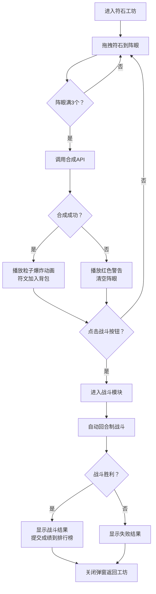

## 1. 产品概述
符石工坊是一款Web魔法合成游戏，玩家通过拖拽不同属性的符石到符文阵眼上组合出魔法符文，并使用符文进行回合制战斗闯关。
- 核心玩法：符石拖拽合成 + 自动回合制战斗
- 目标用户：休闲游戏爱好者、魔法题材爱好者
- 产品价值：提供轻松有趣的合成与策略战斗体验

## 2. 核心功能

### 2.1 用户角色
无多角色区分，所有用户均为普通玩家。

### 2.2 功能模块
1. **符石组合模块**：符石拖拽交互、合成逻辑、动画播放、背包展示
2. **战斗模拟模块**：背包符文载入、自动回合制战斗、战斗日志、结果展示
3. **排行榜系统**：成绩提交、排名查询、前十名展示

### 2.3 页面详情
| 页面名称 | 模块名称 | 功能描述 |
|-----------|-------------|---------------------|
| 符石工坊页 | 符石材料区 | 展示15种不同属性符石，支持拖拽 |
| 符石工坊页 | 符文阵眼区 | 3x3网格阵眼，接收拖拽符石，触发合成 |
| 符石工坊页 | 符文背包区 | 横向滚动展示已合成符文，最多12个 |
| 战斗模拟页 | 战斗主区域 | 敌我生命值条、战斗动画展示 |
| 战斗模拟页 | 战斗日志区 | 实时输出战斗信息，自动滚动 |
| 战斗结果弹窗 | 结果展示区 | 显示战斗数据、排名、排行榜 |

## 3. 核心流程
玩家从左侧材料区拖拽符石到中央3x3阵眼，每放置3个符石触发一次合成检测。合成成功则生成新符文加入背包，失败则清空阵眼。点击战斗按钮进入战斗模块，系统自动使用背包中的符文与敌人进行回合制战斗。战斗胜利后提交成绩并展示排行榜。

## 4. 用户界面设计

### 4.1 设计风格
- **主色调**：深紫色#1E1B4B到黑色#0F172A径向渐变背景
- **强调色**：发光紫色#7C3AED、攻击红#EF4444、回复绿#22C55E、金色#F59E0B
- **文字颜色**：浅灰#E2E8F0
- **按钮风格**：圆形按钮带脉冲光环动画，悬停上浮效果
- **字体**：sans-serif无衬线字体，战斗日志使用等宽字体
- **布局风格**：卡片式布局，统一圆角（8px或12px），毛玻璃浮动提示
- **图标风格**：15种属性符石各具独特颜色和微光动画效果

### 4.2 页面设计概述
| 页面名称 | 模块名称 | UI元素 |
|-----------|-------------|-------------|
| 符石工坊页 | 符石材料区 | 15种符石棋子，各带独特颜色和脉动发光动画 |
| 符石工坊页 | 符文阵眼区 | 3x3网格（90x90px），深紫背景，发光紫边框，拖拽高亮 |
| 符石工坊页 | 符文背包区 | 底部横向滚动（100px高），符文卡片60x60px，悬停放大80x80px |
| 符石工坊页 | 战斗按钮 | 右下角圆形（直径56px），紫色背景，脉冲光环动画 |
| 战斗模拟页 | 战斗区域 | 敌我双方头像、生命值条（绿到红渐变）、战斗动画 |
| 战斗模拟页 | 战斗日志区 | 右侧面板（最大高200px），等宽字体，自动滚动 |
| 结果弹窗 | 排行榜 | 半透明模糊背景，居中布局，金色高亮第一名 |

### 4.3 响应式
- 桌面端：符石组合区域≥960px宽，左右布局（材料区+阵眼区）
- 平板端：自动调整为单列布局，阵眼变为2x3网格
- 手机端：单列布局，阵眼变为1x1网格
- 触摸优化：支持触摸拖拽操作

### 4.4 动画与交互
- 拖拽悬停：目标区域显示2px虚线高亮边框
- 拖拽释放：0.3s弹性回弹动画
- 合成成功：彩色粒子爆炸特效，0.5s淡入淡出
- 合成失败：红色闪烁警告，0.5s淡入淡出
- 生命值变化：0.3s平滑宽度过渡，绿到红渐变色
- 战斗日志：每2秒追加一条，自动滚动到底部
- 按钮悬停：上浮2px，阴影加深，0.4s过渡
