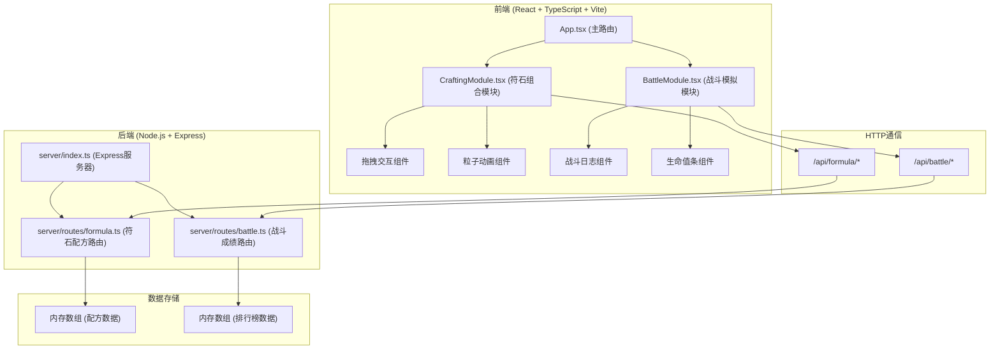
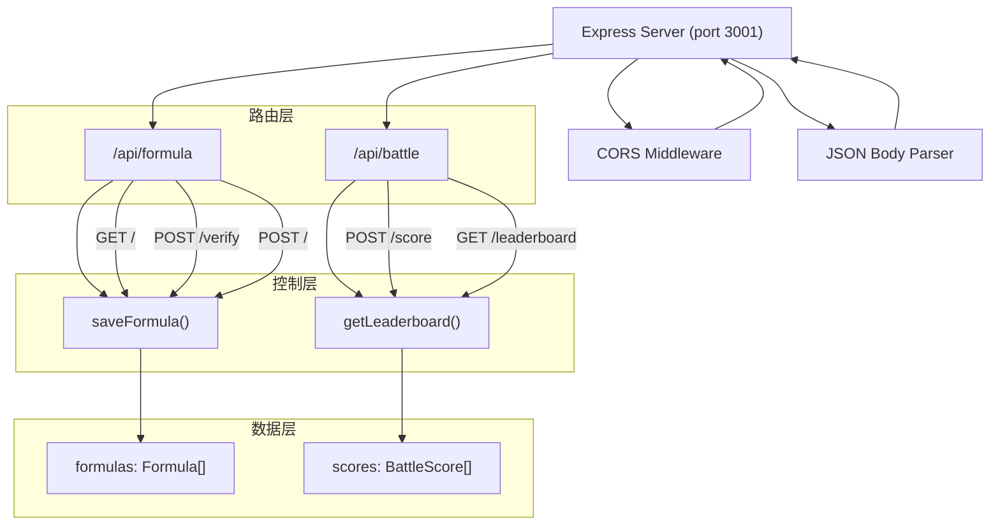
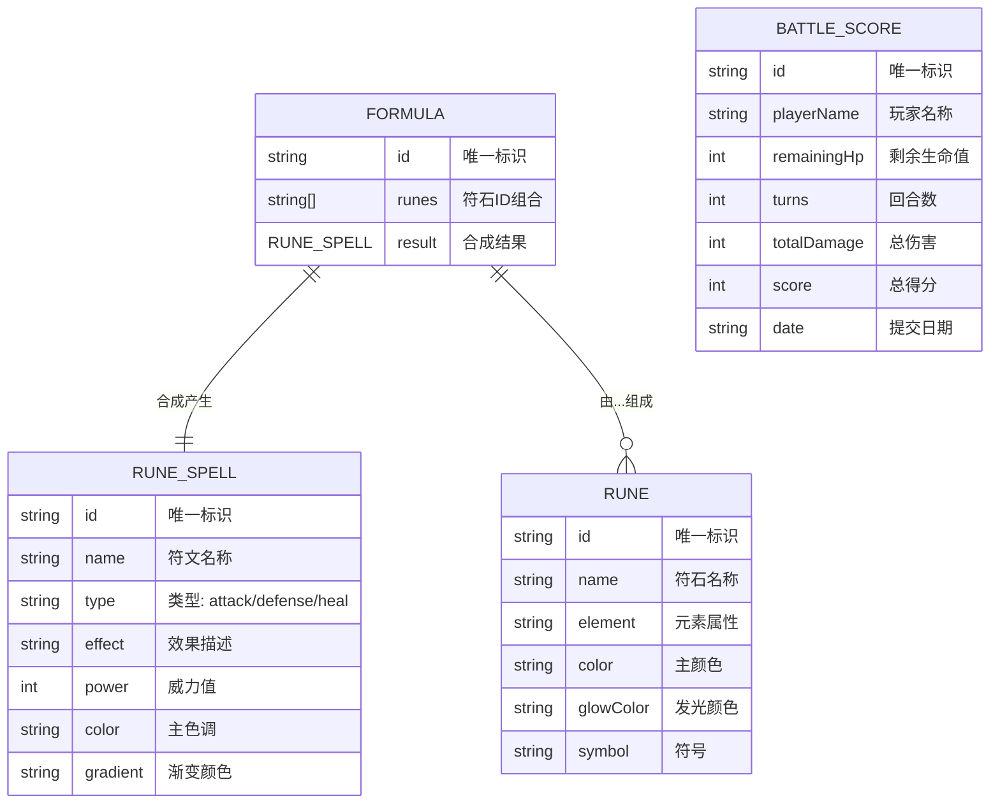

## 1. 架构设计



## 2. 技术描述
- **前端**：React 18 + TypeScript + Vite + Axios
- **构建工具**：Vite 5.x，代理/api到后端3001端口
- **后端**：Express 4.x + TypeScript
- **数据存储**：内存数组（配方数据、排行榜数据）
- **核心库**：
  - axios：HTTP请求
  - uuid：生成唯一ID
  - cors：跨域支持

## 3. 路由定义
| 前端路由 | 后端API路由 | 用途 |
|---------|------------|------|
| /crafting | - | 符石组合工坊页面 |
| /battle | - | 战斗模拟页面 |
| - | GET /api/formula | 查询所有符石配方 |
| - | POST /api/formula/verify | 验证符石组合并返回合成结果 |
| - | POST /api/formula | 保存新的符石配方 |
| - | POST /api/battle/score | 提交战斗成绩 |
| - | GET /api/battle/leaderboard | 查询排行榜前十名 |

## 4. API 定义

### 4.1 类型定义
```typescript
// 符石类型
interface Rune {
  id: string;
  name: string;
  element: string;
  color: string;
  glowColor: string;
  symbol: string;
}

// 符文类型（合成结果）
interface RuneSpell {
  id: string;
  name: string;
  type: 'attack' | 'defense' | 'heal';
  effect: string;
  power: number;
  color: string;
  gradient: string;
}

// 配方类型
interface Formula {
  id: string;
  runes: string[];
  result: RuneSpell;
}

// 战斗成绩类型
interface BattleScore {
  id: string;
  playerName: string;
  remainingHp: number;
  turns: number;
  totalDamage: number;
  score: number;
  date: string;
}

// 战斗状态
interface BattleState {
  playerHp: number;
  enemyHp: number;
  maxHp: number;
  defenseTurns: number;
  currentTurn: number;
  totalDamage: number;
  logs: BattleLog[];
  isRunning: boolean;
  isFinished: boolean;
  isVictory: boolean;
}

// 战斗日志
interface BattleLog {
  turn: number;
  message: string;
  type: 'attack' | 'defense' | 'heal' | 'system';
}
```

### 4.2 请求/响应模式

**POST /api/formula/verify**
- 请求体：`{ runes: string[] }`
- 成功响应：`{ success: true, result: RuneSpell }`
- 失败响应：`{ success: false, message: string }`

**POST /api/battle/score**
- 请求体：`{ remainingHp: number, turns: number, totalDamage: number }`
- 响应：`{ rank: number, leaderboard: BattleScore[] }`

**GET /api/battle/leaderboard**
- 响应：`{ leaderboard: BattleScore[] }`

## 5. 服务器架构图



## 6. 数据模型

### 6.1 数据模型定义


### 6.2 初始数据
```typescript
// 15种符石数据
const RUNES: Rune[] = [
  { id: 'fire', name: '火焰符石', element: 'fire', color: '#EF4444', glowColor: '#FCA5A5', symbol: '🔥' },
  { id: 'water', name: '流水符石', element: 'water', color: '#3B82F6', glowColor: '#93C5FD', symbol: '💧' },
  { id: 'wind', name: '疾风符石', element: 'wind', color: '#22D3EE', glowColor: '#A5F3FC', symbol: '💨' },
  { id: 'earth', name: '岩土符石', element: 'earth', color: '#A16207', glowColor: '#FDE68A', symbol: '🪨' },
  { id: 'light', name: '圣光符石', element: 'light', color: '#FBBF24', glowColor: '#FEF3C7', symbol: '✨' },
  { id: 'dark', name: '暗影符石', element: 'dark', color: '#6B21A8', glowColor: '#C4B5FD', symbol: '🌑' },
  { id: 'thunder', name: '雷电符石', element: 'thunder', color: '#EAB308', glowColor: '#FEF08A', symbol: '⚡' },
  { id: 'ice', name: '寒冰符石', element: 'ice', color: '#06B6D4', glowColor: '#CFFAFE', symbol: '❄️' },
  { id: 'wood', name: '草木符石', element: 'wood', color: '#22C55E', glowColor: '#86EFAC', symbol: '🌿' },
  { id: 'metal', name: '金精符石', element: 'metal', color: '#94A3B8', glowColor: '#E2E8F0', symbol: '⚔️' },
  { id: 'poison', name: '剧毒符石', element: 'poison', color: '#A855F7', glowColor: '#E9D5FF', symbol: '☠️' },
  { id: 'illusion', name: '幻影符石', element: 'illusion', color: '#EC4899', glowColor: '#FBCFE8', symbol: '👁️' },
  { id: 'time', name: '时间符石', element: 'time', color: '#F97316', glowColor: '#FED7AA', symbol: '⏳' },
  { id: 'space', name: '空间符石', element: 'space', color: '#6366F1', glowColor: '#C7D2FE', symbol: '🌀' },
  { id: 'spirit', name: '灵魂符石', element: 'spirit', color: '#14B8A6', glowColor: '#99F6E4', symbol: '💫' },
];

// 初始配方数据
const INITIAL_FORMULAS: Formula[] = [
  { id: '1', runes: ['fire', 'fire', 'thunder'], result: { id: 'spell1', name: '烈焰冲击', type: 'attack', effect: '造成3点火焰伤害', power: 3, color: '#EF4444', gradient: 'linear-gradient(135deg, #EF4444, #F97316)' } },
  { id: '2', runes: ['water', 'ice', 'water'], result: { id: 'spell2', name: '冰霜护盾', type: 'defense', effect: '减少25%伤害持续2回合', power: 2, color: '#06B6D4', gradient: 'linear-gradient(135deg, #06B6D4, #3B82F6)' } },
  { id: '3', runes: ['light', 'wood', 'spirit'], result: { id: 'spell3', name: '生命祝福', type: 'heal', effect: '恢复2点生命值', power: 2, color: '#22C55E', gradient: 'linear-gradient(135deg, #22C55E, #14B8A6)' } },
  { id: '4', runes: ['thunder', 'wind', 'thunder'], result: { id: 'spell4', name: '雷霆万钧', type: 'attack', effect: '造成3点雷电伤害', power: 3, color: '#EAB308', gradient: 'linear-gradient(135deg, #EAB308, #FBBF24)' } },
  { id: '5', runes: ['earth', 'metal', 'earth'], result: { id: 'spell5', name: '钢铁堡垒', type: 'defense', effect: '减少25%伤害持续2回合', power: 2, color: '#A16207', gradient: 'linear-gradient(135deg, #A16207, #78716C)' } },
  { id: '6', runes: ['dark', 'poison', 'illusion'], result: { id: 'spell6', name: '暗影侵蚀', type: 'attack', effect: '造成2点持续伤害', power: 2, color: '#6B21A8', gradient: 'linear-gradient(135deg, #6B21A8, #A855F7)' } },
  { id: '7', runes: ['light', 'water', 'wind'], result: { id: 'spell7', name: '净化之泉', type: 'heal', effect: '恢复2点生命值', power: 2, color: '#22D3EE', gradient: 'linear-gradient(135deg, #22D3EE, #FBBF24)' } },
  { id: '8', runes: ['fire', 'wind', 'fire'], result: { id: 'spell8', name: '火焰风暴', type: 'attack', effect: '造成2点范围伤害', power: 2, color: '#F97316', gradient: 'linear-gradient(135deg, #F97316, #EF4444)' } },
];
```
