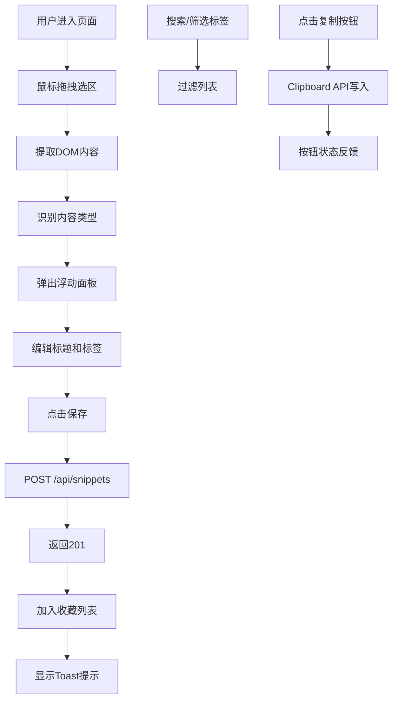

## 1. 产品概述

片段捕捉器是一款面向内容创作者和研究者的网页内容提取与收藏工具，通过鼠标拖拽选区即可快速捕获网页中的文字、图片或混合内容，自动保持原有格式并生成结构化片段，便于后续整理、搜索和分享。

- 解决用户在长文章/产品详情页中手动截图、复制粘贴效率低下且格式丢失的痛点
- 目标用户：知识工作者、内容创作者、产品研究员、学生等需要频繁收集网页内容的人群
- 产品价值：将零散的网页内容转化为结构化、可检索、可复用的数字笔记资产

## 2. 核心功能

### 2.1 功能模块
1. **片段选择模块**：鼠标拖拽选区、内容类型识别、富文本提取、浮动编辑面板
2. **收藏管理模块**：卡片网格展示、搜索框、标签筛选、排序、一键复制、删除操作
3. **标签系统**：标签自动提取、标签增删、标签筛选
4. **内容导出**：Markdown格式导出、HTML格式导出

### 2.2 页面详情

| 页面名称 | 模块名称 | 功能描述 |
|-----------|-------------|---------------------|
| 主页面 | 拖拽选区区域 | 鼠标按下开始选择、移动实时显示选区、松开提取内容，支持requestAnimationFrame节流 |
| 主页面 | 浮动编辑面板 | 显示内容类型图标、富文本预览、标题输入、标签编辑、保存按钮 |
| 主页面 | 收藏列表顶部 | 搜索框（放大镜图标）、标签筛选下拉菜单（复选框+毛玻璃效果）、排序选项 |
| 主页面 | 收藏卡片网格 | 响应式3-4列卡片、悬停动画、内容类型标识、预览文本、标签展示、相对时间、删除按钮 |
| 主页面 | 卡片操作区 | "复制MD"按钮、"复制HTML"按钮、复制成功状态反馈 |
| 主页面 | Toast提示 | 保存成功提示、删除提示、复制成功提示 |

## 3. 核心流程

### 主流程：用户选择并保存片段
1. 用户进入页面，浏览示例内容区域
2. 鼠标按下并拖拽形成矩形选区（显示蓝色虚线边框+半透明遮罩）
3. 松开鼠标，系统根据选区坐标读取DOM元素innerHTML
4. 自动判断内容类型（文字/图片/混合）
5. 右侧弹出浮动面板，展示富文本预览、类型标识
6. 用户编辑标题、添加/修改标签
7. 点击"保存"按钮，发送POST /api/snippets请求
8. 后端返回201，新片段加入收藏列表，显示"已保存"Toast

### 筛选与搜索流程
1. 用户在搜索框输入关键词，实时过滤标题和内容
2. 点击标签筛选下拉，勾选一个或多个标签
3. 列表按字母排序、创建时间等方式重新排序

### 导出流程
1. 点击卡片上"复制MD"或"复制HTML"按钮
2. 系统转换格式并通过Clipboard API写入剪贴板
3. 按钮文字变为"已复制"，背景变绿，1.5秒后恢复

## 4. 用户界面设计

### 4.1 设计风格
- **极简设计风格**：蓝色系为主色调，辅以绿色和紫色标识内容类型
- **主色调**：#3B82F6（主色）、#1D4ED8（深色）、#E0E7FF（浅色）
- **辅助色**：#10B981（绿色，文字类型/成功提示）、#8B5CF6（紫色，混合类型）、#EF4444（红色，删除）
- **背景色**：#F9FAFB（全局）、#FFFFFF（卡片/面板）、#F8FAFC（卡片背景）
- **圆角**：面板12px、卡片16px、按钮/输入框6-8px
- **阴影**：面板0 8px 32px rgba(0,0,0,0.12)、卡片0 2px 8px rgba(0,0,0,0.06)
- **过渡动画**：交互元素0.2-0.3s过渡
- **字体**：系统无衬线字体栈 -apple-system, BlinkMacSystemFont, 'Segoe UI', Roboto

### 4.2 页面设计概览

| 页面名称 | 模块名称 | UI元素 |
|-----------|-------------|-------------|
| 主页面 | 拖拽选区 | 2px蓝色虚线边框#3B82F6、半透明蓝色遮罩#3B82F640、随鼠标实时更新 |
| 主页面 | 浮动面板(420px) | 类型图标标签区、富文本预览区(图片最大宽360px)、标题输入框(1px#D1D5DB聚焦变#3B82F6)、标签芯片(E0E7FF背景/4338CA文字/8px圆角)、保存按钮(100x36px/3B82F6背景/悬停#2563EB/点击scale-0.95) |
| 主页面 | 搜索筛选区 | 搜索框(左放大镜图标/8px圆角/F3F4F6背景/10x16px内边距)、标签下拉(毛玻璃rgba(255,255,255,0.95)/复选框/字母排序) |
| 主页面 | 卡片网格 | minmax(280px,1fr)/背景#F8FAFC/16px圆角/16px内边距/悬停上移3px+阴影/卡片类型图标/标题截断/40字预览/标签芯片(最多3个+N)/相对时间/32x32删除按钮(FEE2E2/EF4444) |
| 主页面 | 卡片按钮 | 复制MD/复制HTML(120x32px/白底/1px#D1D5DB/6px圆角/悬停边框#3B82F6/成功#10B981白字) |
| 主页面 | Toast | 8px圆角/#10B981背景/白色文字/2秒自动消失 |

### 4.3 响应式设计
- **设计策略**：桌面端优先，移动端自适应
- **断点**：<768px为小屏幕
- **小屏幕适配**：
  - 浮动面板全屏覆盖，宽度100%
  - 收藏列表变为单列网格
  - 触摸事件优化
- **大屏幕适配**：
  - 浮动面板420px固定宽度，右侧悬浮
  - 卡片网格3-4列响应式

### 4.4 性能优化
- **拖拽性能**：鼠标移动事件使用requestAnimationFrame节流，确保60fps
- **虚拟滚动**：卡片超过20张时启用虚拟滚动，仅渲染可见区域10-12张卡片，超出部分占位高度
- **DOM操作优化**：选区计算批量进行，避免频繁reflow
