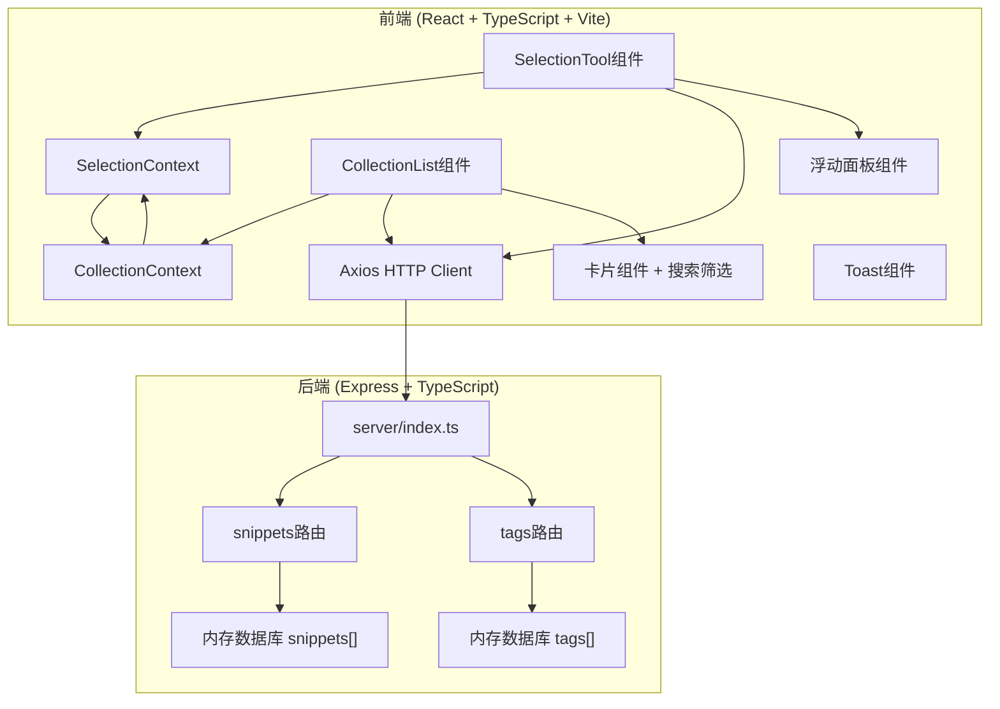
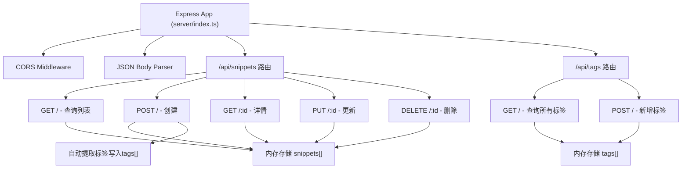

## 1. 架构设计



## 2. 技术描述

- **前端框架**：React@18 + TypeScript@5 + Vite@5
- **初始化工具**：vite-init (react-express-ts模板)
- **状态管理**：React Context API（SelectionContext + CollectionContext）
- **HTTP客户端**：Axios@1
- **图标库**：lucide-react
- **后端框架**：Express@4 + TypeScript@5
- **数据存储**：内存存储（snippets数组 + tags数组）
- **ID生成**：uuid@9
- **CORS处理**：cors@2
- **构建代理**：Vite proxy将/api请求转发到Express后端
- **样式方案**：原生CSS + CSS Variables，不使用Tailwind（用户明确指定了颜色、尺寸等具体CSS值）

## 3. 文件结构定义

```
auto207/
├── package.json
├── index.html
├── vite.config.js
├── tsconfig.json
├── server/
│   ├── index.ts              # Express入口，挂载两个路由
│   └── routes/
│       ├── snippets.ts       # 片段CRUD REST API
│       └── tags.ts           # 标签新增/查询 REST API
└── src/
    ├── main.tsx
    ├── App.tsx
    ├── contexts/
    │   ├── SelectionContext.tsx   # 选中区域Context
    │   └── CollectionContext.tsx  # 收藏列表Context
    ├── components/
    │   ├── SelectionTool.tsx      # 片段选择核心组件
    │   ├── FloatingPanel.tsx      # 浮动编辑面板
    │   ├── CollectionList.tsx     # 收藏列表核心组件
    │   ├── SnippetCard.tsx        # 收藏卡片组件
    │   ├── SearchFilter.tsx       # 搜索和标签筛选
    │   ├── TagChip.tsx            # 标签芯片组件
    │   └── Toast.tsx              # Toast提示组件
    ├── types/
    │   └── index.ts               # 共享TypeScript类型
    ├── utils/
    │   ├── html.ts                # HTML/Markdown转换工具
    │   └── time.ts                # 相对时间格式化工具
    └── styles/
        ├── global.css             # 全局样式
        └── variables.css          # CSS变量
```

## 4. API定义

### 4.1 片段API (snippets.ts)

| 方法 | 路径 | 说明 |
|------|------|------|
| GET | /api/snippets | 获取所有片段，支持query参数 search/tags/sort |
| POST | /api/snippets | 创建新片段，返回201和创建的对象 |
| GET | /api/snippets/:id | 获取单个片段详情 |
| PUT | /api/snippets/:id | 更新片段内容/标题/标签 |
| DELETE | /api/snippets/:id | 删除指定片段，返回204 |

### 4.2 标签API (tags.ts)

| 方法 | 路径 | 说明 |
|------|------|------|
| GET | /api/tags | 获取所有使用过的标签（去重排序后返回） |
| POST | /api/tags | 新增标签（自动首字母大写），返回创建的标签 |

### 4.3 TypeScript类型定义

```typescript
// 内容类型
export type ContentType = 'text' | 'image' | 'mixed';

// 选中区域数据
export interface SelectionData {
  x: number;
  y: number;
  width: number;
  height: number;
  contentType: ContentType;
  html: string;
  plainText: string;
}

// 片段数据模型
export interface Snippet {
  id: string;
  title: string;
  tags: string[];
  sourceUrl: string;
  contentType: ContentType;
  html: string;
  plainText: string;
  createdAt: number;
}

// 创建片段请求体
export interface CreateSnippetRequest {
  title: string;
  tags: string[];
  sourceUrl: string;
  contentType: ContentType;
  html: string;
  plainText: string;
}

// 查询参数
export interface SnippetQuery {
  search?: string;
  tags?: string[];
  sort?: 'createdAt_desc' | 'createdAt_asc' | 'title_asc';
}
```

## 5. 服务器架构



### 数据流向说明
- **片段操作路由**：接收前端请求 → 操作内存snippets数组 → 返回JSON响应
- **标签操作路由**：接收前端请求 → 操作内存tags数组 → 返回JSON响应
- **自动标签管理**：创建片段时自动将新标签加入tags数组（首字母大写）

## 6. Context数据流向

### 6.1 SelectionContext
- **提供者**：SelectionTool组件
- **写入者**：SelectionTool组件（用户拖拽选区完成后写入）
- **读取者**：CollectionContext、FloatingPanel组件
- **数据**：SelectionData | null（当前选中区域的坐标、类型、内容）

### 6.2 CollectionContext
- **提供者**：CollectionContext Provider（App级）
- **写入者**：CollectionList组件（增删改查操作）、FloatingPanel（保存新片段）
- **读取者**：CollectionList组件（展示列表）、SearchFilter（筛选状态）
- **数据**：
  - snippets: Snippet[]（收藏列表）
  - tags: string[]（所有标签）
  - searchQuery: string
  - selectedTags: string[]
  - sortBy: string
  - filteredSnippets: Snippet[]（计算属性）

## 7. 性能优化实现方案

### 7.1 拖拽性能优化
```typescript
// 使用 requestAnimationFrame 节流鼠标移动事件
let rafId: number | null = null;
const onMouseMove = (e: MouseEvent) => {
  if (rafId) return;
  rafId = requestAnimationFrame(() => {
    updateSelectionRectangle(e.clientX, e.clientY);
    rafId = null;
  });
};
```

### 7.2 虚拟滚动实现
```typescript
// 超过20张卡片启用虚拟滚动
const VIRTUAL_THRESHOLD = 20;
const VISIBLE_COUNT = 12;
const CARD_HEIGHT = 320; // 估算每张卡片高度

// 使用IntersectionObserver或scroll事件监听可见区域
// 只渲染 startIndex 到 endIndex 之间的卡片
// 上下使用占位div撑开高度
```

### 7.3 DOM内容提取优化
- 使用 Document.elementFromPoint() + Range API 获取选区内容
- 避免频繁读写DOM，批量提取后统一处理
- 图片加载使用loading="lazy"
