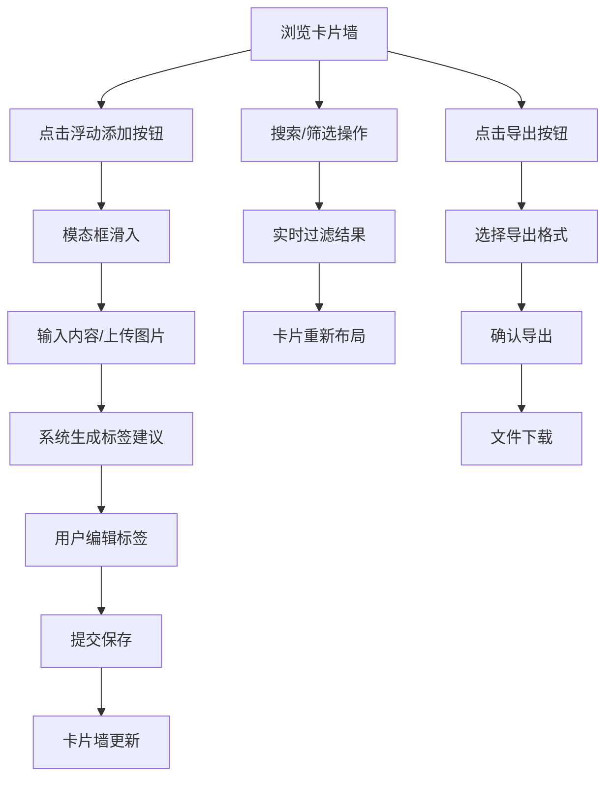

## 1. 产品概述

信息碎片整理应用，帮助个人或小团队收集、组织和检索网络上的信息碎片（网页摘录、灵感笔记、图片快照），解决收藏信息散落在浏览器书签、备忘录和截图文件夹中难以检索和关联的问题。

- 核心价值：统一管理碎片化信息，通过智能标签和搜索快速定位内容
- 目标用户：知识工作者、研究人员、创意工作者、学生

## 2. 核心功能

### 2.1 用户角色

| 角色 | 注册方式 | 核心权限 |
|------|----------|----------|
| 普通用户 | 无需注册（本地存储） | 添加/编辑/删除碎片、搜索筛选、导出数据 |

### 2.2 功能模块

1. **卡片墙展示**：以卡片网格形式浏览所有信息碎片，支持来源类型图标标注、内容预览、图片缩略图
2. **碎片管理**：添加新碎片（文本/图片）、删除碎片、标签管理（自动建议 + 手动编辑）
3. **搜索筛选**：关键词搜索、来源类型筛选、日期范围筛选、标签分组
4. **数据导出**：一键导出为 JSON 或 Markdown 格式

### 2.3 页面详情

| 页面名称 | 模块名称 | 功能描述 |
|----------|----------|----------|
| 主页面 | 顶部导航栏 | 应用标题、搜索框、筛选按钮 |
| 主页面 | 卡片墙区域 | 自适应网格布局、卡片悬停动效、逐张淡入动画 |
| 主页面 | 浮动添加按钮 | 点击打开添加碎片模态框 |
| 主页面 | 筛选面板 | 来源类型下拉、日期双滑块、标签筛选 |
| 添加碎片模态框 | 文本输入区 | 自动高度文本框、聚焦高亮效果 |
| 添加碎片模态框 | 图片上传区 | 点击/拖拽上传、进度条动画 |
| 添加碎片模态框 | 标签编辑区 | 胶囊状标签、自动建议、添加/删除 |
| 导出确认弹窗 | 导出选项 | JSON/Markdown 格式选择、确认按钮 |

## 3. 核心流程

### 3.1 添加碎片流程
用户点击浮动按钮 → 模态框从底部滑入 → 输入文本或上传图片 → 系统自动生成标签建议 → 用户确认或编辑标签 → 提交保存 → 卡片墙即时更新

### 3.2 搜索筛选流程
用户在搜索框输入关键词 → 实时过滤卡片 → 选择来源类型/日期范围 → 进一步缩小结果 → 卡片墙布局自适应调整

### 3.3 导出流程
用户点击卡片导出按钮 → 弹出确认对话框 → 选择导出格式 → 确认导出 → 文件下载

## 4. 用户界面设计

### 4.1 设计风格

- **主题风格**：深色科技风格，强调信息密度和内容聚焦
- **主色调**：背景 #0A0A1A，卡片背景 #1E293B，导航栏 #111827
- **强调色**：绿色 #22C55E（网页类型）、橙色 #F59E0B（笔记类型）、紫色 #6366F1（交互高亮）
- **文字色**：#E2E8F0（主文字）、#D4D4D8（次要文字）
- **按钮样式**：圆角 8px/12px/24px，悬停有颜色过渡和阴影变化
- **字体**：现代无衬线字体，清晰易读
- **布局方式**：卡片式网格布局，顶部导航 + 主体内容区
- **图标风格**：线性简约图标，与文字搭配使用

### 4.2 页面设计概览

| 页面名称 | 模块名称 | UI 元素 |
|----------|----------|---------|
| 主页面 | 顶部导航栏 | 固定高度 56px、底部边框分隔、搜索框居中 |
| 主页面 | 卡片墙 | 自适应 3-5 列网格、间距 16px、逐张淡入动画 |
| 主页面 | 碎片卡片 | 宽度 280px、圆角 12px、悬停阴影上浮、来源类型标签 |
| 主页面 | 浮动按钮 | 固定右下角、圆形、点击打开模态框 |
| 添加模态框 | 模态框容器 | 毛玻璃效果、底部滑入动画、居中显示 |
| 添加模态框 | 表单区域 | 文本输入区、图片上传区、标签编辑区 |
| 筛选面板 | 筛选控件 | 下拉菜单、双滑块、标签胶囊 |

### 4.3 响应式设计

- **桌面端**：卡片墙 3-5 列自适应，导航栏高度 56px，搜索框宽度 60%（最大 600px）
- **移动端**（<768px）：卡片墙单列布局，导航栏高度 64px，搜索框宽度 100%
- **触摸优化**：增大点击区域，优化手势操作

### 4.4 动画与交互

- 页面加载：卡片逐张淡入（stagger 0.08s 延迟，透明度 0→1，上移 2px）
- 卡片悬停：阴影加深 + 上浮 2px（0.25s cubic-bezier 过渡）
- 模态框：从底部滑入（0.3s ease-out）
- 输入框聚焦：边框高亮过渡（0.2s）
- 按钮交互：背景色过渡（0.2s）
- 上传进度：进度条渐变（#22C55E）
