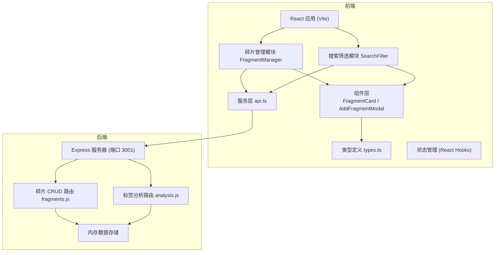
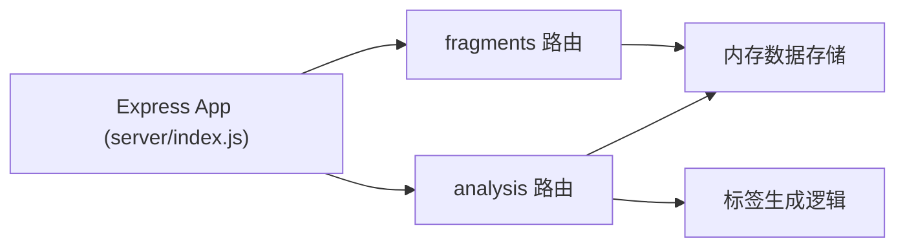
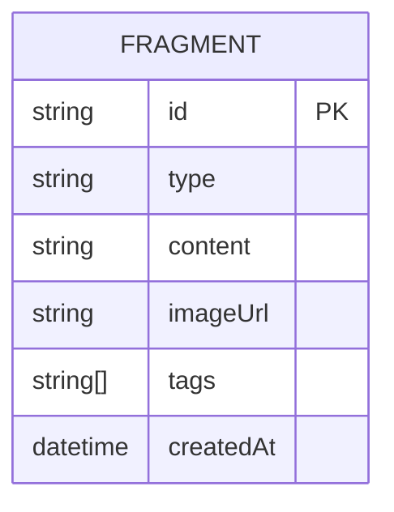

## 1. 架构设计



## 2. 技术选型

- **前端框架**：React 18 + TypeScript
- **构建工具**：Vite
- **HTTP 客户端**：axios
- **后端框架**：Express 4
- **数据库**：内存数组模拟（开发阶段）
- **后端依赖**：cors、uuid、node-fetch
- **路由**：react-router-dom

## 3. 路由定义

| 路由 | 用途 |
|------|------|
| / | 主页 - 卡片墙展示与碎片管理 |

## 4. API 定义

### 4.1 碎片 CRUD API

**类型定义**
```typescript
interface Fragment {
  id: string;
  type: 'webpage' | 'note' | 'image';
  content: string;
  imageUrl?: string;
  tags: string[];
  createdAt: string;
}
```

**接口列表**
- `GET /api/fragments` - 获取所有碎片
  - 响应：`Fragment[]`
  
- `POST /api/fragments` - 创建新碎片
  - 请求体：`{ type, content, imageUrl?, tags }`
  - 响应：`Fragment`
  
- `PUT /api/fragments/:id` - 更新碎片
  - 请求体：`{ type?, content?, imageUrl?, tags? }`
  - 响应：`Fragment`
  
- `DELETE /api/fragments/:id` - 删除碎片
  - 响应：`{ success: boolean }`

### 4.2 标签分析 API

- `POST /api/analysis/tags` - 分析内容并返回标签建议
  - 请求体：`{ content: string }`
  - 响应：`{ tags: string[] }`

## 5. 服务端架构



- **server/index.js**：Express 服务器入口，启用 CORS，挂载两个路由模块
- **server/routes/fragments.js**：碎片的增删改查操作
- **server/routes/analysis.js**：标签分析服务，模拟 AI 标签生成

## 6. 数据模型

### 6.1 数据模型定义



### 6.2 数据说明

- **id**：唯一标识符，使用 uuid 生成
- **type**：碎片类型，枚举值：webpage / note / image
- **content**：碎片文本内容，最多 200 字显示（超出省略）
- **imageUrl**：图片类型碎片的图片地址
- **tags**：标签数组，用于分类和搜索
- **createdAt**：创建时间，ISO 格式字符串

## 7. 前端模块结构

### 7.1 模块划分

- **碎片管理模块 (FragmentManager)**：
  - 加载碎片列表
  - 渲染卡片墙
  - 添加/删除碎片 API 调用
  - 本地状态管理

- **搜索筛选模块 (SearchFilter)**：
  - 搜索框交互
  - 来源类型筛选
  - 日期范围筛选
  - 筛选条件管理
  - 卡片分组渲染

### 7.2 组件划分

- **FragmentCard**：单张碎片卡片，展示类型、内容/图片、标签
- **AddFragmentModal**：添加碎片模态框，包含表单和上传功能

### 7.3 文件结构

```
src/
├── main.tsx          # React 入口
├── App.tsx           # 根组件
├── types.ts          # 类型定义
├── services/
│   └── api.ts        # API 封装
├── components/
│   ├── FragmentCard.tsx
│   └── AddFragmentModal.tsx
└── modules/
    ├── FragmentManager.tsx
    └── SearchFilter.tsx
```
